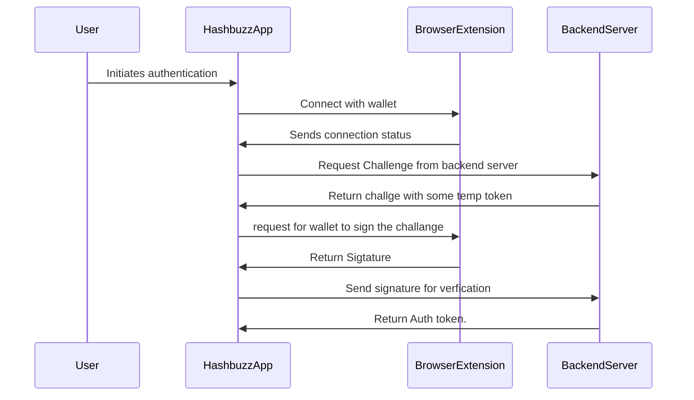

# Authentication Flow

This authentication flow includes three APIs and involves the following components: React app, backend server, and browser extension.

## Components

1. **Hashbuzz App**: The frontend application built with React.
2. **Backend Server**: The server-side application handling API requests.
3. **Browser Extension**: The extension installed in the user's browser to facilitate authentication.

## APIs

1. **API 1**: Ping API if any existing api is in the browser.
2. **API 2**: Request challengeform the server to sign.
3. **API 3**: Verify the signature and return the auth token.

## Flow Overview

1. **User Interaction**: The user interacts with the React app.
2. **Request to Backend**: The React app sends an authentication request to the backend server.
3. **Backend Processing**: The backend server processes the request and communicates with the browser extension if necessary.
4. **Response Handling**: The backend server sends a response back to the React app.
5. **User Authentication**: The React app handles the response and completes the authentication process.

## Sequence Diagram

## Conclusion

This document outlines the authentication flow involving the Hashbuzz app, backend server, and browser extension, along with the three APIs used in the process.