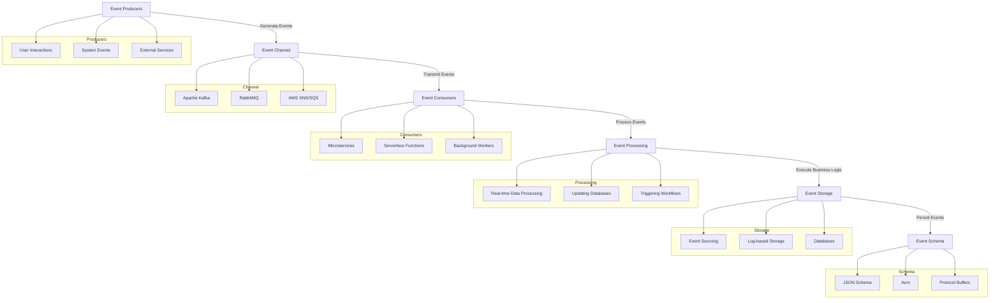

# V201 Event driven Architecture 

```mermaid
graph TD;
    A[Event Producers] -->|Generate Events| B[Event Channel];
    B -->|Transmit Events| C[Event Consumers];
    C -->|Process Events| D[Event Processing];
    D -->|Execute Business Logic| E[Event Storage];
    E -->|Persist Events| F[Event Schema];

    subgraph Producers
        A1[User Interactions]
        A2[System Events]
        A3[External Services]
    end

    subgraph Channel
        B1[Apache Kafka]
        B2[RabbitMQ]
        B3[AWS SNS/SQS]
    end

    subgraph Consumers
        C1[Microservices]
        C2[Serverless Functions]
        C3[Background Workers]
    end

    subgraph Processing
        D1[Real-time Data Processing]
        D2[Updating Databases]
        D3[Triggering Workflows]
    end

    subgraph Storage
        E1[Event Sourcing]
        E2[Log-based Storage]
        E3[Databases]
    end

    subgraph Schema
        F1[JSON Schema]
        F2[Avro]
        F3[Protocol Buffers]
    end

    A --> A1
    A --> A2
    A --> A3
    B --> B1
    B --> B2
    B --> B3
    C --> C1
    C --> C2
    C --> C3
    D --> D1
    D --> D2
    D --> D3
    E --> E1
    E --> E2
    E --> E3
    F --> F1
    F --> F2
    F --> F3
```