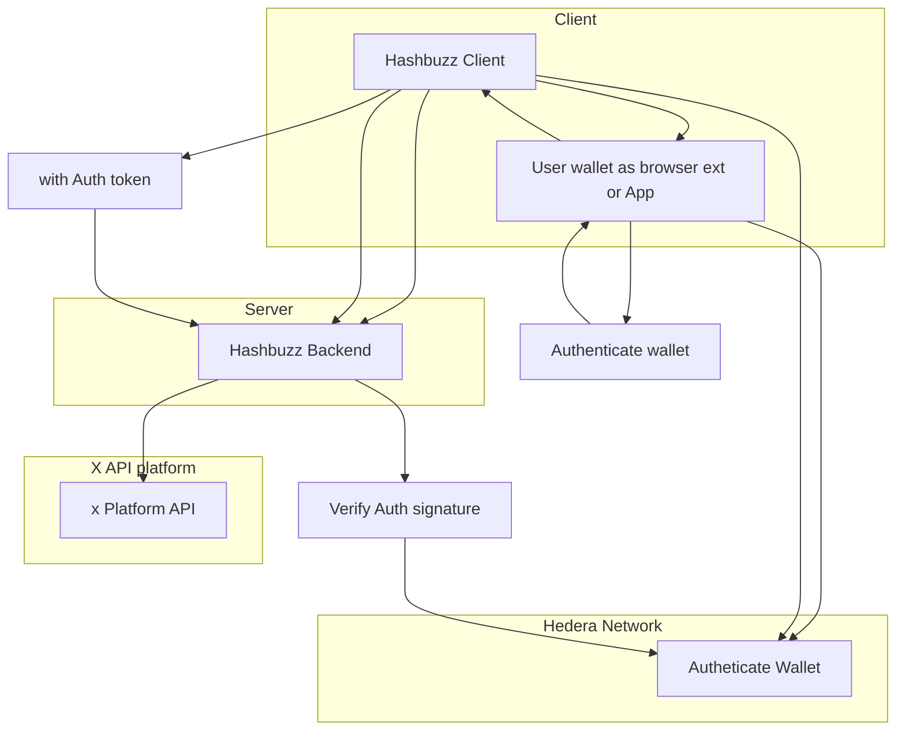

# High Level system info of hashbuzz 

```mermaid
graph TD
    subgraph Client
        A[Hashbuzz Client] --> B[User wallet as browser ext or App]
    end

    subgraph Server
        A --> C[Hashbuzz Backend]
    end

    subgraph Hedera Network
        B --> D[Hedera Hashgraph]
    end

    subgraph X API platform
         C --> E[x Platform API]
    end

    A --> D[Autheticate Wallet]
    B --> F[Authenticate wallet] --> B --> A --> C
    C--> H[Verify Auth signature] -->  D

    A --> G[with Auth token] --> C
```
