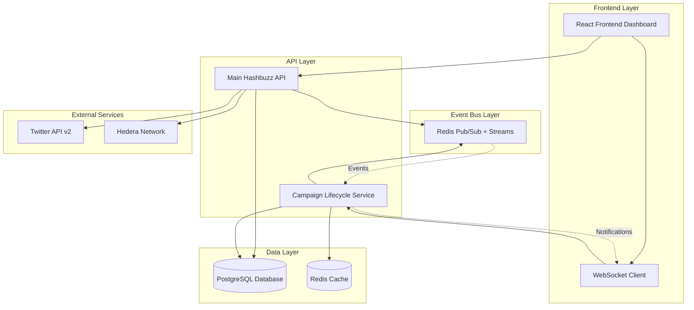
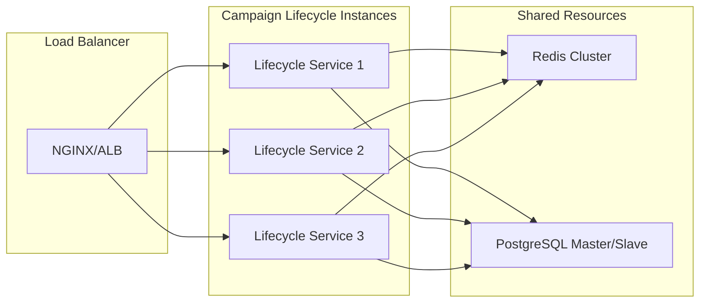
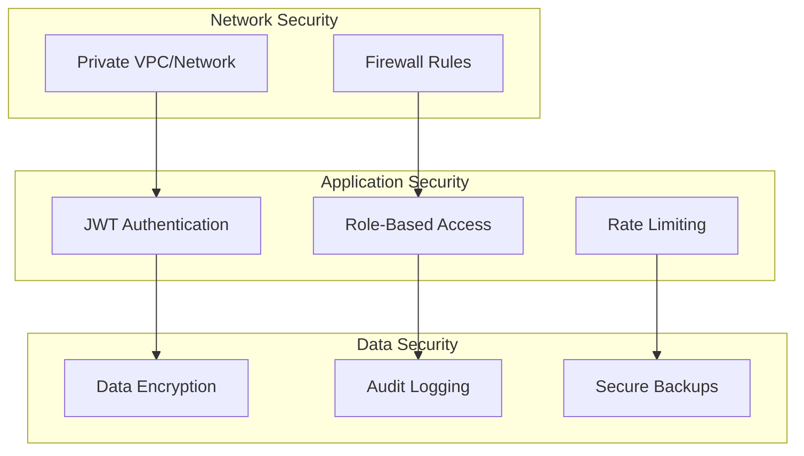

# 🏗️ Architecture Overview

## 🎯 **System Architecture**

The Campaign Lifecycle Service follows a **microservice architecture** pattern with event-driven communication, providing scalability, reliability, and maintainability.

---

## 📐 **High-Level Architecture Diagram**



---

## 🏛️ **Service Components**

### **1. Main Hashbuzz API**
- **Responsibility**: Campaign creation, user management, Twitter integration
- **Technology**: Node.js, TypeScript, Prisma
- **Role in Lifecycle**: Triggers campaign creation events

### **2. Campaign Lifecycle Service**
- **Responsibility**: Automated campaign state management
- **Technology**: Node.js, TypeScript, Redis, WebSocket
- **Role in Lifecycle**: Core orchestrator for all campaign transitions

### **3. Redis Event Bus**
- **Responsibility**: Inter-service communication and event persistence
- **Technology**: Redis Pub/Sub + Streams
- **Role in Lifecycle**: Reliable message delivery and event durability

### **4. PostgreSQL Database**
- **Responsibility**: Persistent data storage and timer state
- **Technology**: PostgreSQL with Prisma ORM
- **Role in Lifecycle**: Campaign data and timer persistence

---

## 🔄 **Architecture Patterns**

### **Event-Driven Architecture (EDA)**

```
┌─────────────┐    Event     ┌─────────────┐    Process    ┌─────────────┐
│   Producer  │──────────────▶│ Event Bus   │──────────────▶│  Consumer   │
│  (Main API) │              │   (Redis)   │              │ (Lifecycle) │
└─────────────┘              └─────────────┘              └─────────────┘
       │                            │                            │
       ▼                            ▼                            ▼
┌─────────────┐              ┌─────────────┐              ┌─────────────┐
│ Campaign    │              │ Event       │              │ Timer       │
│ Created     │              │ Persistence │              │ Scheduled   │
└─────────────┘              └─────────────┘              └─────────────┘
```

### **CQRS Pattern (Command Query Responsibility Segregation)**

```
┌─────────────────────────────────────────────────────────────┐
│                    Campaign Operations                       │
├─────────────────────────────────────────────────────────────┤
│                                                            │
│  Commands (Write Side)     │    Queries (Read Side)        │
│  ┌─────────────────────┐   │   ┌─────────────────────┐     │
│  │ • Create Campaign   │   │   │ • Get Campaign Status │    │
│  │ • Update Status     │   │   │ • List Active Timers  │    │
│  │ • Schedule Timer    │   │   │ • Get Transition Log  │    │
│  │ • Process Expiry    │   │   │ • Health Metrics      │    │
│  └─────────────────────┘   │   └─────────────────────┘     │
│           │                │              │                │
│           ▼                │              ▼                │
│  ┌─────────────────────┐   │   ┌─────────────────────┐     │
│  │ Event Store         │   │   │ Read Models         │     │
│  │ (Redis Streams)     │   │   │ (Materialized Views)│     │
│  └─────────────────────┘   │   └─────────────────────┘     │
└─────────────────────────────────────────────────────────────┘
```

---

## 🎯 **Design Principles**

### **1. Single Responsibility**
- Each service has one clear purpose
- Campaign Lifecycle Service only manages campaign states
- Main API handles business logic and user interactions

### **2. Loose Coupling**
- Services communicate only through events
- No direct API calls between services
- Redis acts as the communication buffer

### **3. High Cohesion**
- Related functionality grouped together
- Timer management, event processing, and WebSocket notifications in one service
- Clear boundaries between concerns

### **4. Fault Tolerance**
- Service failures don't cascade
- Event persistence ensures no lost messages
- Automatic recovery mechanisms

---

## 🔧 **Technology Stack Rationale**

### **Node.js + TypeScript**
```
✅ Reasons:
- Consistent language across all services
- Excellent async/await support for timers
- Rich ecosystem for WebSocket and Redis
- Type safety with TypeScript
- Fast development and deployment

❌ Alternatives Considered:
- Python: Slower async performance
- Java: More complex deployment
- Go: Less familiar to team
```

### **Redis as Event Bus**
```
✅ Reasons:
- Lower cost than RabbitMQ
- Built-in persistence with Streams
- Simple Pub/Sub model
- Already used for caching
- Excellent Node.js integration

❌ Alternatives Considered:
- RabbitMQ: Higher cost and complexity
- Apache Kafka: Overkill for current scale
- AWS SQS: Vendor lock-in concerns
```

### **PostgreSQL for Persistence**
```
✅ Reasons:
- ACID compliance for timer consistency
- Excellent JSON support for metadata
- Already used by main application
- Strong indexing for timer queries
- Proven reliability at scale

❌ Alternatives Considered:
- MongoDB: Eventual consistency issues
- MySQL: Less advanced JSON features
- SQLite: Not suitable for production
```

---

## 📊 **Scalability Considerations**

### **Horizontal Scaling Strategy**



### **Scaling Metrics & Thresholds**

| Metric | Threshold | Action |
|--------|-----------|--------|
| CPU Usage | >70% | Add instance |
| Memory Usage | >80% | Add instance |
| Timer Lag | >5 minutes | Scale up |
| Redis Connections | >1000 | Add Redis node |
| DB Connections | >80% pool | Add read replica |

---

## 🛡️ **Security Architecture**

### **Security Layers**



### **Security Measures**

1. **Network Level**
   - Private network isolation
   - Firewall rules for service communication
   - TLS encryption for all connections

2. **Application Level**
   - JWT token validation for API access
   - Service-to-service authentication
   - Input validation and sanitization

3. **Data Level**
   - Database connection encryption
   - Sensitive data encryption at rest
   - Regular security audits

---

## 📈 **Performance Characteristics**

### **Expected Performance Metrics**

```
┌─────────────────┬─────────────┬─────────────┬─────────────┐
│ Component       │ Latency     │ Throughput  │ Availability│
├─────────────────┼─────────────┼─────────────┼─────────────┤
│ Event Bus       │ <10ms       │ 10K msg/sec │ 99.9%       │
│ Timer Processing│ <1 minute   │ 1K timers   │ 99.95%      │
│ WebSocket       │ <50ms       │ 1K clients  │ 99.9%       │
│ Database Writes │ <100ms      │ 1K ops/sec  │ 99.99%      │
│ State Transitions│ <5 seconds  │ 100/minute  │ 99.95%      │
└─────────────────┴─────────────┴─────────────┴─────────────┘
```

### **Resource Requirements**

```yaml
# Minimum Requirements
resources:
  cpu: "500m"
  memory: "512Mi"
  storage: "10Gi"

# Production Requirements  
resources:
  cpu: "1000m"
  memory: "1Gi"
  storage: "50Gi"
  
# High-Load Requirements
resources:
  cpu: "2000m"
  memory: "2Gi"  
  storage: "100Gi"
```

---

## 🔮 **Future Architecture Evolution**

### **Phase 1: Current (MVP)**
- Single service instance
- Basic event handling
- Simple WebSocket notifications

### **Phase 2: Enhanced (6 months)**
- Multi-instance deployment
- Advanced monitoring
- Performance optimizations

### **Phase 3: Scale (12 months)**
- Microservice decomposition
- Event sourcing implementation
- Advanced analytics integration

### **Phase 4: Enterprise (18 months)**
- Multi-tenant architecture
- Advanced ML-based predictions
- Global deployment

---

*This architecture provides a solid foundation for reliable, scalable campaign lifecycle management while maintaining simplicity and cost-effectiveness.*
