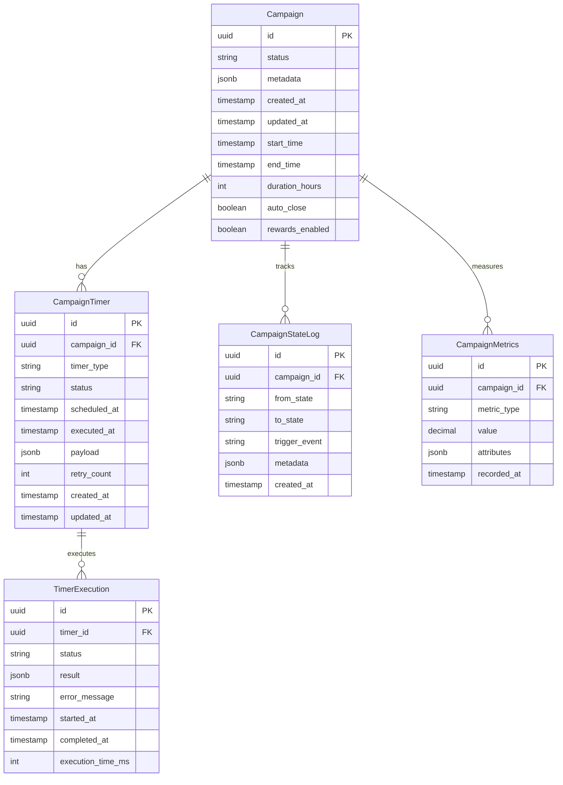

# 🗄️ Database Schema Design

## 📊 **Overview**

The Campaign Lifecycle Service requires a robust database schema to manage campaign states, timers, and event tracking with crash recovery capabilities.

---

## 🏗️ **Schema Architecture**



---

## 📋 **Core Tables**

### **1. campaigns Table**

```sql
CREATE TABLE campaigns (
    id UUID PRIMARY KEY,
    status VARCHAR(20) NOT NULL,
    metadata JSONB NOT NULL DEFAULT '{}',
    created_at TIMESTAMP WITH TIME ZONE NOT NULL DEFAULT NOW(),
    updated_at TIMESTAMP WITH TIME ZONE NOT NULL DEFAULT NOW(),
    start_time TIMESTAMP WITH TIME ZONE,
    end_time TIMESTAMP WITH TIME ZONE,
    duration_hours INTEGER NOT NULL,
    auto_close BOOLEAN NOT NULL DEFAULT true,
    rewards_enabled BOOLEAN NOT NULL DEFAULT true,
    
    -- Constraints
    CONSTRAINT valid_status CHECK (status IN ('CREATED', 'RUNNING', 'CLOSED', 'REWARD_CLAIM', 'EXPIRED')),
    CONSTRAINT valid_duration CHECK (duration_hours > 0),
    CONSTRAINT valid_time_range CHECK (end_time IS NULL OR end_time > start_time)
);

-- Indexes
CREATE INDEX idx_campaigns_status ON campaigns(status);
CREATE INDEX idx_campaigns_start_time ON campaigns(start_time);
CREATE INDEX idx_campaigns_end_time ON campaigns(end_time);
CREATE INDEX idx_campaigns_created_at ON campaigns(created_at);
```

### **2. campaign_timers Table**

```sql
CREATE TABLE campaign_timers (
    id UUID PRIMARY KEY,
    campaign_id UUID NOT NULL REFERENCES campaigns(id) ON DELETE CASCADE,
    timer_type VARCHAR(50) NOT NULL,
    status VARCHAR(20) NOT NULL DEFAULT 'PENDING',
    scheduled_at TIMESTAMP WITH TIME ZONE NOT NULL,
    executed_at TIMESTAMP WITH TIME ZONE,
    payload JSONB NOT NULL DEFAULT '{}',
    retry_count INTEGER NOT NULL DEFAULT 0,
    created_at TIMESTAMP WITH TIME ZONE NOT NULL DEFAULT NOW(),
    updated_at TIMESTAMP WITH TIME ZONE NOT NULL DEFAULT NOW(),
    
    -- Constraints
    CONSTRAINT valid_timer_type CHECK (timer_type IN ('START_CAMPAIGN', 'CLOSE_CAMPAIGN', 'EXPIRE_CAMPAIGN', 'REWARD_REMINDER')),
    CONSTRAINT valid_timer_status CHECK (status IN ('PENDING', 'RUNNING', 'COMPLETED', 'FAILED', 'CANCELLED')),
    CONSTRAINT valid_retry_count CHECK (retry_count >= 0 AND retry_count <= 5)
);

-- Indexes
CREATE INDEX idx_campaign_timers_campaign_id ON campaign_timers(campaign_id);
CREATE INDEX idx_campaign_timers_status ON campaign_timers(status);
CREATE INDEX idx_campaign_timers_scheduled_at ON campaign_timers(scheduled_at);
CREATE INDEX idx_campaign_timers_timer_type ON campaign_timers(timer_type);

-- Composite index for timer processing
CREATE INDEX idx_campaign_timers_processing ON campaign_timers(status, scheduled_at) 
WHERE status IN ('PENDING', 'FAILED');
```

### **3. campaign_state_log Table**

```sql
CREATE TABLE campaign_state_log (
    id UUID PRIMARY KEY,
    campaign_id UUID NOT NULL REFERENCES campaigns(id) ON DELETE CASCADE,
    from_state VARCHAR(20),
    to_state VARCHAR(20) NOT NULL,
    trigger_event VARCHAR(50) NOT NULL,
    metadata JSONB NOT NULL DEFAULT '{}',
    created_at TIMESTAMP WITH TIME ZONE NOT NULL DEFAULT NOW(),
    
    -- Constraints
    CONSTRAINT valid_from_state CHECK (from_state IN ('CREATED', 'RUNNING', 'CLOSED', 'REWARD_CLAIM', 'EXPIRED')),
    CONSTRAINT valid_to_state CHECK (to_state IN ('CREATED', 'RUNNING', 'CLOSED', 'REWARD_CLAIM', 'EXPIRED')),
    CONSTRAINT valid_state_transition CHECK (from_state != to_state OR from_state IS NULL)
);

-- Indexes
CREATE INDEX idx_campaign_state_log_campaign_id ON campaign_state_log(campaign_id);
CREATE INDEX idx_campaign_state_log_created_at ON campaign_state_log(created_at);
CREATE INDEX idx_campaign_state_log_trigger_event ON campaign_state_log(trigger_event);
```

### **4. campaign_metrics Table**

```sql
CREATE TABLE campaign_metrics (
    id UUID PRIMARY KEY,
    campaign_id UUID NOT NULL REFERENCES campaigns(id) ON DELETE CASCADE,
    metric_type VARCHAR(50) NOT NULL,
    value DECIMAL(15,4) NOT NULL,
    attributes JSONB NOT NULL DEFAULT '{}',
    recorded_at TIMESTAMP WITH TIME ZONE NOT NULL DEFAULT NOW(),
    
    -- Constraints
    CONSTRAINT valid_metric_type CHECK (metric_type IN (
        'ENGAGEMENT_COUNT', 'PARTICIPANT_COUNT', 'REWARD_CLAIMED', 
        'TIMER_EXECUTION_TIME', 'STATE_TRANSITION_TIME'
    ))
);

-- Indexes
CREATE INDEX idx_campaign_metrics_campaign_id ON campaign_metrics(campaign_id);
CREATE INDEX idx_campaign_metrics_type ON campaign_metrics(metric_type);
CREATE INDEX idx_campaign_metrics_recorded_at ON campaign_metrics(recorded_at);

-- Composite index for analytics
CREATE INDEX idx_campaign_metrics_analytics ON campaign_metrics(campaign_id, metric_type, recorded_at);
```

### **5. timer_executions Table**

```sql
CREATE TABLE timer_executions (
    id UUID PRIMARY KEY,
    timer_id UUID NOT NULL REFERENCES campaign_timers(id) ON DELETE CASCADE,
    status VARCHAR(20) NOT NULL DEFAULT 'STARTED',
    result JSONB,
    error_message TEXT,
    started_at TIMESTAMP WITH TIME ZONE NOT NULL DEFAULT NOW(),
    completed_at TIMESTAMP WITH TIME ZONE,
    execution_time_ms INTEGER,
    
    -- Constraints
    CONSTRAINT valid_execution_status CHECK (status IN ('STARTED', 'COMPLETED', 'FAILED')),
    CONSTRAINT valid_execution_time CHECK (execution_time_ms IS NULL OR execution_time_ms >= 0),
    CONSTRAINT valid_completion CHECK (
        (status = 'COMPLETED' AND completed_at IS NOT NULL) OR
        (status = 'FAILED' AND completed_at IS NOT NULL) OR
        (status = 'STARTED' AND completed_at IS NULL)
    )
);

-- Indexes
CREATE INDEX idx_timer_executions_timer_id ON timer_executions(timer_id);
CREATE INDEX idx_timer_executions_status ON timer_executions(status);
CREATE INDEX idx_timer_executions_started_at ON timer_executions(started_at);
```

---

## 🔧 **Database Functions & Triggers**

### **1. Auto-Update Timestamps**

```sql
-- Function to update updated_at timestamp
CREATE OR REPLACE FUNCTION update_updated_at_column()
RETURNS TRIGGER AS $$
BEGIN
    NEW.updated_at = NOW();
    RETURN NEW;
END;
$$ language 'plpgsql';

-- Apply to relevant tables
CREATE TRIGGER update_campaigns_updated_at 
    BEFORE UPDATE ON campaigns 
    FOR EACH ROW EXECUTE FUNCTION update_updated_at_column();

CREATE TRIGGER update_campaign_timers_updated_at 
    BEFORE UPDATE ON campaign_timers 
    FOR EACH ROW EXECUTE FUNCTION update_updated_at_column();
```

### **2. State Change Logging**

```sql
-- Function to log campaign state changes
CREATE OR REPLACE FUNCTION log_campaign_state_change()
RETURNS TRIGGER AS $$
BEGIN
    -- Only log if status actually changed
    IF (OLD.status IS DISTINCT FROM NEW.status) THEN
        INSERT INTO campaign_state_log (
            campaign_id,
            from_state,
            to_state,
            trigger_event,
            metadata
        ) VALUES (
            NEW.id,
            OLD.status,
            NEW.status,
            COALESCE(NEW.metadata->>'trigger_event', 'UNKNOWN'),
            jsonb_build_object(
                'previous_updated_at', OLD.updated_at,
                'new_updated_at', NEW.updated_at,
                'changed_by', NEW.metadata->>'changed_by'
            )
        );
    END IF;
    
    RETURN NEW;
END;
$$ language 'plpgsql';

-- Apply trigger
CREATE TRIGGER log_campaign_state_changes
    AFTER UPDATE ON campaigns
    FOR EACH ROW EXECUTE FUNCTION log_campaign_state_change();
```

### **3. Timer Validation**

```sql
-- Function to validate timer scheduling
CREATE OR REPLACE FUNCTION validate_timer_schedule()
RETURNS TRIGGER AS $$
BEGIN
    -- Prevent scheduling timers for expired campaigns
    IF EXISTS (
        SELECT 1 FROM campaigns 
        WHERE id = NEW.campaign_id 
        AND status = 'EXPIRED'
    ) THEN
        RAISE EXCEPTION 'Cannot schedule timer for expired campaign: %', NEW.campaign_id;
    END IF;
    
    -- Prevent scheduling timers in the past (with 1 minute tolerance)
    IF NEW.scheduled_at < (NOW() - INTERVAL '1 minute') THEN
        RAISE EXCEPTION 'Cannot schedule timer in the past: %', NEW.scheduled_at;
    END IF;
    
    RETURN NEW;
END;
$$ language 'plpgsql';

-- Apply trigger
CREATE TRIGGER validate_timer_scheduling
    BEFORE INSERT ON campaign_timers
    FOR EACH ROW EXECUTE FUNCTION validate_timer_schedule();
```

---

## 📈 **Performance Optimization**

### **1. Partitioning Strategy**

```sql
-- Partition campaign_state_log by month for better performance
CREATE TABLE campaign_state_log_y2024m01 PARTITION OF campaign_state_log
    FOR VALUES FROM ('2024-01-01') TO ('2024-02-01');

CREATE TABLE campaign_state_log_y2024m02 PARTITION OF campaign_state_log
    FOR VALUES FROM ('2024-02-01') TO ('2024-03-01');

-- Create monthly partitions automatically
CREATE OR REPLACE FUNCTION create_monthly_partitions()
RETURNS VOID AS $$
DECLARE
    start_date DATE;
    end_date DATE;
    table_name TEXT;
BEGIN
    start_date := DATE_TRUNC('month', CURRENT_DATE);
    end_date := start_date + INTERVAL '1 month';
    table_name := 'campaign_state_log_y' || TO_CHAR(start_date, 'YYYY') || 'm' || TO_CHAR(start_date, 'MM');
    
    EXECUTE format('CREATE TABLE IF NOT EXISTS %I PARTITION OF campaign_state_log FOR VALUES FROM (%L) TO (%L)',
                   table_name, start_date, end_date);
END;
$$ LANGUAGE plpgsql;

-- Schedule monthly partition creation
SELECT cron.schedule('create-monthly-partitions', '0 0 1 * *', 'SELECT create_monthly_partitions();');
```

### **2. Materialized Views**

```sql
-- Active campaigns summary view
CREATE MATERIALIZED VIEW mv_active_campaigns AS
SELECT 
    status,
    COUNT(*) as campaign_count,
    AVG(duration_hours) as avg_duration,
    MIN(created_at) as oldest_campaign,
    MAX(created_at) as newest_campaign
FROM campaigns 
WHERE status IN ('CREATED', 'RUNNING', 'REWARD_CLAIM')
GROUP BY status;

-- Refresh schedule
CREATE INDEX ON mv_active_campaigns (status);
SELECT cron.schedule('refresh-active-campaigns', '*/5 * * * *', 'REFRESH MATERIALIZED VIEW mv_active_campaigns;');

-- Pending timers view
CREATE MATERIALIZED VIEW mv_pending_timers AS
SELECT 
    timer_type,
    COUNT(*) as timer_count,
    MIN(scheduled_at) as next_execution,
    AVG(retry_count) as avg_retries
FROM campaign_timers 
WHERE status = 'PENDING' 
AND scheduled_at <= NOW() + INTERVAL '1 hour'
GROUP BY timer_type;

CREATE INDEX ON mv_pending_timers (timer_type);
SELECT cron.schedule('refresh-pending-timers', '* * * * *', 'REFRESH MATERIALIZED VIEW mv_pending_timers;');
```

---

## 🔒 **Data Integrity & Constraints**

### **1. Business Rule Constraints**

```sql
-- Ensure campaign end time is calculated correctly
ALTER TABLE campaigns ADD CONSTRAINT calculated_end_time 
CHECK (
    end_time IS NULL OR 
    end_time = start_time + (duration_hours * INTERVAL '1 hour')
);

-- Prevent duplicate active timers of same type
CREATE UNIQUE INDEX unique_active_timer_per_type 
ON campaign_timers(campaign_id, timer_type) 
WHERE status IN ('PENDING', 'RUNNING');

-- Ensure logical state transitions
CREATE OR REPLACE FUNCTION validate_state_transition()
RETURNS TRIGGER AS $$
BEGIN
    -- Define valid transitions
    IF (OLD.status, NEW.status) NOT IN (
        ('CREATED', 'RUNNING'),
        ('RUNNING', 'CLOSED'),
        ('CLOSED', 'REWARD_CLAIM'),
        ('REWARD_CLAIM', 'EXPIRED'),
        ('RUNNING', 'EXPIRED'),
        ('CLOSED', 'EXPIRED')
    ) THEN
        RAISE EXCEPTION 'Invalid state transition from % to %', OLD.status, NEW.status;
    END IF;
    
    RETURN NEW;
END;
$$ language 'plpgsql';

CREATE TRIGGER validate_campaign_state_transition
    BEFORE UPDATE ON campaigns
    FOR EACH ROW EXECUTE FUNCTION validate_state_transition();
```

### **2. Data Cleanup Policies**

```sql
-- Archive old state logs (older than 1 year)
CREATE OR REPLACE FUNCTION archive_old_state_logs()
RETURNS VOID AS $$
BEGIN
    -- Move to archive table
    INSERT INTO campaign_state_log_archive 
    SELECT * FROM campaign_state_log 
    WHERE created_at < NOW() - INTERVAL '1 year';
    
    -- Delete from main table
    DELETE FROM campaign_state_log 
    WHERE created_at < NOW() - INTERVAL '1 year';
    
    RAISE NOTICE 'Archived % old state log records', ROW_COUNT;
END;
$$ LANGUAGE plpgsql;

-- Schedule monthly cleanup
SELECT cron.schedule('archive-state-logs', '0 2 1 * *', 'SELECT archive_old_state_logs();');

-- Clean up completed timer executions (older than 6 months)
CREATE OR REPLACE FUNCTION cleanup_timer_executions()
RETURNS VOID AS $$
BEGIN
    DELETE FROM timer_executions 
    WHERE status = 'COMPLETED' 
    AND completed_at < NOW() - INTERVAL '6 months';
    
    RAISE NOTICE 'Cleaned up % old timer execution records', ROW_COUNT;
END;
$$ LANGUAGE plpgsql;

SELECT cron.schedule('cleanup-timer-executions', '0 3 * * 0', 'SELECT cleanup_timer_executions();');
```

---

## 📊 **Monitoring Queries**

### **1. Health Check Queries**

```sql
-- Check for stuck timers
SELECT 
    timer_type,
    COUNT(*) as stuck_count,
    MIN(scheduled_at) as oldest_stuck
FROM campaign_timers 
WHERE status = 'PENDING' 
AND scheduled_at < NOW() - INTERVAL '10 minutes'
GROUP BY timer_type;

-- Check for failed timers needing retry
SELECT 
    campaign_id,
    timer_type,
    retry_count,
    scheduled_at,
    updated_at
FROM campaign_timers 
WHERE status = 'FAILED' 
AND retry_count < 5
AND updated_at < NOW() - INTERVAL '5 minutes';

-- Campaign state distribution
SELECT 
    status,
    COUNT(*) as count,
    ROUND(COUNT(*) * 100.0 / SUM(COUNT(*)) OVER (), 2) as percentage
FROM campaigns 
GROUP BY status 
ORDER BY count DESC;
```

### **2. Performance Monitoring**

```sql
-- Average timer execution times
SELECT 
    t.timer_type,
    COUNT(te.id) as executions,
    ROUND(AVG(te.execution_time_ms)) as avg_ms,
    MAX(te.execution_time_ms) as max_ms,
    COUNT(CASE WHEN te.status = 'FAILED' THEN 1 END) as failures
FROM campaign_timers t
LEFT JOIN timer_executions te ON t.id = te.timer_id
WHERE te.started_at > NOW() - INTERVAL '24 hours'
GROUP BY t.timer_type
ORDER BY avg_ms DESC;

-- Database table sizes
SELECT 
    schemaname,
    tablename,
    attname,
    n_distinct,
    correlation
FROM pg_stats 
WHERE schemaname = 'public' 
AND tablename LIKE 'campaign%'
ORDER BY tablename, attname;
```

---

## 🔄 **Migration Strategy**

### **1. Initial Schema Setup**

```sql
-- migrations/001_create_campaign_lifecycle_tables.sql
BEGIN;

-- Create all tables
\i create_campaigns_table.sql
\i create_campaign_timers_table.sql
\i create_campaign_state_log_table.sql
\i create_campaign_metrics_table.sql
\i create_timer_executions_table.sql

-- Create functions and triggers
\i create_functions.sql
\i create_triggers.sql

-- Create indexes
\i create_indexes.sql

-- Create materialized views
\i create_materialized_views.sql

COMMIT;
```

### **2. Zero-Downtime Migration**

```sql
-- For adding new columns without downtime
ALTER TABLE campaigns 
ADD COLUMN new_feature_flag BOOLEAN DEFAULT false;

-- Update default for new rows
ALTER TABLE campaigns 
ALTER COLUMN new_feature_flag SET DEFAULT true;

-- Backfill existing rows in batches
DO $$
DECLARE
    batch_size INTEGER := 1000;
    total_rows INTEGER;
BEGIN
    SELECT COUNT(*) INTO total_rows FROM campaigns WHERE new_feature_flag IS NULL;
    
    WHILE total_rows > 0 LOOP
        UPDATE campaigns 
        SET new_feature_flag = true 
        WHERE id IN (
            SELECT id FROM campaigns 
            WHERE new_feature_flag IS NULL 
            LIMIT batch_size
        );
        
        -- Commit and sleep between batches
        COMMIT;
        PERFORM pg_sleep(0.1);
        
        SELECT COUNT(*) INTO total_rows FROM campaigns WHERE new_feature_flag IS NULL;
    END LOOP;
END $$;
```

---

*This database schema provides a robust foundation for campaign lifecycle management with proper indexing, constraints, and monitoring capabilities.*
