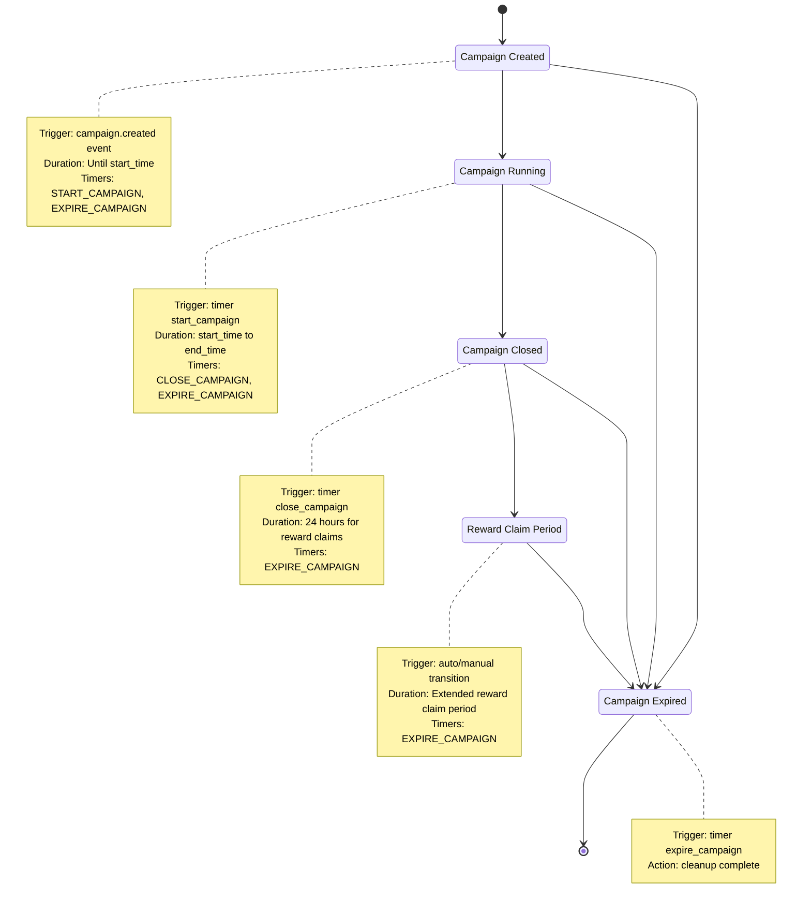
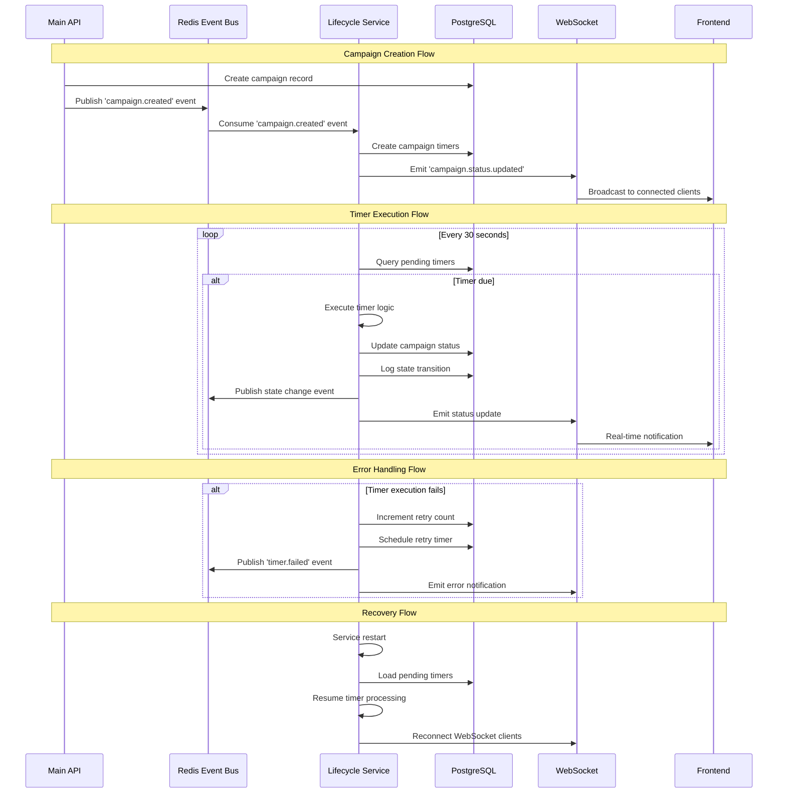
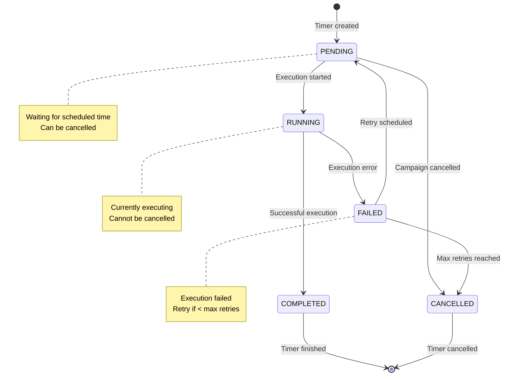
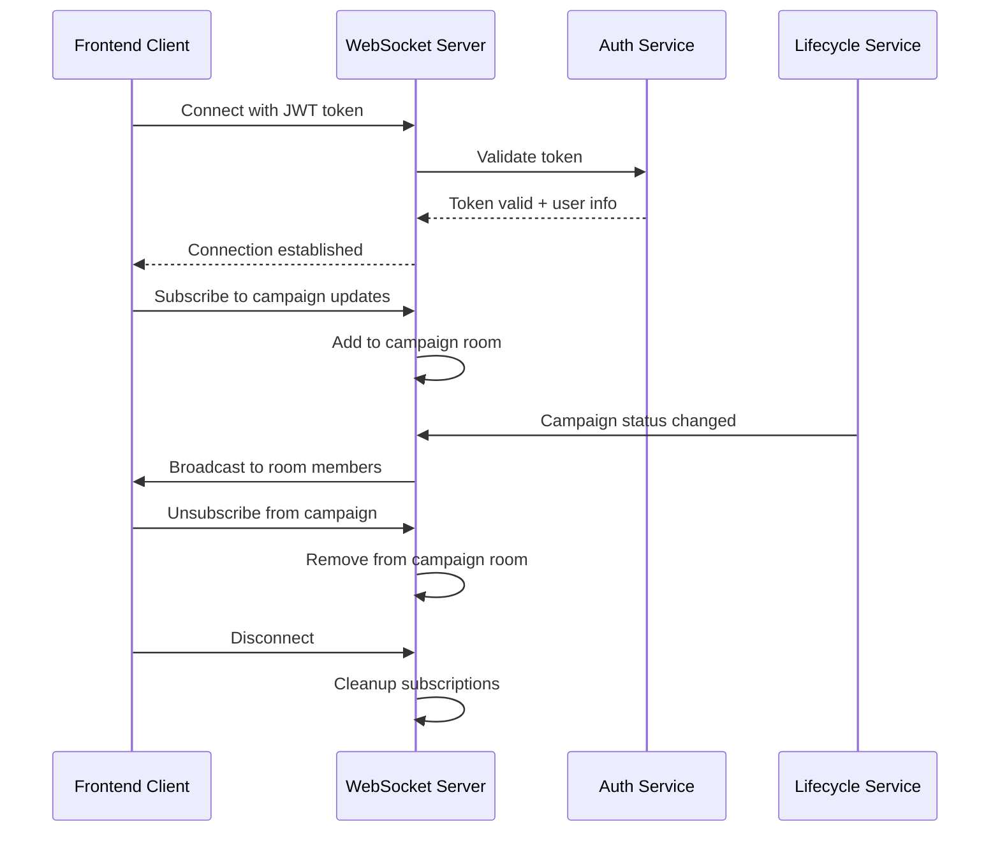

# 🔄 Event Flow & State Management

## 🎯 **Overview**

The Campaign Lifecycle Service operates on an event-driven architecture where campaign state transitions are triggered by events and managed through automated timers with real-time notifications.

---

## 📊 **Campaign State Machine**



---

## 🚀 **Event Flow Diagram**



---

## 📋 **Event Types & Payloads**

### **1. Inbound Events (Consumed)**

#### **campaign.created**
```json
{
  "eventType": "campaign.created",
  "eventId": "uuid-v4",
  "timestamp": "2024-01-15T10:30:00Z",
  "source": "main-api",
  "data": {
    "campaignId": "campaign-uuid",
    "startTime": "2024-01-15T12:00:00Z",
    "endTime": "2024-01-16T12:00:00Z",
    "durationHours": 24,
    "autoClose": true,
    "rewardsEnabled": true,
    "metadata": {
      "createdBy": "user-uuid",
      "campaignType": "engagement",
      "targetPlatform": "twitter"
    }
  }
}
```

#### **campaign.updated**
```json
{
  "eventType": "campaign.updated",
  "eventId": "uuid-v4",
  "timestamp": "2024-01-15T10:30:00Z",
  "source": "main-api",
  "data": {
    "campaignId": "campaign-uuid",
    "changes": {
      "endTime": "2024-01-17T12:00:00Z",
      "durationHours": 48
    },
    "reason": "manual_extension",
    "updatedBy": "user-uuid"
  }
}
```

#### **campaign.cancelled**
```json
{
  "eventType": "campaign.cancelled",
  "eventId": "uuid-v4",
  "timestamp": "2024-01-15T10:30:00Z",
  "source": "main-api",
  "data": {
    "campaignId": "campaign-uuid",
    "reason": "insufficient_funds",
    "cancelledBy": "user-uuid"
  }
}
```

### **2. Outbound Events (Published)**

#### **campaign.status.changed**
```json
{
  "eventType": "campaign.status.changed",
  "eventId": "uuid-v4",
  "timestamp": "2024-01-15T12:00:00Z",
  "source": "lifecycle-service",
  "data": {
    "campaignId": "campaign-uuid",
    "fromStatus": "CREATED",
    "toStatus": "RUNNING",
    "trigger": "timer.start_campaign",
    "metadata": {
      "timerId": "timer-uuid",
      "executionTime": "2024-01-15T12:00:01Z",
      "processingTimeMs": 145
    }
  }
}
```

#### **timer.scheduled**
```json
{
  "eventType": "timer.scheduled",
  "eventId": "uuid-v4",
  "timestamp": "2024-01-15T10:30:00Z",
  "source": "lifecycle-service",
  "data": {
    "timerId": "timer-uuid",
    "campaignId": "campaign-uuid",
    "timerType": "START_CAMPAIGN",
    "scheduledAt": "2024-01-15T12:00:00Z",
    "payload": {
      "targetStatus": "RUNNING",
      "notificationEnabled": true
    }
  }
}
```

#### **timer.executed**
```json
{
  "eventType": "timer.executed",
  "eventId": "uuid-v4",
  "timestamp": "2024-01-15T12:00:01Z",
  "source": "lifecycle-service",
  "data": {
    "timerId": "timer-uuid",
    "campaignId": "campaign-uuid",
    "timerType": "START_CAMPAIGN",
    "status": "COMPLETED",
    "executionTime": "2024-01-15T12:00:01Z",
    "processingTimeMs": 145,
    "result": {
      "statusChanged": true,
      "newStatus": "RUNNING",
      "notificationsSent": 1
    }
  }
}
```

#### **timer.failed**
```json
{
  "eventType": "timer.failed",
  "eventId": "uuid-v4",
  "timestamp": "2024-01-15T12:00:01Z",
  "source": "lifecycle-service",
  "data": {
    "timerId": "timer-uuid",
    "campaignId": "campaign-uuid",
    "timerType": "START_CAMPAIGN",
    "error": "Database connection timeout",
    "retryCount": 1,
    "nextRetryAt": "2024-01-15T12:05:00Z",
    "maxRetries": 5
  }
}
```

---

## ⏱️ **Timer Management Flow**

### **Timer Lifecycle**



### **Timer Processing Algorithm**

```typescript
// Pseudo-code for timer processing
async function processTimers() {
  while (serviceRunning) {
    try {
      // 1. Get pending timers
      const pendingTimers = await db.getPendingTimers({
        scheduledBefore: new Date(),
        status: 'PENDING',
        limit: 10
      });

      // 2. Process each timer
      for (const timer of pendingTimers) {
        await processTimer(timer);
      }

      // 3. Wait before next check
      await sleep(30000); // 30 seconds

    } catch (error) {
      logger.error('Timer processing error:', error);
      await sleep(60000); // 1 minute on error
    }
  }
}

async function processTimer(timer: CampaignTimer) {
  // 1. Mark as running
  await db.updateTimerStatus(timer.id, 'RUNNING');
  
  // 2. Create execution record
  const execution = await db.createTimerExecution(timer.id);
  
  try {
    // 3. Execute timer logic
    const result = await executeTimerLogic(timer);
    
    // 4. Mark as completed
    await db.completeTimerExecution(execution.id, result);
    await db.updateTimerStatus(timer.id, 'COMPLETED');
    
    // 5. Publish success event
    await eventBus.publish('timer.executed', {
      timerId: timer.id,
      status: 'COMPLETED',
      result
    });
    
  } catch (error) {
    // 6. Handle failure
    await db.failTimerExecution(execution.id, error.message);
    
    if (timer.retryCount < MAX_RETRIES) {
      // Schedule retry
      await scheduleRetry(timer);
    } else {
      // Max retries reached
      await db.updateTimerStatus(timer.id, 'CANCELLED');
    }
    
    // Publish failure event
    await eventBus.publish('timer.failed', {
      timerId: timer.id,
      error: error.message,
      retryCount: timer.retryCount
    });
  }
}
```

---

## 🎯 **State Transition Rules**

### **Valid Transitions**

| From State | To State | Trigger | Conditions |
|------------|----------|---------|------------|
| `CREATED` | `RUNNING` | Timer: START_CAMPAIGN | `start_time` reached |
| `CREATED` | `EXPIRED` | Timer: EXPIRE_CAMPAIGN | `end_time` passed without starting |
| `RUNNING` | `CLOSED` | Timer: CLOSE_CAMPAIGN | `end_time` reached |
| `RUNNING` | `EXPIRED` | Timer: EXPIRE_CAMPAIGN | Grace period exceeded |
| `CLOSED` | `REWARD_CLAIM` | Auto/Manual | Rewards enabled |
| `CLOSED` | `EXPIRED` | Timer: EXPIRE_CAMPAIGN | No rewards or timeout |
| `REWARD_CLAIM` | `EXPIRED` | Timer: EXPIRE_CAMPAIGN | Claim period ended |

### **Invalid Transitions**

- Direct transition from `CREATED` to `CLOSED`
- Transition from `EXPIRED` to any other state
- Transition from `RUNNING` to `REWARD_CLAIM`
- Any transition back to `CREATED`

### **Business Rules**

```typescript
// State transition validation
const VALID_TRANSITIONS = {
  'CREATED': ['RUNNING', 'EXPIRED'],
  'RUNNING': ['CLOSED', 'EXPIRED'],
  'CLOSED': ['REWARD_CLAIM', 'EXPIRED'],
  'REWARD_CLAIM': ['EXPIRED'],
  'EXPIRED': [] // Terminal state
};

function validateTransition(fromState: string, toState: string): boolean {
  return VALID_TRANSITIONS[fromState]?.includes(toState) ?? false;
}

// Time-based business rules  
function canTransitionToRunning(campaign: Campaign): boolean {
  const now = new Date();
  const startTime = new Date(campaign.startTime);
  const gracePeriod = 5 * 60 * 1000; // 5 minutes
  
  return (
    campaign.status === 'CREATED' &&
    now >= startTime &&
    now <= new Date(startTime.getTime() + gracePeriod)
  );
}

function shouldAutoClose(campaign: Campaign): boolean {
  const now = new Date();
  const endTime = new Date(campaign.endTime);
  
  return (
    campaign.status === 'RUNNING' &&
    campaign.autoClose &&
    now >= endTime
  );
}
```

---

## 📱 **WebSocket Events**

### **Client Connection Flow**



### **WebSocket Event Types**

#### **campaign.status.updated**
```json
{
  "event": "campaign.status.updated",
  "timestamp": "2024-01-15T12:00:01Z",
  "data": {
    "campaignId": "campaign-uuid",
    "status": "RUNNING",
    "previousStatus": "CREATED",
    "transition": {
      "trigger": "timer.start_campaign",
      "timestamp": "2024-01-15T12:00:01Z",
      "metadata": {
        "timerId": "timer-uuid",
        "processingTime": "145ms"
      }
    }
  }
}
```

#### **campaign.timer.scheduled**
```json
{
  "event": "campaign.timer.scheduled",
  "timestamp": "2024-01-15T10:30:00Z",
  "data": {
    "campaignId": "campaign-uuid",
    "timers": [
      {
        "id": "timer-uuid-1",
        "type": "START_CAMPAIGN",
        "scheduledAt": "2024-01-15T12:00:00Z"
      },
      {
        "id": "timer-uuid-2", 
        "type": "CLOSE_CAMPAIGN",
        "scheduledAt": "2024-01-16T12:00:00Z"
      }
    ]
  }
}
```

#### **campaign.error**
```json
{
  "event": "campaign.error",
  "timestamp": "2024-01-15T12:00:01Z",
  "data": {
    "campaignId": "campaign-uuid",
    "error": {
      "type": "TIMER_EXECUTION_FAILED",
      "message": "Failed to start campaign due to database timeout",
      "code": "ERR_DB_TIMEOUT",
      "retryable": true,
      "retryAt": "2024-01-15T12:05:00Z"
    }
  }
}
```

---

## 🔄 **Event Bus Configuration**

### **Redis Streams Setup**

```typescript
// Stream configuration
const STREAMS = {
  'campaign-events': {
    maxlen: 10000,
    groups: ['lifecycle-service', 'analytics-service']
  },
  'timer-events': {
    maxlen: 5000,
    groups: ['monitoring-service']
  },
  'notification-events': {
    maxlen: 2000,
    groups: ['websocket-service', 'email-service']
  }
};

// Consumer group setup
async function setupConsumerGroups() {
  for (const [stream, config] of Object.entries(STREAMS)) {
    for (const group of config.groups) {
      try {
        await redis.xgroup('CREATE', stream, group, '$', 'MKSTREAM');
      } catch (error) {
        if (!error.message.includes('BUSYGROUP')) {
          throw error;
        }
      }
    }
  }
}
```

### **Event Publishing**

```typescript
// Event publisher
class EventPublisher {
  async publishCampaignEvent(event: CampaignEvent) {
    const streamData = {
      eventType: event.type,
      eventId: event.id,
      timestamp: event.timestamp.toISOString(),
      source: 'lifecycle-service',
      data: JSON.stringify(event.data)
    };
    
    await this.redis.xadd(
      'campaign-events',
      'MAXLEN', '~', '10000',
      '*',
      ...Object.entries(streamData).flat()
    );
  }
  
  async publishTimerEvent(event: TimerEvent) {
    const streamData = {
      eventType: event.type,
      eventId: event.id,
      timestamp: event.timestamp.toISOString(),
      source: 'lifecycle-service',
      data: JSON.stringify(event.data)
    };
    
    await this.redis.xadd(
      'timer-events',
      'MAXLEN', '~', '5000',
      '*',
      ...Object.entries(streamData).flat()
    );
  }
}
```

### **Event Consumption**

```typescript
// Event consumer
class EventConsumer {
  async consumeEvents() {
    while (this.running) {
      try {
        const streams = await this.redis.xreadgroup(
          'GROUP', 'lifecycle-service', 'consumer-1',
          'COUNT', '10',
          'BLOCK', '1000',
          'STREAMS', 'campaign-events', '>'
        );
        
        for (const stream of streams) {
          for (const message of stream[1]) {
            await this.processMessage(message);
            await this.redis.xack('campaign-events', 'lifecycle-service', message[0]);
          }
        }
        
      } catch (error) {
        this.logger.error('Event consumption error:', error);
        await this.sleep(5000);
      }
    }
  }
  
  async processMessage(message: RedisStreamMessage) {
    const eventData = this.parseMessage(message);
    
    switch (eventData.eventType) {
      case 'campaign.created':
        await this.handleCampaignCreated(eventData);
        break;
      case 'campaign.updated':
        await this.handleCampaignUpdated(eventData);
        break;
      case 'campaign.cancelled':
        await this.handleCampaignCancelled(eventData);
        break;
      default:
        this.logger.warn('Unknown event type:', eventData.eventType);
    }
  }
}
```

---

## 📊 **Event Flow Monitoring**

### **Key Metrics**

```typescript
// Metrics collection
const eventMetrics = {
  // Event processing
  eventsProcessed: new Counter('events_processed_total'),
  eventProcessingDuration: new Histogram('event_processing_duration_ms'),
  eventProcessingErrors: new Counter('event_processing_errors_total'),
  
  // Timer execution
  timersExecuted: new Counter('timers_executed_total'),
  timerExecutionDuration: new Histogram('timer_execution_duration_ms'),
  timerFailures: new Counter('timer_failures_total'),
  
  // State transitions
  stateTransitions: new Counter('state_transitions_total'),
  invalidTransitions: new Counter('invalid_transitions_total'),
  
  // WebSocket
  websocketConnections: new Gauge('websocket_connections_active'),
  websocketMessages: new Counter('websocket_messages_sent_total')
};
```

### **Health Checks**

```typescript
// Service health checks
async function healthCheck(): Promise<HealthStatus> {
  const checks = await Promise.allSettled([
    checkDatabase(),
    checkRedis(),
    checkEventConsumption(),
    checkTimerProcessing(),
    checkWebSocketConnections()
  ]);
  
  const results = checks.map((check, index) => ({
    name: ['database', 'redis', 'events', 'timers', 'websocket'][index],
    status: check.status === 'fulfilled' ? 'healthy' : 'unhealthy',
    error: check.status === 'rejected' ? check.reason.message : null
  }));
  
  const overallHealth = results.every(r => r.status === 'healthy') ? 'healthy' : 'unhealthy';
  
  return {
    status: overallHealth,
    timestamp: new Date().toISOString(),
    checks: results
  };
}
```

---

*This event flow design ensures reliable, scalable, and observable campaign lifecycle management with proper error handling and recovery mechanisms.*
