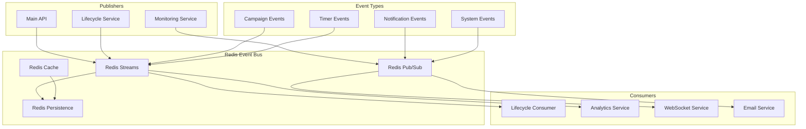

# 🚌 Redis Event Bus Implementation

## 🎯 **Overview**

The Campaign Lifecycle Service uses Redis as a cost-effective, reliable event bus for inter-service communication, event persistence, and crash recovery with Redis Streams and Pub/Sub patterns.

---

## 🏗️ **Redis Architecture**



---

## 📊 **Stream Design**

### **1. Stream Structure**

| Stream Name | Purpose | Retention | Consumer Groups |
|-------------|---------|-----------|-----------------|
| `campaign-events` | Campaign lifecycle events | 10,000 messages | `lifecycle-service`, `analytics-service` |
| `timer-events` | Timer execution events | 5,000 messages | `monitoring-service`, `audit-service` |
| `notification-events` | Real-time notifications | 2,000 messages | `websocket-service`, `email-service` |
| `system-events` | Service health & metrics | 1,000 messages | `monitoring-service` |

### **2. Stream Configuration**

```typescript
// Redis Streams configuration
interface StreamConfig {
  name: string;
  maxLength: number;
  consumerGroups: string[];
  retention: 'count' | 'time';
  retentionValue: number;
}

const STREAM_CONFIGS: StreamConfig[] = [
  {
    name: 'campaign-events',
    maxLength: 10000,
    consumerGroups: ['lifecycle-service', 'analytics-service', 'audit-service'],
    retention: 'count',
    retentionValue: 10000
  },
  {
    name: 'timer-events', 
    maxLength: 5000,
    consumerGroups: ['monitoring-service', 'audit-service'],
    retention: 'count',
    retentionValue: 5000
  },
  {
    name: 'notification-events',
    maxLength: 2000,
    consumerGroups: ['websocket-service', 'email-service', 'push-service'],
    retention: 'time',
    retentionValue: 86400000 // 24 hours in ms
  },
  {
    name: 'system-events',
    maxLength: 1000,
    consumerGroups: ['monitoring-service'],
    retention: 'time',
    retentionValue: 3600000 // 1 hour in ms
  }
];
```

---

## 🔧 **Event Bus Implementation**

### **1. Redis Connection & Setup**

```typescript
import Redis from 'ioredis';
import { EventEmitter } from 'events';

class RedisEventBus extends EventEmitter {
  private redis: Redis;
  private publisher: Redis;
  private subscriber: Redis;
  private streams: Map<string, StreamConsumer> = new Map();
  
  constructor(config: RedisConfig) {
    super();
    
    // Main Redis connection
    this.redis = new Redis({
      host: config.host,
      port: config.port,
      password: config.password,
      db: config.database,
      retryDelayOnFailover: 100,
      maxRetriesPerRequest: 3,
      lazyConnect: true,
      keepAlive: 30000,
      connectionName: 'event-bus-main'
    });
    
    // Dedicated publisher connection
    this.publisher = new Redis({
      ...config,
      connectionName: 'event-bus-publisher'
    });
    
    // Dedicated subscriber connection  
    this.subscriber = new Redis({
      ...config,
      connectionName: 'event-bus-subscriber'
    });
    
    this.setupErrorHandlers();
  }
  
  async initialize(): Promise<void> {
    try {
      await Promise.all([
        this.redis.connect(),
        this.publisher.connect(),
        this.subscriber.connect()
      ]);
      
      await this.setupStreams();
      await this.setupConsumerGroups();
      
      this.emit('ready');
      
    } catch (error) {
      this.emit('error', error);
      throw error;
    }
  }
  
  private async setupStreams(): Promise<void> {
    for (const config of STREAM_CONFIGS) {
      try {
        // Create stream if it doesn't exist
        await this.redis.xadd(config.name, 'MAXLEN', '0', '*', 'init', 'true');
        await this.redis.xdel(config.name, '*');
        
      } catch (error) {
        // Stream might already exist
        if (!error.message.includes('NOGROUP')) {
          throw error;
        }
      }
    }
  }
  
  private async setupConsumerGroups(): Promise<void> {
    for (const config of STREAM_CONFIGS) {
      for (const group of config.consumerGroups) {
        try {
          await this.redis.xgroup(
            'CREATE',
            config.name,
            group,
            '$',
            'MKSTREAM'
          );
          
        } catch (error) {
          // Group might already exist
          if (!error.message.includes('BUSYGROUP')) {
            throw error;
          }
        }
      }
    }
  }
}
```

### **2. Event Publishing**

```typescript
interface EventMetadata {
  eventId: string;
  eventType: string;
  timestamp: Date;
  source: string;
  correlationId?: string;
  causationId?: string;
}

interface Event {
  metadata: EventMetadata;
  data: any;
}

class EventPublisher {
  constructor(private redis: Redis) {}
  
  async publishCampaignEvent(event: Event): Promise<string> {
    const streamData = this.serializeEvent(event);
    
    const messageId = await this.redis.xadd(
      'campaign-events',
      'MAXLEN', '~', '10000', // Approximate trimming
      '*', // Auto-generate ID
      ...streamData
    );
    
    // Also publish to pub/sub for real-time notifications
    if (this.isRealTimeEvent(event)) {
      await this.redis.publish(
        `campaign:${event.data.campaignId}`,
        JSON.stringify(event)
      );
    }
    
    return messageId;
  }
  
  async publishTimerEvent(event: Event): Promise<string> {
    const streamData = this.serializeEvent(event);
    
    return await this.redis.xadd(
      'timer-events',
      'MAXLEN', '~', '5000',
      '*',
      ...streamData
    );
  }
  
  async publishNotificationEvent(event: Event): Promise<void> {
    // Use pub/sub for real-time notifications
    const channel = this.getNotificationChannel(event);
    await this.redis.publish(channel, JSON.stringify(event));
    
    // Also store in stream for persistence
    const streamData = this.serializeEvent(event);
    await this.redis.xadd(
      'notification-events',
      'MAXLEN', '~', '2000',
      '*',
      ...streamData
    );
  }
  
  private serializeEvent(event: Event): string[] {
    return [
      'eventId', event.metadata.eventId,
      'eventType', event.metadata.eventType,
      'timestamp', event.metadata.timestamp.toISOString(),
      'source', event.metadata.source,
      'correlationId', event.metadata.correlationId || '',
      'causationId', event.metadata.causationId || '',
      'data', JSON.stringify(event.data)
    ];
  }
  
  private isRealTimeEvent(event: Event): boolean {
    const realTimeEvents = [
      'campaign.status.changed',
      'campaign.timer.executed',
      'campaign.error'
    ];
    return realTimeEvents.includes(event.metadata.eventType);
  }
  
  private getNotificationChannel(event: Event): string {
    switch (event.metadata.eventType) {
      case 'campaign.status.changed':
        return `campaign:${event.data.campaignId}:status`;
      case 'timer.executed':
        return `timer:${event.data.timerId}:executed`;
      case 'system.alert':
        return 'system:alerts';
      default:
        return 'notifications:general';
    }
  }
}
```

### **3. Event Consumption**

```typescript
interface ConsumerConfig {
  groupName: string;
  consumerName: string;
  streamName: string;
  batchSize: number;
  blockTime: number; // milliseconds
  processingTimeout: number;
}

class StreamConsumer {
  private running: boolean = false;
  private processingQueue: Map<string, NodeJS.Timeout> = new Map();
  
  constructor(
    private redis: Redis,
    private config: ConsumerConfig,
    private eventHandler: (event: Event) => Promise<void>
  ) {}
  
  async start(): Promise<void> {
    this.running = true;
    
    // Process pending messages first
    await this.processPendingMessages();
    
    // Start consuming new messages
    this.consumeMessages();
  }
  
  async stop(): Promise<void> {
    this.running = false;
    
    // Cancel all pending processing timeouts
    for (const timeout of this.processingQueue.values()) {
      clearTimeout(timeout);
    }
    this.processingQueue.clear();
  }
  
  private async consumeMessages(): Promise<void> {
    while (this.running) {
      try {
        const streams = await this.redis.xreadgroup(
          'GROUP',
          this.config.groupName,
          this.config.consumerName,
          'COUNT',
          this.config.batchSize.toString(),
          'BLOCK',
          this.config.blockTime.toString(),
          'STREAMS',
          this.config.streamName,
          '>' // Only new messages
        );
        
        if (streams && streams.length > 0) {
          await this.processStreamMessages(streams[0][1]);
        }
        
      } catch (error) {
        if (error.message.includes('NOGROUP')) {
          await this.recreateConsumerGroup();
          continue;
        }
        
        console.error('Stream consumption error:', error);
        await this.sleep(5000);
      }
    }
  }
  
  private async processStreamMessages(messages: any[]): Promise<void> {
    for (const [messageId, fields] of messages) {
      try {
        // Set processing timeout
        const timeoutId = setTimeout(() => {
          console.warn(`Message processing timeout: ${messageId}`);
          this.processingQueue.delete(messageId);
        }, this.config.processingTimeout);
        
        this.processingQueue.set(messageId, timeoutId);
        
        // Parse and process event
        const event = this.deserializeEvent(fields);
        await this.eventHandler(event);
        
        // Acknowledge successful processing
        await this.redis.xack(
          this.config.streamName,
          this.config.groupName,
          messageId
        );
        
        // Clear timeout
        clearTimeout(timeoutId);
        this.processingQueue.delete(messageId);
        
      } catch (error) {
        console.error(`Error processing message ${messageId}:`, error);
        
        // Don't acknowledge failed messages
        // They will be retried later
        clearTimeout(this.processingQueue.get(messageId)!);
        this.processingQueue.delete(messageId);
      }
    }
  }
  
  private async processPendingMessages(): Promise<void> {
    try {
      const pending = await this.redis.xpending(
        this.config.streamName,
        this.config.groupName,
        '-',
        '+',
        10 // Process up to 10 pending messages
      );
      
      if (pending && pending.length > 1) {
        const pendingMessages = pending.slice(1); // Skip summary
        
        for (const [messageId] of pendingMessages) {
          try {
            const messages = await this.redis.xclaim(
              this.config.streamName,
              this.config.groupName,
              this.config.consumerName,
              60000, // 1 minute idle time
              messageId
            );
            
            if (messages && messages.length > 0) {
              await this.processStreamMessages(messages);
            }
            
          } catch (error) {
            console.error(`Error claiming message ${messageId}:`, error);
          }
        }
      }
      
    } catch (error) {
      console.error('Error processing pending messages:', error);
    }
  }
  
  private deserializeEvent(fields: string[]): Event {
    const fieldMap = new Map<string, string>();
    
    for (let i = 0; i < fields.length; i += 2) {
      fieldMap.set(fields[i], fields[i + 1]);
    }
    
    return {
      metadata: {
        eventId: fieldMap.get('eventId')!,
        eventType: fieldMap.get('eventType')!,
        timestamp: new Date(fieldMap.get('timestamp')!),
        source: fieldMap.get('source')!,
        correlationId: fieldMap.get('correlationId') || undefined,
        causationId: fieldMap.get('causationId') || undefined
      },
      data: JSON.parse(fieldMap.get('data')!)
    };
  }
  
  private async recreateConsumerGroup(): Promise<void> {
    try {
      await this.redis.xgroup(
        'CREATE',
        this.config.streamName,
        this.config.groupName,
        '$',
        'MKSTREAM'
      );
    } catch (error) {
      if (!error.message.includes('BUSYGROUP')) {
        throw error;
      }
    }
  }
  
  private sleep(ms: number): Promise<void> {
    return new Promise(resolve => setTimeout(resolve, ms));
  }
}
```

---

## 🔄 **Pub/Sub for Real-Time Events**

### **1. Real-Time Subscriber**

```typescript
class RealTimeSubscriber {
  private subscribers: Map<string, Set<Function>> = new Map();
  
  constructor(private redis: Redis) {
    this.setupSubscriptions();
  }
  
  private setupSubscriptions(): void {
    // Subscribe to campaign-specific channels
    this.redis.psubscribe('campaign:*:status');
    this.redis.psubscribe('timer:*:executed');
    this.redis.psubscribe('system:*');
    
    this.redis.on('pmessage', (pattern, channel, message) => {
      this.handleMessage(pattern, channel, message);
    });
  }
  
  private handleMessage(pattern: string, channel: string, message: string): void {
    try {
      const event = JSON.parse(message);
      const handlers = this.subscribers.get(channel) || new Set();
      
      for (const handler of handlers) {
        // Handle async without blocking
        Promise.resolve(handler(event)).catch(error => {
          console.error('Event handler error:', error);
        });
      }
      
    } catch (error) {
      console.error('Error parsing message:', error);
    }
  }
  
  subscribe(channel: string, handler: Function): void {
    if (!this.subscribers.has(channel)) {
      this.subscribers.set(channel, new Set());
    }
    
    this.subscribers.get(channel)!.add(handler);
  }
  
  unsubscribe(channel: string, handler: Function): void {
    const handlers = this.subscribers.get(channel);
    if (handlers) {
      handlers.delete(handler);
      if (handlers.size === 0) {
        this.subscribers.delete(channel);
      }
    }
  }
}
```

### **2. WebSocket Integration**

```typescript
class WebSocketEventBridge {
  private realTimeSubscriber: RealTimeSubscriber;
  private io: SocketIOServer;
  
  constructor(io: SocketIOServer, redis: Redis) {
    this.io = io;
    this.realTimeSubscriber = new RealTimeSubscriber(redis);
    this.setupEventHandlers();
  }
  
  private setupEventHandlers(): void {
    // Campaign status updates
    this.realTimeSubscriber.subscribe('campaign:*:status', (event) => {
      const campaignId = this.extractCampaignId(event);
      this.io.to(`campaign:${campaignId}`).emit('campaign.status.updated', event);
    });
    
    // Timer execution updates
    this.realTimeSubscriber.subscribe('timer:*:executed', (event) => {
      const campaignId = event.data.campaignId;
      this.io.to(`campaign:${campaignId}`).emit('timer.executed', event);
    });
    
    // System alerts
    this.realTimeSubscriber.subscribe('system:alerts', (event) => {
      this.io.emit('system.alert', event);
    });
  }
  
  private extractCampaignId(event: any): string {
    return event.data.campaignId || event.metadata.campaignId;
  }
}
```

---

## 🛡️ **Error Handling & Resilience**

### **1. Connection Management**

```typescript
class RedisConnectionManager {
  private connectionState: 'disconnected' | 'connecting' | 'connected' = 'disconnected';
  private reconnectAttempts: number = 0;
  private maxReconnectAttempts: number = 10;
  private reconnectDelay: number = 1000;
  
  constructor(private redis: Redis) {
    this.setupConnectionHandlers();
  }
  
  private setupConnectionHandlers(): void {
    this.redis.on('connect', () => {
      this.connectionState = 'connected';
      this.reconnectAttempts = 0;
      console.log('Redis connected');
    });
    
    this.redis.on('error', (error) => {
      console.error('Redis connection error:', error);
      this.handleConnectionError(error);
    });
    
    this.redis.on('close', () => {
      this.connectionState = 'disconnected';
      console.log('Redis connection closed');
      this.attemptReconnect();
    });
    
    this.redis.on('reconnecting', () => {
      this.connectionState = 'connecting';
      console.log('Redis reconnecting...');
    });
  }
  
  private handleConnectionError(error: Error): void {
    if (error.message.includes('ECONNREFUSED')) {
      console.error('Redis server is not available');
    } else if (error.message.includes('NOAUTH')) {
      console.error('Redis authentication failed');
    } else if (error.message.includes('WRONGPASS')) {
      console.error('Redis wrong password');
    }
  }
  
  private async attemptReconnect(): Promise<void> {
    if (this.reconnectAttempts >= this.maxReconnectAttempts) {
      console.error('Max reconnection attempts reached');
      return;
    }
    
    this.reconnectAttempts++;
    const delay = this.reconnectDelay * Math.pow(2, this.reconnectAttempts - 1);
    
    setTimeout(async () => {
      try {
        await this.redis.connect();
      } catch (error) {
        console.error(`Reconnection attempt ${this.reconnectAttempts} failed:`, error);
        this.attemptReconnect();
      }
    }, delay);
  }
  
  async waitForConnection(timeout: number = 30000): Promise<void> {
    return new Promise((resolve, reject) => {
      if (this.connectionState === 'connected') {
        resolve();
        return;
      }
      
      const timeoutId = setTimeout(() => {
        reject(new Error('Connection timeout'));
      }, timeout);
      
      const checkConnection = () => {
        if (this.connectionState === 'connected') {
          clearTimeout(timeoutId);
          resolve();
        } else {
          setTimeout(checkConnection, 100);
        }
      };
      
      checkConnection();
    });
  }
}
```

### **2. Message Processing Resilience**

```typescript
class ResilientMessageProcessor {
  private dlq: DeadLetterQueue;
  private circuitBreaker: CircuitBreaker;
  
  constructor(redis: Redis) {
    this.dlq = new DeadLetterQueue(redis);
    this.circuitBreaker = new CircuitBreaker({
      timeout: 30000,
      errorThresholdPercentage: 50,
      resetTimeout: 60000
    });
  }
  
  async processMessage(message: any, handler: Function): Promise<void> {
    try {
      await this.circuitBreaker.execute(() => handler(message));
      
    } catch (error) {
      if (this.isRetryableError(error)) {
        await this.retryMessage(message, handler);
      } else {
        await this.dlq.send(message, error);
      }
      throw error;
    }
  }
  
  private isRetryableError(error: Error): boolean {
    const retryableErrors = [
      'ECONNREFUSED',
      'ETIMEDOUT',
      'ENOTFOUND',
      'Database connection timeout'
    ];
    
    return retryableErrors.some(err => error.message.includes(err));
  }
  
  private async retryMessage(message: any, handler: Function): Promise<void> {
    const retryCount = message.retryCount || 0;
    const maxRetries = 3;
    
    if (retryCount >= maxRetries) {
      await this.dlq.send(message, new Error('Max retries exceeded'));
      return;
    }
    
    const delay = Math.pow(2, retryCount) * 1000; // Exponential backoff
    
    setTimeout(async () => {
      try {
        message.retryCount = retryCount + 1;
        await this.processMessage(message, handler);
      } catch (error) {
        // Error already handled in processMessage
      }
    }, delay);
  }
}

class DeadLetterQueue {
  constructor(private redis: Redis) {}
  
  async send(message: any, error: Error): Promise<void> {
    const dlqMessage = {
      originalMessage: message,
      error: {
        message: error.message,
        stack: error.stack,
        timestamp: new Date().toISOString()
      },
      retryCount: message.retryCount || 0
    };
    
    await this.redis.lpush('dlq:campaign-events', JSON.stringify(dlqMessage));
    
    // Keep DLQ size manageable
    await this.redis.ltrim('dlq:campaign-events', 0, 999);
  }
  
  async processDLQ(): Promise<void> {
    const message = await this.redis.rpop('dlq:campaign-events');
    if (message) {
      const dlqMessage = JSON.parse(message);
      
      // Log for manual intervention
      console.error('DLQ Message:', dlqMessage);
      
      // Could implement manual retry logic here
      // Or send to external monitoring system
    }
  }
}
```

---

## 📊 **Monitoring & Metrics**

### **1. Event Bus Metrics**

```typescript
import { Counter, Histogram, Gauge } from 'prom-client';

class EventBusMetrics {
  private readonly messagesPublished = new Counter({
    name: 'eventbus_messages_published_total',
    help: 'Total number of messages published',
    labelNames: ['stream', 'event_type']
  });
  
  private readonly messagesConsumed = new Counter({
    name: 'eventbus_messages_consumed_total',
    help: 'Total number of messages consumed',
    labelNames: ['stream', 'consumer_group']
  });
  
  private readonly messageProcessingDuration = new Histogram({
    name: 'eventbus_message_processing_duration_ms',
    help: 'Message processing duration in milliseconds',
    labelNames: ['stream', 'event_type'],
    buckets: [1, 5, 10, 25, 50, 100, 250, 500, 1000, 2500, 5000]
  });
  
  private readonly activeConnections = new Gauge({
    name: 'eventbus_active_connections',
    help: 'Number of active Redis connections',
    labelNames: ['connection_type']
  });
  
  private readonly streamLength = new Gauge({
    name: 'eventbus_stream_length',
    help: 'Number of messages in stream',
    labelNames: ['stream']
  });
  
  recordMessagePublished(stream: string, eventType: string): void {
    this.messagesPublished.inc({ stream, event_type: eventType });
  }
  
  recordMessageConsumed(stream: string, consumerGroup: string): void {
    this.messagesConsumed.inc({ stream, consumer_group: consumerGroup });
  }
  
  recordProcessingDuration(stream: string, eventType: string, duration: number): void {
    this.messageProcessingDuration.observe({ stream, event_type: eventType }, duration);
  }
  
  setActiveConnections(type: string, count: number): void {
    this.activeConnections.set({ connection_type: type }, count);
  }
  
  async updateStreamMetrics(redis: Redis): Promise<void> {
    for (const config of STREAM_CONFIGS) {
      try {
        const length = await redis.xlen(config.name);
        this.streamLength.set({ stream: config.name }, length);
      } catch (error) {
        console.error(`Error getting stream length for ${config.name}:`, error);
      }
    }
  }
}
```

### **2. Health Monitoring**

```typescript
class EventBusHealthMonitor {
  private metrics: EventBusMetrics;
  private redis: Redis;
  
  constructor(redis: Redis, metrics: EventBusMetrics) {
    this.redis = redis;
    this.metrics = metrics;
    
    this.startMonitoring();
  }
  
  private startMonitoring(): void {
    // Update metrics every 30 seconds
    setInterval(() => {
      this.updateMetrics();
    }, 30000);
    
    // Health check every 10 seconds
    setInterval(() => {
      this.performHealthCheck();
    }, 10000);
  }
  
  private async updateMetrics(): Promise<void> {
    try {
      await this.metrics.updateStreamMetrics(this.redis);
      
      // Update connection count
      const info = await this.redis.info('clients');
      const connectionCount = this.parseConnectionCount(info);
      this.metrics.setActiveConnections('total', connectionCount);
      
    } catch (error) {
      console.error('Error updating metrics:', error);
    }
  }
  
  private async performHealthCheck(): Promise<void> {
    try {
      // Test Redis connectivity
      const pong = await this.redis.ping();
      if (pong !== 'PONG') {
        throw new Error('Redis ping failed');
      }
      
      // Check stream health
      for (const config of STREAM_CONFIGS) {
        const info = await this.redis.xinfo('STREAM', config.name);
        if (!info) {
          throw new Error(`Stream ${config.name} not found`);
        }
      }
      
      // Check consumer group health
      await this.checkConsumerGroups();
      
    } catch (error) {
      console.error('Health check failed:', error);
      // Could trigger alerts here
    }
  }
  
  private async checkConsumerGroups(): Promise<void> {
    for (const config of STREAM_CONFIGS) {
      try {
        const groups = await this.redis.xinfo('GROUPS', config.name);
        
        for (const group of groups) {
          const groupName = group[1];
          const pending = group[3];
          
          // Alert if too many pending messages
          if (pending > 100) {
            console.warn(`High pending count for group ${groupName}: ${pending}`);
          }
        }
        
      } catch (error) {
        console.error(`Error checking consumer groups for ${config.name}:`, error);
      }
    }
  }
  
  private parseConnectionCount(info: string): number {
    const match = info.match(/connected_clients:(\d+)/);
    return match ? parseInt(match[1], 10) : 0;
  }
}
```

---

## 🔧 **Configuration & Optimization**

### **1. Redis Configuration**

```redis
# redis.conf optimizations for event bus

# Memory optimizations
maxmemory 2gb
maxmemory-policy allkeys-lru

# Persistence for durability
save 900 1
save 300 10
save 60 10000

# AOF for better durability
appendonly yes
appendfsync everysec
no-appendfsync-on-rewrite no
auto-aof-rewrite-percentage 100
auto-aof-rewrite-min-size 64mb

# Network optimizations
tcp-keepalive 300
timeout 300

# Client connection limits
maxclients 10000

# Slow log for monitoring
slowlog-log-slower-than 10000
slowlog-max-len 128

# Stream-specific optimizations
stream-node-max-bytes 4096
stream-node-max-entries 100
```

### **2. Connection Pool Configuration**

```typescript
interface RedisPoolConfig {
  host: string;
  port: number;
  password?: string;
  database: number;
  poolSize: number;
  connectTimeout: number;
  commandTimeout: number;
  retryDelayOnFailover: number;
  maxRetriesPerRequest: number;
  keepAlive: number;
}

const REDIS_CONFIG: RedisPoolConfig = {
  host: process.env.REDIS_HOST || 'localhost',
  port: parseInt(process.env.REDIS_PORT || '6379'),
  password: process.env.REDIS_PASSWORD,
  database: parseInt(process.env.REDIS_DB || '0'),
  poolSize: 10,
  connectTimeout: 10000,
  commandTimeout: 5000,
  retryDelayOnFailover: 100,
  maxRetriesPerRequest: 3,
  keepAlive: 30000
};

class RedisConnectionPool {
  private pool: Redis[] = [];
  private currentIndex: number = 0;
  
  constructor(private config: RedisPoolConfig) {
    this.initializePool();
  }
  
  private initializePool(): void {
    for (let i = 0; i < this.config.poolSize; i++) {
      const connection = new Redis({
        host: this.config.host,
        port: this.config.port,
        password: this.config.password,
        db: this.config.database,
        connectTimeout: this.config.connectTimeout,
        commandTimeout: this.config.commandTimeout,
        retryDelayOnFailover: this.config.retryDelayOnFailover,
        maxRetriesPerRequest: this.config.maxRetriesPerRequest,
        keepAlive: this.config.keepAlive,
        connectionName: `pool-connection-${i}`,
        lazyConnect: true
      });
      
      this.pool.push(connection);
    }
  }
  
  getConnection(): Redis {
    const connection = this.pool[this.currentIndex];
    this.currentIndex = (this.currentIndex + 1) % this.pool.length;
    return connection;
  }
  
  async closeAll(): Promise<void> {
    await Promise.all(this.pool.map(conn => conn.quit()));
  }
}
```

---

*This Redis event bus implementation provides a robust, scalable, and cost-effective foundation for event-driven communication with excellent monitoring and error handling capabilities.*
