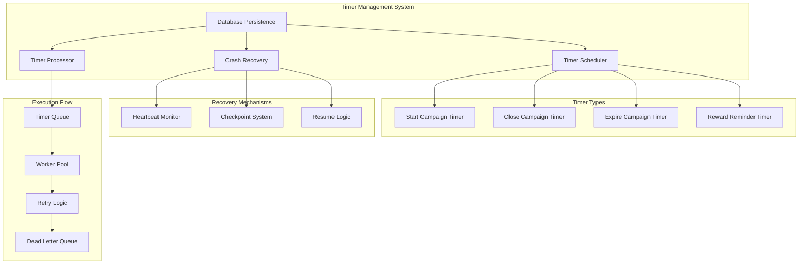

# ⏰ Timer Management & Crash Recovery

## 🎯 **Overview**

The Campaign Lifecycle Service implements persistent timers with crash recovery capabilities, ensuring campaign state transitions occur reliably even after service restarts or failures.

---

## 🏗️ **Timer Architecture**



---

## ⚡ **Timer Types & Logic**

### **1. Timer Type Definitions**

| Timer Type | Purpose | Trigger Condition | Target State | Duration |
|------------|---------|-------------------|--------------|----------|
| `START_CAMPAIGN` | Begin campaign execution | `start_time` reached | `CREATED` → `RUNNING` | At scheduled start time |
| `CLOSE_CAMPAIGN` | End campaign execution | `end_time` reached | `RUNNING` → `CLOSED` | At scheduled end time |
| `EXPIRE_CAMPAIGN` | Force campaign expiration | Grace period exceeded | Any → `EXPIRED` | Variable based on state |
| `REWARD_REMINDER` | Notify about reward claims | 24h before expiry | No state change | 24h after close |

### **2. Timer Scheduling Logic**

```typescript
interface TimerSchedule {
  id: string;
  campaignId: string;
  type: TimerType;
  scheduledAt: Date;
  payload: TimerPayload;
  retryCount: number;
  maxRetries: number;
  status: TimerStatus;
}

enum TimerType {
  START_CAMPAIGN = 'START_CAMPAIGN',
  CLOSE_CAMPAIGN = 'CLOSE_CAMPAIGN', 
  EXPIRE_CAMPAIGN = 'EXPIRE_CAMPAIGN',
  REWARD_REMINDER = 'REWARD_REMINDER'
}

enum TimerStatus {
  PENDING = 'PENDING',
  RUNNING = 'RUNNING',
  COMPLETED = 'COMPLETED',
  FAILED = 'FAILED',
  CANCELLED = 'CANCELLED'
}

class TimerScheduler {
  private db: DatabaseService;
  private eventBus: EventBus;
  
  async scheduleCampaignTimers(campaign: Campaign): Promise<TimerSchedule[]> {
    const timers: TimerSchedule[] = [];
    
    // 1. Start Campaign Timer
    if (campaign.startTime && campaign.status === 'CREATED') {
      timers.push({
        id: uuidv4(),
        campaignId: campaign.id,
        type: TimerType.START_CAMPAIGN,
        scheduledAt: new Date(campaign.startTime),
        payload: { targetStatus: 'RUNNING' },
        retryCount: 0,
        maxRetries: 3,
        status: TimerStatus.PENDING
      });
    }
    
    // 2. Close Campaign Timer
    if (campaign.endTime && campaign.autoClose) {
      timers.push({
        id: uuidv4(),
        campaignId: campaign.id,
        type: TimerType.CLOSE_CAMPAIGN,
        scheduledAt: new Date(campaign.endTime),
        payload: { targetStatus: 'CLOSED' },
        retryCount: 0,
        maxRetries: 3,
        status: TimerStatus.PENDING
      });
    }
    
    // 3. Expiry Timer (safety net)
    const expiryTime = this.calculateExpiryTime(campaign);
    timers.push({
      id: uuidv4(),
      campaignId: campaign.id,
      type: TimerType.EXPIRE_CAMPAIGN,
      scheduledAt: expiryTime,
      payload: { targetStatus: 'EXPIRED', reason: 'auto_expire' },
      retryCount: 0,
      maxRetries: 5,
      status: TimerStatus.PENDING
    });
    
    // 4. Reward Reminder Timer
    if (campaign.rewardsEnabled) {
      const reminderTime = new Date(campaign.endTime);
      reminderTime.setHours(reminderTime.getHours() + 23); // 23h after close
      
      timers.push({
        id: uuidv4(),
        campaignId: campaign.id,
        type: TimerType.REWARD_REMINDER,
        scheduledAt: reminderTime,
        payload: { reminderType: 'reward_claim_ending' },
        retryCount: 0,
        maxRetries: 2,
        status: TimerStatus.PENDING
      });
    }
    
    // Save to database
    await this.db.saveTimers(timers);
    
    // Publish timer scheduled events
    for (const timer of timers) {
      await this.eventBus.publish('timer.scheduled', {
        timerId: timer.id,
        campaignId: timer.campaignId,
        timerType: timer.type,
        scheduledAt: timer.scheduledAt
      });
    }
    
    return timers;
  }
  
  private calculateExpiryTime(campaign: Campaign): Date {
    const baseTime = campaign.endTime ? new Date(campaign.endTime) : new Date(campaign.startTime);
    
    // Add grace periods based on campaign state
    switch (campaign.status) {
      case 'CREATED':
        // Expire 1 hour after start time if not started
        baseTime.setHours(baseTime.getHours() + 1);
        break;
      case 'RUNNING':
        // Expire 2 hours after end time if not closed
        baseTime.setHours(baseTime.getHours() + 2);
        break;
      case 'CLOSED':
        // Expire 48 hours after close for reward claims
        baseTime.setHours(baseTime.getHours() + 48);
        break;
      case 'REWARD_CLAIM':
        // Expire 7 days after reward claim period starts
        baseTime.setDate(baseTime.getDate() + 7);
        break;
      default:
        // Default 24 hour expiry
        baseTime.setHours(baseTime.getHours() + 24);
    }
    
    return baseTime;
  }
}
```

---

## 🔄 **Timer Processing Engine**

### **1. Processing Loop**

```typescript
class TimerProcessor {
  private running: boolean = false;
  private processingInterval: NodeJS.Timeout | null = null;
  private workerPool: TimerWorker[] = [];
  private readonly BATCH_SIZE = 10;
  private readonly POLL_INTERVAL = 30000; // 30 seconds
  
  constructor(
    private db: DatabaseService,
    private eventBus: EventBus,
    private metrics: MetricsService,
    private workerCount: number = 3
  ) {
    this.initializeWorkerPool();
  }
  
  async start(): Promise<void> {
    if (this.running) return;
    
    this.running = true;
    console.log('Starting timer processor...');
    
    // Start processing loop
    this.processingInterval = setInterval(() => {
      this.processTimers().catch(error => {
        console.error('Timer processing error:', error);
        this.metrics.incrementTimerProcessingErrors();
      });
    }, this.POLL_INTERVAL);
    
    // Start worker pool
    this.workerPool.forEach(worker => worker.start());
    
    console.log(`Timer processor started with ${this.workerCount} workers`);
  }
  
  async stop(): Promise<void> {
    if (!this.running) return;
    
    this.running = false;
    console.log('Stopping timer processor...');;
    
    // Stop processing loop
    if (this.processingInterval) {
      clearInterval(this.processingInterval);
      this.processingInterval = null;
    }
    
    // Stop worker pool
    await Promise.all(this.workerPool.map(worker => worker.stop()));
    
    console.log('Timer processor stopped');
  }
  
  private async processTimers(): Promise<void> {
    try {
      // Get pending timers that are due
      const pendingTimers = await this.db.getPendingTimers({
        status: TimerStatus.PENDING,
        scheduledBefore: new Date(),
        limit: this.BATCH_SIZE
      });
      
      if (pendingTimers.length === 0) return;
      
      console.log(`Processing ${pendingTimers.length} pending timers`);
      
      // Distribute timers among workers
      for (let i = 0; i < pendingTimers.length; i++) {
        const worker = this.workerPool[i % this.workerPool.length];
        await worker.scheduleTimer(pendingTimers[i]);
      }
      
      this.metrics.recordTimersProcessed(pendingTimers.length);
      
    } catch (error) {
      console.error('Error in timer processing loop:', error);
      throw error;
    }
  }
  
  private initializeWorkerPool(): void {
    for (let i = 0; i < this.workerCount; i++) {
      const worker = new TimerWorker(
        `worker-${i}`,
        this.db,
        this.eventBus,
        this.metrics
      );
      this.workerPool.push(worker);
    }
  }
}
```

### **2. Timer Worker Implementation**

```typescript
class TimerWorker {
  private queue: TimerSchedule[] = [];
  private processing: boolean = false;
  private running: boolean = false;
  
  constructor(
    private workerId: string,
    private db: DatabaseService,
    private eventBus: EventBus,
    private metrics: MetricsService
  ) {}
  
  async start(): Promise<void> {
    this.running = true;
    this.processQueue();
  }
  
  async stop(): Promise<void> {
    this.running = false;
    
    // Wait for current processing to complete
    while (this.processing) {
      await this.sleep(100);
    }
  }
  
  async scheduleTimer(timer: TimerSchedule): Promise<void> {
    this.queue.push(timer);
  }
  
  private async processQueue(): Promise<void> {
    while (this.running) {
      if (this.queue.length > 0 && !this.processing) {
        this.processing = true;
        
        const timer = this.queue.shift()!;
        
        try {
          await this.executeTimer(timer);
        } catch (error) {
          console.error(`Worker ${this.workerId} timer execution error:`, error);
        } finally {
          this.processing = false;
        }
      }
      
      await this.sleep(1000); // 1 second polling
    }
  }
  
  private async executeTimer(timer: TimerSchedule): Promise<void> {
    const startTime = Date.now();
    
    try {
      // Mark timer as running
      await this.db.updateTimerStatus(timer.id, TimerStatus.RUNNING);
      
      // Create execution record
      const execution = await this.db.createTimerExecution({
        timerId: timer.id,
        status: 'STARTED',
        startedAt: new Date()
      });
      
      // Execute timer logic based on type
      const result = await this.executeTimerLogic(timer);
      
      // Mark as completed
      await this.db.completeTimerExecution(execution.id, {
        status: 'COMPLETED',
        result,
        completedAt: new Date(),
        executionTimeMs: Date.now() - startTime
      });
      
      await this.db.updateTimerStatus(timer.id, TimerStatus.COMPLETED, new Date());
      
      // Publish success event
      await this.eventBus.publish('timer.executed', {
        timerId: timer.id,
        campaignId: timer.campaignId,
        timerType: timer.type,
        status: 'COMPLETED',
        executionTimeMs: Date.now() - startTime,
        result
      });
      
      this.metrics.recordTimerExecution(timer.type, Date.now() - startTime, true);
      
    } catch (error) {
      await this.handleTimerFailure(timer, error, startTime);
      this.metrics.recordTimerExecution(timer.type, Date.now() - startTime, false);
    }
  }
  
  private async executeTimerLogic(timer: TimerSchedule): Promise<any> {
    switch (timer.type) {
      case TimerType.START_CAMPAIGN:
        return await this.startCampaign(timer);
      case TimerType.CLOSE_CAMPAIGN:
        return await this.closeCampaign(timer);
      case TimerType.EXPIRE_CAMPAIGN:
        return await this.expireCampaign(timer);
      case TimerType.REWARD_REMINDER:
        return await this.sendRewardReminder(timer);
      default:
        throw new Error(`Unknown timer type: ${timer.type}`);
    }
  }
  
  private async startCampaign(timer: TimerSchedule): Promise<any> {
    const campaign = await this.db.getCampaign(timer.campaignId);
    
    if (campaign.status !== 'CREATED') {
      return { skipped: true, reason: `Campaign already in status: ${campaign.status}` };
    }
    
    // Update campaign status
    await this.db.updateCampaignStatus(timer.campaignId, 'RUNNING', {
      trigger: 'timer.start_campaign',
      timerId: timer.id,
      executedAt: new Date()
    });
    
    // Cancel any pending start timers for this campaign
    await this.db.cancelTimers({
      campaignId: timer.campaignId,
      type: TimerType.START_CAMPAIGN,
      status: TimerStatus.PENDING,
      excludeId: timer.id
    });
    
    return { 
      statusChanged: true, 
      newStatus: 'RUNNING',
      cancelledTimers: 1
    };
  }
  
  private async closeCampaign(timer: TimerSchedule): Promise<any> {
    const campaign = await this.db.getCampaign(timer.campaignId);
    
    if (campaign.status !== 'RUNNING') {
      return { skipped: true, reason: `Campaign not running: ${campaign.status}` };
    }
    
    // Update campaign status
    await this.db.updateCampaignStatus(timer.campaignId, 'CLOSED', {
      trigger: 'timer.close_campaign',
      timerId: timer.id,
      executedAt: new Date()
    });
    
    // Schedule reward claim transition if rewards enabled
    if (campaign.rewardsEnabled) {
      const rewardClaimTime = new Date();
      rewardClaimTime.setMinutes(rewardClaimTime.getMinutes() + 5); // 5 min delay
      
      await this.db.saveTimers([{
        id: uuidv4(),
        campaignId: timer.campaignId,
        type: TimerType.REWARD_REMINDER,
        scheduledAt: rewardClaimTime,
        payload: { targetStatus: 'REWARD_CLAIM' },
        retryCount: 0,
        maxRetries: 3,
        status: TimerStatus.PENDING
      }]);
    }
    
    return { 
      statusChanged: true, 
      newStatus: 'CLOSED',
      rewardClaimScheduled: campaign.rewardsEnabled
    };
  }
  
  private async expireCampaign(timer: TimerSchedule): Promise<any> {
    const campaign = await this.db.getCampaign(timer.campaignId);
    
    if (campaign.status === 'EXPIRED') {
      return { skipped: true, reason: 'Campaign already expired' };
    }
    
    // Update campaign status
    await this.db.updateCampaignStatus(timer.campaignId, 'EXPIRED', {
      trigger: 'timer.expire_campaign',
      timerId: timer.id,
      executedAt: new Date(),
      reason: timer.payload.reason || 'auto_expire'
    });
    
    // Cancel all other pending timers for this campaign
    await this.db.cancelTimers({
      campaignId: timer.campaignId,
      status: TimerStatus.PENDING,
      excludeId: timer.id
    });
    
    return { 
      statusChanged: true, 
      newStatus: 'EXPIRED',
      cancelledTimers: 'all_pending'
    };
  }
  
  private async sendRewardReminder(timer: TimerSchedule): Promise<any> {
    const campaign = await this.db.getCampaign(timer.campaignId);
    
    if (!campaign.rewardsEnabled) {
      return { skipped: true, reason: 'Rewards not enabled' };
    }
    
    // Send notification
    await this.eventBus.publish('notification.reward_reminder', {
      campaignId: timer.campaignId,
      reminderType: timer.payload.reminderType,
      expiresAt: campaign.endTime,
      message: 'Reward claim period ending soon'
    });
    
    return { 
      notificationSent: true,
      reminderType: timer.payload.reminderType
    };
  }
  
  private async handleTimerFailure(
    timer: TimerSchedule, 
    error: Error, 
    startTime: number
  ): Promise<void> {
    const execution = await this.db.createTimerExecution({
      timerId: timer.id,
      status: 'FAILED',
      error: error.message,
      startedAt: new Date(startTime),
      completedAt: new Date(),
      executionTimeMs: Date.now() - startTime
    });
    
    // Increment retry count
    const newRetryCount = timer.retryCount + 1;
    
    if (newRetryCount <= timer.maxRetries) {
      // Schedule retry with exponential backoff
      const retryDelay = Math.pow(2, newRetryCount) * 60000; // Minutes
      const retryAt = new Date(Date.now() + retryDelay);
      
      await this.db.scheduleTimerRetry(timer.id, {
        retryCount: newRetryCount,
        scheduledAt: retryAt,
        status: TimerStatus.PENDING
      });
      
      await this.eventBus.publish('timer.retry_scheduled', {
        timerId: timer.id,
        retryCount: newRetryCount,
        retryAt,
        error: error.message
      });
      
    } else {
      // Max retries reached, mark as failed
      await this.db.updateTimerStatus(timer.id, TimerStatus.FAILED);
      
      await this.eventBus.publish('timer.failed', {
        timerId: timer.id,
        campaignId: timer.campaignId,
        timerType: timer.type,
        error: error.message,
        retryCount: newRetryCount,
        maxRetriesReached: true
      });
    }
  }
  
  private sleep(ms: number): Promise<void> {
    return new Promise(resolve => setTimeout(resolve, ms));
  }
}
```

---

## 🔄 **Crash Recovery System**

### **1. Service Startup Recovery**

```typescript
class CrashRecoveryManager {
  private heartbeatInterval: NodeJS.Timeout | null = null;
  private readonly HEARTBEAT_INTERVAL = 30000; // 30 seconds
  private readonly SERVICE_ID = `lifecycle-service-${process.pid}`;
  
  constructor(
    private db: DatabaseService,
    private timerProcessor: TimerProcessor,
    private eventBus: EventBus
  ) {}
  
  async performRecovery(): Promise<void> {
    console.log('Starting crash recovery process...');
    
    try {
      // 1. Detect if this is a restart after crash
      const lastHeartbeat = await this.getLastHeartbeat();
      const isCrashRecovery = this.detectCrashRecovery(lastHeartbeat);
      
      if (isCrashRecovery) {
        console.log('Crash detected, performing recovery...');
        await this.recoverFromCrash();
      }
      
      // 2. Resume pending timers
      await this.resumePendingTimers();
      
      // 3. Start heartbeat monitoring
      this.startHeartbeat();
      
      console.log('Crash recovery completed successfully');
      
    } catch (error) {
      console.error('Crash recovery failed:', error);
      throw error;
    }
  }
  
  private async getLastHeartbeat(): Promise<Date | null> {
    try {
      const heartbeat = await this.db.getServiceHeartbeat(this.SERVICE_ID);
      return heartbeat ? new Date(heartbeat.lastSeen) : null;
    } catch (error) {
      console.error('Error getting last heartbeat:', error);
      return null;
    }
  }
  
  private detectCrashRecovery(lastHeartbeat: Date | null): boolean {
    if (!lastHeartbeat) return false;
    
    const now = new Date();
    const timeSinceLastHeartbeat = now.getTime() - lastHeartbeat.getTime();
    
    // If more than 2 minutes since last heartbeat, consider it a crash
    return timeSinceLastHeartbeat > 120000;
  }
  
  private async recoverFromCrash(): Promise<void> {
    // 1. Find timers that were running during crash
    const stuckTimers = await this.db.getStuckTimers({
      status: TimerStatus.RUNNING,
      updatedBefore: new Date(Date.now() - 300000) // 5 minutes ago
    });
    
    console.log(`Found ${stuckTimers.length} stuck timers to recover`);
    
    // 2. Reset stuck timers to pending
    for (const timer of stuckTimers) {
      await this.db.updateTimerStatus(timer.id, TimerStatus.PENDING);
      
      // Log recovery action
      await this.db.logTimerRecovery({
        timerId: timer.id,
        action: 'reset_from_running',
        reason: 'crash_recovery',
        timestamp: new Date()
      });
    }
    
    // 3. Check for missed timer executions
    await this.checkMissedTimers();
    
    // 4. Validate campaign states
    await this.validateCampaignStates();
  }
  
  private async resumePendingTimers(): Promise<void> {
    const pendingTimers = await this.db.getPendingTimers({
      status: TimerStatus.PENDING,
      scheduledBefore: new Date(),
      limit: 100
    });
    
    console.log(`Resuming ${pendingTimers.length} pending timers`);
    
    // Start timer processor to handle these
    await this.timerProcessor.start();
  }
  
  private async checkMissedTimers(): Promise<void> {
    const missedTimers = await this.db.getMissedTimers({
      status: TimerStatus.PENDING,
      scheduledBefore: new Date(Date.now() - 300000), // 5 minutes ago
      limit: 50
    });
    
    console.log(`Found ${missedTimers.length} missed timers`);
    
    for (const timer of missedTimers) {
      // Check if still valid to execute
      const campaign = await this.db.getCampaign(timer.campaignId);
      
      if (this.shouldExecuteMissedTimer(timer, campaign)) {
        // Reset to pending for immediate execution
        await this.db.updateTimerStatus(timer.id, TimerStatus.PENDING);
        
        await this.db.logTimerRecovery({
          timerId: timer.id,
          action: 'recover_missed',
          reason: 'missed_during_downtime',
          timestamp: new Date()
        });
      } else {
        // Cancel if no longer valid
        await this.db.updateTimerStatus(timer.id, TimerStatus.CANCELLED);
        
        await this.db.logTimerRecovery({
          timerId: timer.id,
          action: 'cancel_missed',
          reason: 'no_longer_valid',
          timestamp: new Date()
        });
      }
    }
  }
  
  private shouldExecuteMissedTimer(timer: TimerSchedule, campaign: Campaign): boolean {
    const now = new Date();
    const scheduledTime = new Date(timer.scheduledAt);
    const timeSinceMissed = now.getTime() - scheduledTime.getTime();
    
    // Don't execute if missed by more than 1 hour
    if (timeSinceMissed > 3600000) return false;
    
    // Check campaign state compatibility
    switch (timer.type) {
      case TimerType.START_CAMPAIGN:
        return campaign.status === 'CREATED';
      case TimerType.CLOSE_CAMPAIGN:
        return campaign.status === 'RUNNING';
      case TimerType.EXPIRE_CAMPAIGN:
        return campaign.status !== 'EXPIRED';
      case TimerType.REWARD_REMINDER:
        return campaign.status === 'CLOSED' || campaign.status === 'REWARD_CLAIM';
      default:
        return false;
    }
  }
  
  private async validateCampaignStates(): Promise<void> {
    // Find campaigns that might be in inconsistent states
    const campaigns = await this.db.getActiveCampaigns();
    
    for (const campaign of campaigns) {
      const now = new Date();
      const startTime = new Date(campaign.startTime);
      const endTime = new Date(campaign.endTime);
      
      let expectedStatus = campaign.status;
      
      // Determine what status should be based on time
      if (now >= endTime && campaign.status === 'RUNNING') {
        expectedStatus = 'CLOSED';
      } else if (now >= startTime && campaign.status === 'CREATED') {
        expectedStatus = 'RUNNING';
      }
      
      // Fix inconsistent states
      if (expectedStatus !== campaign.status) {
        await this.db.updateCampaignStatus(campaign.id, expectedStatus, {
          trigger: 'crash_recovery',
          reason: 'state_correction',
          timestamp: new Date()
        });
        
        console.log(`Corrected campaign ${campaign.id} status from ${campaign.status} to ${expectedStatus}`);
      }
    }
  }
  
  private startHeartbeat(): void {
    this.heartbeatInterval = setInterval(async () => {
      try {
        await this.db.updateServiceHeartbeat(this.SERVICE_ID, {
          lastSeen: new Date(),
          status: 'running',
          processId: process.pid,
          memoryUsage: process.memoryUsage(),
          uptime: process.uptime()
        });
      } catch (error) {
        console.error('Heartbeat update failed:', error);
      }
    }, this.HEARTBEAT_INTERVAL);
  }
  
  async shutdown(): Promise<void> {
    if (this.heartbeatInterval) {
      clearInterval(this.heartbeatInterval);
      this.heartbeatInterval = null;
    }
    
    // Mark service as stopped
    await this.db.updateServiceHeartbeat(this.SERVICE_ID, {
      lastSeen: new Date(),
      status: 'stopped',
      processId: process.pid
    });
  }
}
```

### **2. Data Persistence Strategy**

```typescript
interface TimerCheckpoint {
  id: string;
  timerId: string;
  checkpointAt: Date;
  executionStep: string;
  data: any;
  completed: boolean;
}

class TimerCheckpointManager {
  constructor(private db: DatabaseService) {}
  
  async createCheckpoint(
    timerId: string, 
    step: string, 
    data: any
  ): Promise<string> {
    const checkpoint: TimerCheckpoint = {
      id: uuidv4(),
      timerId,
      checkpointAt: new Date(),
      executionStep: step,
      data,
      completed: false
    };
    
    await this.db.saveTimerCheckpoint(checkpoint);
    return checkpoint.id;
  }
  
  async updateCheckpoint(
    checkpointId: string, 
    step: string, 
    data: any
  ): Promise<void> {
    await this.db.updateTimerCheckpoint(checkpointId, {
      executionStep: step,
      data: { ...data },
      checkpointAt: new Date()
    });
  }
  
  async completeCheckpoint(checkpointId: string): Promise<void> {
    await this.db.updateTimerCheckpoint(checkpointId, {
      completed: true,
      checkpointAt: new Date()
    });
  }
  
  async recoverFromCheckpoint(timerId: string): Promise<TimerCheckpoint | null> {
    const checkpoints = await this.db.getTimerCheckpoints({
      timerId,
      completed: false,
      orderBy: 'checkpointAt',
      order: 'DESC',
      limit: 1
    });
    
    return checkpoints[0] || null;
  }
  
  async cleanupOldCheckpoints(): Promise<void> {
    // Remove checkpoints older than 24 hours
    const cutoff = new Date(Date.now() - 86400000);
    
    await this.db.deleteTimerCheckpoints({
      checkpointBefore: cutoff
    });
  }
}
```

---

## 📊 **Timer Monitoring & Metrics**

### **1. Timer Metrics Collection**

```typescript
import { Counter, Histogram, Gauge } from 'prom-client';

class TimerMetrics {
  private readonly timersScheduled = new Counter({
    name: 'timers_scheduled_total',
    help: 'Total number of timers scheduled',
    labelNames: ['timer_type', 'campaign_id']
  });
  
  private readonly timersExecuted = new Counter({
    name: 'timers_executed_total',
    help: 'Total number of timers executed',
    labelNames: ['timer_type', 'status', 'retry_count']
  });
  
  private readonly timerExecutionDuration = new Histogram({
    name: 'timer_execution_duration_ms',
    help: 'Timer execution duration in milliseconds',
    labelNames: ['timer_type'],
    buckets: [100, 500, 1000, 2500, 5000, 10000, 30000]
  });
  
  private readonly pendingTimers = new Gauge({
    name: 'timers_pending',
    help: 'Number of pending timers',
    labelNames: ['timer_type']
  });
  
  private readonly failedTimers = new Counter({
    name: 'timers_failed_total',
    help: 'Total number of failed timers',
    labelNames: ['timer_type', 'error_type']
  });
  
  private readonly timerLag = new Histogram({
    name: 'timer_execution_lag_ms',
    help: 'Difference between scheduled time and actual execution time',
    labelNames: ['timer_type'],
    buckets: [1000, 5000, 10000, 30000, 60000, 300000] // 1s to 5min
  });
  
  recordTimerScheduled(timerType: string, campaignId: string): void {
    this.timersScheduled.inc({ timer_type: timerType, campaign_id: campaignId });
  }
  
  recordTimerExecution(
    timerType: string, 
    duration: number, 
    success: boolean,
    retryCount: number = 0
  ): void {
    const status = success ? 'success' : 'failure';
    this.timersExecuted.inc({ 
      timer_type: timerType, 
      status, 
      retry_count: retryCount.toString() 
    });
    this.timerExecutionDuration.observe({ timer_type: timerType }, duration);
  }
  
  recordTimerLag(timerType: string, scheduledAt: Date, executedAt: Date): void {
    const lag = executedAt.getTime() - scheduledAt.getTime();
    this.timerLag.observe({ timer_type: timerType }, lag);
  }
  
  recordTimerFailure(timerType: string, errorType: string): void {
    this.failedTimers.inc({ timer_type: timerType, error_type: errorType });
  }
  
  setPendingTimers(timerType: string, count: number): void {
    this.pendingTimers.set({ timer_type: timerType }, count);
  }
  
  async updatePendingTimersMetrics(db: DatabaseService): Promise<void> {
    const timerTypes = ['START_CAMPAIGN', 'CLOSE_CAMPAIGN', 'EXPIRE_CAMPAIGN', 'REWARD_REMINDER'];
    
    for (const type of timerTypes) {
      const count = await db.countPendingTimers({ timerType: type });
      this.setPendingTimers(type, count);
    }
  }
}
```

### **2. Timer Health Monitoring**

```typescript
interface TimerHealthStatus {
  status: 'healthy' | 'warning' | 'critical';
  metrics: {
    pendingCount: number;
    overdueCount: number;
    failureRate: number;
    averageLag: number;
  };
  issues: string[];
}

class TimerHealthMonitor {
  constructor(
    private db: DatabaseService,
    private metrics: TimerMetrics
  ) {}
  
  async getHealthStatus(): Promise<TimerHealthStatus> {
    const [pendingCount, overdueCount, recentFailures, lagData] = await Promise.all([
      this.db.countPendingTimers({}),
      this.db.countOverdueTimers({ threshold: new Date(Date.now() - 300000) }), // 5 min
      this.db.getRecentTimerFailures({ since: new Date(Date.now() - 3600000) }), // 1 hour
      this.db.getTimerLagStats({ since: new Date(Date.now() - 3600000) })
    ]);
    
    const issues: string[] = [];
    let status: 'healthy' | 'warning' | 'critical' = 'healthy';
    
    // Check pending timer count
    if (pendingCount > 100) {
      issues.push(`High pending timer count: ${pendingCount}`);
      status = 'warning';
    }
    
    // Check overdue timers
    if (overdueCount > 10) {
      issues.push(`High overdue timer count: ${overdueCount}`);
      status = 'critical';
    } else if (overdueCount > 5) {
      issues.push(`Some overdue timers: ${overdueCount}`);
      status = status === 'healthy' ? 'warning' : status;
    }
    
    // Check failure rate
    const totalExecutions = recentFailures.total;
    const failureRate = totalExecutions > 0 ? (recentFailures.failed / totalExecutions) * 100 : 0;
    
    if (failureRate > 20) {
      issues.push(`High failure rate: ${failureRate.toFixed(1)}%`);
      status = 'critical';
    } else if (failureRate > 10) {
      issues.push(`Elevated failure rate: ${failureRate.toFixed(1)}%`);
      status = status === 'healthy' ? 'warning' : status;
    }
    
    // Check execution lag
    const averageLag = lagData.averageLag || 0;
    if (averageLag > 300000) { // 5 minutes
      issues.push(`High execution lag: ${(averageLag / 60000).toFixed(1)} minutes`);
      status = 'critical';
    } else if (averageLag > 60000) { // 1 minute
      issues.push(`Elevated execution lag: ${(averageLag / 1000).toFixed(1)} seconds`);
      status = status === 'healthy' ? 'warning' : status;
    }
    
    return {
      status,
      metrics: {
        pendingCount,
        overdueCount,
        failureRate,
        averageLag
      },
      issues
    };
  }
  
  async generateHealthReport(): Promise<string> {
    const health = await this.getHealthStatus();
    
    let report = `Timer System Health Report - ${new Date().toISOString()}\n`;
    report += `Status: ${health.status.toUpperCase()}\n\n`;
    
    report += `Metrics:\n`;
    report += `- Pending Timers: ${health.metrics.pendingCount}\n`;
    report += `- Overdue Timers: ${health.metrics.overdueCount}\n`;
    report += `- Failure Rate: ${health.metrics.failureRate.toFixed(1)}%\n`;
    report += `- Average Lag: ${(health.metrics.averageLag / 1000).toFixed(1)}s\n\n`;
    
    if (health.issues.length > 0) {
      report += `Issues:\n`;
      health.issues.forEach(issue => {
        report += `- ${issue}\n`;
      });
    } else {
      report += `No issues detected.\n`;
    }
    
    return report;
  }
}
```

---

## 🔧 **Configuration & Tuning**

### **1. Timer Configuration**

```typescript
interface TimerConfig {
  processing: {
    batchSize: number;
    pollInterval: number;
    workerCount: number;
    maxRetries: number;
    retryBackoffMultiplier: number;
  };
  recovery: {
    heartbeatInterval: number;
    crashDetectionThreshold: number;
    stuckTimerThreshold: number;
    missedTimerGracePeriod: number;
  };
  monitoring: {
    metricsUpdateInterval: number;
    healthCheckInterval: number;
    alertThresholds: {
      pendingTimers: number;
      overdueTimers: number;
      failureRate: number;
      executionLag: number;
    };
  };
}

const DEFAULT_TIMER_CONFIG: TimerConfig = {
  processing: {
    batchSize: 10,
    pollInterval: 30000, // 30 seconds
    workerCount: 3,
    maxRetries: 3,
    retryBackoffMultiplier: 2
  },
  recovery: {
    heartbeatInterval: 30000, // 30 seconds
    crashDetectionThreshold: 120000, // 2 minutes
    stuckTimerThreshold: 300000, // 5 minutes
    missedTimerGracePeriod: 3600000 // 1 hour
  },
  monitoring: {
    metricsUpdateInterval: 60000, // 1 minute
    healthCheckInterval: 30000, // 30 seconds
    alertThresholds: {
      pendingTimers: 100,
      overdueTimers: 10,
      failureRate: 20, // percentage
      executionLag: 300000 // 5 minutes
    }
  }
};
```

### **2. Performance Optimization**

```typescript
class TimerOptimizer {
  constructor(private config: TimerConfig) {}
  
  optimizeForLoad(currentLoad: number): Partial<TimerConfig> {
    const optimizations: Partial<TimerConfig> = {};
    
    if (currentLoad > 1000) {
      // High load optimizations
      optimizations.processing = {
        ...this.config.processing,
        batchSize: 20,
        pollInterval: 15000, // 15 seconds
        workerCount: 5
      };
    } else if (currentLoad < 100) {
      // Low load optimizations
      optimizations.processing = {
        ...this.config.processing,
        batchSize: 5,
        pollInterval: 60000, // 1 minute
        workerCount: 2
      };
    }
    
    return optimizations;
  }
  
  calculateOptimalWorkerCount(
    avgProcessingTime: number,
    targetLatency: number,
    expectedLoad: number
  ): number {
    // Little's Law: L = λ × W
    // Workers needed = (arrival rate × processing time) / target utilization
    const utilization = 0.8; // 80% utilization target
    const workersNeeded = Math.ceil((expectedLoad * avgProcessingTime) / (targetLatency * utilization));
    
    // Cap between 1 and 10 workers
    return Math.max(1, Math.min(10, workersNeeded));
  }
}
```

---

*This timer management system provides robust, persistent, and recoverable timer execution with comprehensive monitoring and automatic optimization capabilities.*
