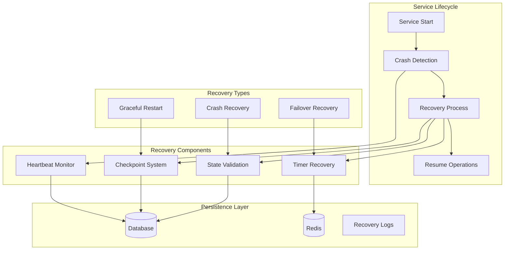

# 🔄 Crash Recovery & Service Resilience

## 🎯 **Overview**

The Campaign Lifecycle Service implements comprehensive crash recovery mechanisms to ensure campaign timers and state transitions continue seamlessly after service restarts, failures, or unexpected shutdowns.

---

## 🏗️ **Recovery Architecture**



---

## 💗 **Heartbeat & Health Monitoring**

### **1. Service Heartbeat System**

```typescript
interface ServiceHeartbeat {
  serviceId: string;
  instanceId: string;
  lastSeen: Date;
  status: 'starting' | 'running' | 'stopping' | 'stopped' | 'crashed';
  metadata: {
    processId: number;
    version: string;
    uptime: number;
    memoryUsage: NodeJS.MemoryUsage;
    activeTimers: number;
    lastProcessedTimer: Date;
  };
}

class HeartbeatManager {
  private heartbeatInterval: NodeJS.Timeout | null = null;
  private readonly HEARTBEAT_FREQUENCY = 30000; // 30 seconds
  private readonly CRASH_THRESHOLD = 120000; // 2 minutes
  
  constructor(
    private serviceId: string,
    private instanceId: string,
    private db: DatabaseService
  ) {}
  
  async startHeartbeat(): Promise<void> {
    // Initial heartbeat
    await this.sendHeartbeat('starting');
    
    // Regular heartbeat interval
    this.heartbeatInterval = setInterval(async () => {
      try {
        await this.sendHeartbeat('running');
      } catch (error) {
        console.error('Heartbeat failed:', error);
        // Continue trying - don't stop on heartbeat failures
      }
    }, this.HEARTBEAT_FREQUENCY);
    
    // Mark as running after successful start
    setTimeout(() => {
      this.sendHeartbeat('running');
    }, 5000);
  }
  
  async stopHeartbeat(): Promise<void> {
    if (this.heartbeatInterval) {
      clearInterval(this.heartbeatInterval);
      this.heartbeatInterval = null;
    }
    
    // Final heartbeat
    await this.sendHeartbeat('stopping');
    
    // Grace period for cleanup
    setTimeout(async () => {
      await this.sendHeartbeat('stopped');
    }, 2000);
  }
  
  private async sendHeartbeat(status: string): Promise<void> {
    const heartbeat: ServiceHeartbeat = {
      serviceId: this.serviceId,
      instanceId: this.instanceId,
      lastSeen: new Date(),
      status: status as any,
      metadata: {
        processId: process.pid,
        version: process.env.SERVICE_VERSION || '1.0.0',
        uptime: process.uptime(),
        memoryUsage: process.memoryUsage(),
        activeTimers: await this.getActiveTimerCount(),
        lastProcessedTimer: await this.getLastProcessedTimer()
      }
    };
    
    await this.db.updateServiceHeartbeat(heartbeat);
  }
  
  async detectCrash(): Promise<boolean> {
    const lastHeartbeat = await this.db.getLastHeartbeat(this.serviceId);
    
    if (!lastHeartbeat) {
      return false; // First run
    }
    
    const timeSinceLastSeen = Date.now() - new Date(lastHeartbeat.lastSeen).getTime();
    const wasCrash = timeSinceLastSeen > this.CRASH_THRESHOLD && 
                     lastHeartbeat.status === 'running';
    
    if (wasCrash) {
      console.log(`Crash detected: ${timeSinceLastSeen}ms since last heartbeat`);
      await this.logCrashEvent(lastHeartbeat);
    }
    
    return wasCrash;
  }
  
  private async getActiveTimerCount(): Promise<number> {
    return await this.db.countPendingTimers({
      status: ['PENDING', 'RUNNING']
    });
  }
  
  private async getLastProcessedTimer(): Promise<Date> {
    const lastTimer = await this.db.getLastProcessedTimer();
    return lastTimer ? new Date(lastTimer.executedAt) : new Date(0);
  }
  
  private async logCrashEvent(lastHeartbeat: ServiceHeartbeat): Promise<void> {
    await this.db.logCrashEvent({
      serviceId: this.serviceId,
      instanceId: lastHeartbeat.instanceId,
      crashDetectedAt: new Date(),
      lastSeenAt: new Date(lastHeartbeat.lastSeen),
      lastStatus: lastHeartbeat.status,
      metadata: lastHeartbeat.metadata
    });
  }
}
```

### **2. Health Check System**

```typescript
interface HealthCheckResult {
  component: string;
  status: 'healthy' | 'degraded' | 'unhealthy';
  responseTime: number;
  error?: string;
  metadata?: any;
}

class HealthChecker {
  private checks: Map<string, () => Promise<HealthCheckResult>> = new Map();
  
  constructor(
    private db: DatabaseService,
    private redis: RedisService,
    private timerProcessor: TimerProcessor
  ) {
    this.registerHealthChecks();
  }
  
  private registerHealthChecks(): void {
    this.checks.set('database', () => this.checkDatabase());
    this.checks.set('redis', () => this.checkRedis());
    this.checks.set('timer_processor', () => this.checkTimerProcessor());
    this.checks.set('event_bus', () => this.checkEventBus());
    this.checks.set('memory', () => this.checkMemoryUsage());
  }
  
  async performHealthCheck(): Promise<HealthCheckResult[]> {
    const results: HealthCheckResult[] = [];
    
    for (const [component, checkFn] of this.checks) {
      const startTime = Date.now();
      
      try {
        const result = await Promise.race([
          checkFn(),
          this.timeoutCheck(component, 5000) // 5 second timeout
        ]);
        
        results.push({
          ...result,
          responseTime: Date.now() - startTime
        });
        
      } catch (error) {
        results.push({
          component,
          status: 'unhealthy',
          responseTime: Date.now() - startTime,
          error: error.message
        });
      }
    }
    
    return results;
  }
  
  private async checkDatabase(): Promise<HealthCheckResult> {
    try {
      const result = await this.db.healthCheck();
      return {
        component: 'database',
        status: result.connected ? 'healthy' : 'unhealthy',
        responseTime: 0,
        metadata: {
          connectionCount: result.connectionCount,
          lastQuery: result.lastQuery
        }
      };
    } catch (error) {
      return {
        component: 'database',
        status: 'unhealthy',
        responseTime: 0,
        error: error.message
      };
    }
  }
  
  private async checkRedis(): Promise<HealthCheckResult> {
    try {
      const startTime = Date.now();
      const pong = await this.redis.ping();
      const responseTime = Date.now() - startTime;
      
      return {
        component: 'redis',
        status: pong === 'PONG' ? 'healthy' : 'unhealthy',
        responseTime,
        metadata: {
          connectionStatus: this.redis.status,
          memoryUsage: await this.redis.memory('usage')
        }
      };
    } catch (error) {
      return {
        component: 'redis',
        status: 'unhealthy',
        responseTime: 0,
        error: error.message
      };
    }
  }
  
  private async checkTimerProcessor(): Promise<HealthCheckResult> {
    const isRunning = this.timerProcessor.isRunning();
    const lastProcessed = await this.timerProcessor.getLastProcessedTime();
    const timeSinceLastProcess = Date.now() - lastProcessed.getTime();
    
    let status: 'healthy' | 'degraded' | 'unhealthy' = 'healthy';
    
    if (!isRunning) {
      status = 'unhealthy';
    } else if (timeSinceLastProcess > 300000) { // 5 minutes
      status = 'degraded';
    }
    
    return {
      component: 'timer_processor',
      status,
      responseTime: 0,
      metadata: {
        isRunning,
        lastProcessed,
        timeSinceLastProcess,
        queueSize: await this.timerProcessor.getQueueSize()
      }
    };
  }
  
  private async checkEventBus(): Promise<HealthCheckResult> {
    try {
      const streamInfo = await this.redis.xinfoStream('campaign-events');
      const consumerGroups = await this.redis.xinfoGroups('campaign-events');
      
      return {
        component: 'event_bus',
        status: 'healthy',
        responseTime: 0,
        metadata: {
          streamLength: streamInfo.length,
          consumerGroups: consumerGroups.length,
          lastEntryId: streamInfo['last-generated-id']
        }
      };
    } catch (error) {
      return {
        component: 'event_bus',
        status: 'unhealthy',
        responseTime: 0,
        error: error.message
      };
    }
  }
  
  private async checkMemoryUsage(): Promise<HealthCheckResult> {
    const memUsage = process.memoryUsage();
    const totalMem = memUsage.heapTotal;
    const usedMem = memUsage.heapUsed;
    const usagePercent = (usedMem / totalMem) * 100;
    
    let status: 'healthy' | 'degraded' | 'unhealthy' = 'healthy';
    
    if (usagePercent > 90) {
      status = 'unhealthy';
    } else if (usagePercent > 75) {
      status = 'degraded';
    }
    
    return {
      component: 'memory',
      status,
      responseTime: 0,
      metadata: {
        heapUsed: usedMem,
        heapTotal: totalMem,
        usagePercent: usagePercent.toFixed(2),
        external: memUsage.external,
        rss: memUsage.rss
      }
    };
  }
  
  private async timeoutCheck(component: string, timeout: number): Promise<HealthCheckResult> {
    return new Promise((_, reject) => {
      setTimeout(() => {
        reject(new Error(`Health check timeout for ${component}`));
      }, timeout);
    });
  }
}
```

---

## 🔄 **Recovery Process**

### **1. Startup Recovery Manager**

```typescript
class StartupRecoveryManager {
  private recoverySteps: RecoveryStep[] = [];
  
  constructor(
    private db: DatabaseService,
    private redis: RedisService,
    private timerProcessor: TimerProcessor,
    private eventBus: EventBus,
    private heartbeat: HeartbeatManager
  ) {
    this.initializeRecoverySteps();
  }
  
  async performRecovery(): Promise<RecoveryResult> {
    console.log('🔄 Starting service recovery process...');
    
    const recoveryResult: RecoveryResult = {
      success: false,
      steps: [],
      timersRecovered: 0,
      campaignsFixed: 0,
      startTime: new Date(),
      endTime: null,
      errors: []
    };
    
    try {
      // Step 1: Detect if crash recovery is needed
      const wasCrash = await this.heartbeat.detectCrash();
      recoveryResult.wasCrash = wasCrash;
      
      if (wasCrash) {
        console.log('💥 Crash detected - performing full recovery');
      } else {
        console.log('✅ Clean startup - performing standard initialization');
      }
      
      // Step 2: Execute recovery steps
      for (const step of this.recoverySteps) {
        const stepResult = await this.executeRecoveryStep(step, wasCrash);
        recoveryResult.steps.push(stepResult);
        
        if (!stepResult.success && step.critical) {
          throw new Error(`Critical recovery step failed: ${step.name}`);
        }
      }
      
      // Step 3: Validate system state
      await this.validateSystemState();
      
      // Step 4: Start services
      await this.startServices();
      
      recoveryResult.success = true;
      recoveryResult.endTime = new Date();
      
      console.log('✅ Recovery completed successfully');
      
    } catch (error) {
      recoveryResult.success = false;
      recoveryResult.endTime = new Date();
      recoveryResult.errors.push(error.message);
      
      console.error('❌ Recovery failed:', error);
      throw error;
    }
    
    return recoveryResult;
  }
  
  private initializeRecoverySteps(): void {
    this.recoverySteps = [
      {
        name: 'Database Connection',
        critical: true,
        execute: () => this.recoverDatabaseConnection()
      },
      {
        name: 'Redis Connection',
        critical: true,
        execute: () => this.recoverRedisConnection()
      },
      {
        name: 'Stuck Timers',
        critical: false,
        execute: (wasCrash) => this.recoverStuckTimers(wasCrash)
      },
      {
        name: 'Missed Timers',
        critical: false,
        execute: (wasCrash) => this.recoverMissedTimers(wasCrash)
      },
      {
        name: 'Campaign States',
        critical: false,
        execute: (wasCrash) => this.validateCampaignStates(wasCrash)
      },
      {
        name: 'Event Bus',
        critical: true,
        execute: () => this.recoverEventBus()
      },
      {
        name: 'Pending Timers',
        critical: false,
        execute: () => this.resumePendingTimers()
      }
    ];
  }
  
  private async executeRecoveryStep(
    step: RecoveryStep, 
    wasCrash: boolean
  ): Promise<StepResult> {
    const startTime = Date.now();
    console.log(`🔧 Executing recovery step: ${step.name}`);
    
    try {
      const result = await step.execute(wasCrash);
      const duration = Date.now() - startTime;
      
      console.log(`✅ ${step.name} completed in ${duration}ms`);
      
      return {
        name: step.name,
        success: true,
        duration,
        result
      };
      
    } catch (error) {
      const duration = Date.now() - startTime;
      
      console.error(`❌ ${step.name} failed after ${duration}ms:`, error);
      
      return {
        name: step.name,
        success: false,
        duration,
        error: error.message
      };
    }
  }
  
  private async recoverDatabaseConnection(): Promise<any> {
    await this.db.testConnection();
    await this.db.runMigrations();
    return { connected: true };
  }
  
  private async recoverRedisConnection(): Promise<any> {
    await this.redis.ping();
    await this.redis.setupStreams();
    return { connected: true };
  }
  
  private async recoverStuckTimers(wasCrash: boolean): Promise<any> {
    if (!wasCrash) return { stuckTimers: 0 };
    
    const stuckTimers = await this.db.getStuckTimers({
      status: 'RUNNING',
      updatedBefore: new Date(Date.now() - 300000) // 5 minutes ago
    });
    
    let recoveredCount = 0;
    
    for (const timer of stuckTimers) {
      try {
        // Reset to pending for re-processing
        await this.db.updateTimerStatus(timer.id, 'PENDING');
        
        // Log recovery action
        await this.db.logTimerRecovery({
          timerId: timer.id,
          action: 'reset_stuck_timer',
          reason: 'crash_recovery',
          previousStatus: 'RUNNING',
          newStatus: 'PENDING',
          timestamp: new Date()
        });
        
        recoveredCount++;
        
      } catch (error) {
        console.error(`Failed to recover stuck timer ${timer.id}:`, error);
      }
    }
    
    return { stuckTimers: stuckTimers.length, recovered: recoveredCount };
  }
  
  private async recoverMissedTimers(wasCrash: boolean): Promise<any> {
    if (!wasCrash) return { missedTimers: 0 };
    
    const missedTimers = await this.db.getMissedTimers({
      status: 'PENDING',
      scheduledBefore: new Date(Date.now() - 300000), // 5 minutes ago
      limit: 100
    });
    
    let recoveredCount = 0;
    let cancelledCount = 0;
    
    for (const timer of missedTimers) {
      try {
        const campaign = await this.db.getCampaign(timer.campaignId);
        
        if (this.shouldRecoverMissedTimer(timer, campaign)) {
          // Execute immediately
          await this.db.updateTimerSchedule(timer.id, new Date());
          recoveredCount++;
          
          await this.db.logTimerRecovery({
            timerId: timer.id,
            action: 'recover_missed_timer',
            reason: 'execute_immediately',
            timestamp: new Date()
          });
          
        } else {
          // Cancel if no longer valid
          await this.db.updateTimerStatus(timer.id, 'CANCELLED');
          cancelledCount++;
          
          await this.db.logTimerRecovery({
            timerId: timer.id,
            action: 'cancel_missed_timer',
            reason: 'no_longer_valid',
            timestamp: new Date()
          });
        }
        
      } catch (error) {
        console.error(`Failed to process missed timer ${timer.id}:`, error);
      }
    }
    
    return { 
      missedTimers: missedTimers.length, 
      recovered: recoveredCount, 
      cancelled: cancelledCount 
    };
  }
  
  private shouldRecoverMissedTimer(timer: any, campaign: any): boolean {
    const now = new Date();
    const scheduledTime = new Date(timer.scheduledAt);
    const timeSinceMissed = now.getTime() - scheduledTime.getTime();
    
    // Don't recover if missed by more than 1 hour
    if (timeSinceMissed > 3600000) return false;
    
    // Check campaign state compatibility
    switch (timer.type) {
      case 'START_CAMPAIGN':
        return campaign.status === 'CREATED';
      case 'CLOSE_CAMPAIGN':
        return campaign.status === 'RUNNING';
      case 'EXPIRE_CAMPAIGN':
        return campaign.status !== 'EXPIRED';
      case 'REWARD_REMINDER':
        return ['CLOSED', 'REWARD_CLAIM'].includes(campaign.status);
      default:
        return false;
    }
  }
  
  private async validateCampaignStates(wasCrash: boolean): Promise<any> {
    const campaigns = await this.db.getActiveCampaigns();
    let correctedCount = 0;
    
    for (const campaign of campaigns) {
      const now = new Date();
      const startTime = new Date(campaign.startTime);
      const endTime = new Date(campaign.endTime);
      
      let expectedStatus = campaign.status;
      
      // Determine expected status based on current time
      if (now >= endTime && campaign.status === 'RUNNING') {
        expectedStatus = 'CLOSED';
      } else if (now >= startTime && campaign.status === 'CREATED') {
        expectedStatus = 'RUNNING';
      }
      
      // Fix inconsistent states
      if (expectedStatus !== campaign.status) {
        await this.db.updateCampaignStatus(campaign.id, expectedStatus, {
          trigger: 'crash_recovery',
          reason: 'state_correction',
          previousStatus: campaign.status,
          timestamp: new Date()
        });
        
        correctedCount++;
        console.log(`Corrected campaign ${campaign.id}: ${campaign.status} → ${expectedStatus}`);
      }
    }
    
    return { campaignsChecked: campaigns.length, corrected: correctedCount };
  }
  
  private async recoverEventBus(): Promise<any> {
    await this.eventBus.initialize();
    await this.eventBus.setupConsumerGroups();
    return { initialized: true };
  }
  
  private async resumePendingTimers(): Promise<any> {
    const pendingCount = await this.db.countPendingTimers({
      status: 'PENDING',
      scheduledBefore: new Date()
    });
    
    return { pendingTimers: pendingCount };
  }
  
  private async validateSystemState(): Promise<void> {
    const healthCheck = new HealthChecker(this.db, this.redis, this.timerProcessor);
    const results = await healthCheck.performHealthCheck();
    
    const unhealthyComponents = results.filter(r => r.status === 'unhealthy');
    
    if (unhealthyComponents.length > 0) {
      throw new Error(`Unhealthy components after recovery: ${unhealthyComponents.map(c => c.component).join(', ')}`);
    }
  }
  
  private async startServices(): Promise<void> {
    // Start heartbeat
    await this.heartbeat.startHeartbeat();
    
    // Start timer processor
    await this.timerProcessor.start();
    
    // Start event bus consumers
    await this.eventBus.startConsumers();
    
    console.log('✅ All services started successfully');
  }
}

interface RecoveryStep {
  name: string;
  critical: boolean;
  execute: (wasCrash?: boolean) => Promise<any>;
}

interface StepResult {
  name: string;
  success: boolean;
  duration: number;
  result?: any;
  error?: string;
}

interface RecoveryResult {
  success: boolean;
  wasCrash?: boolean;
  steps: StepResult[];
  timersRecovered: number;
  campaignsFixed: number;
  startTime: Date;
  endTime: Date | null;
  errors: string[];
}
```

---

## 🔧 **Graceful Shutdown**

### **1. Shutdown Manager**

```typescript
class GracefulShutdownManager {
  private shutdownInProgress = false;
  private shutdownTimeout = 30000; // 30 seconds
  
  constructor(
    private timerProcessor: TimerProcessor,
    private eventBus: EventBus,
    private heartbeat: HeartbeatManager,
    private db: DatabaseService
  ) {
    this.setupSignalHandlers();
  }
  
  private setupSignalHandlers(): void {
    process.on('SIGTERM', () => this.handleShutdown('SIGTERM'));
    process.on('SIGINT', () => this.handleShutdown('SIGINT'));
    process.on('SIGHUP', () => this.handleShutdown('SIGHUP'));
    
    process.on('uncaughtException', (error) => {
      console.error('Uncaught Exception:', error);
      this.handleShutdown('UNCAUGHT_EXCEPTION');
    });
    
    process.on('unhandledRejection', (reason, promise) => {
      console.error('Unhandled Rejection at:', promise, 'reason:', reason);
      this.handleShutdown('UNHANDLED_REJECTION');
    });
  }
  
  private async handleShutdown(signal: string): Promise<void> {
    if (this.shutdownInProgress) {
      console.log('Shutdown already in progress, forcing exit...');
      process.exit(1);
    }
    
    this.shutdownInProgress = true;
    console.log(`\n🛑 Received ${signal}, starting graceful shutdown...`);
    
    const shutdownPromise = this.performGracefulShutdown();
    const timeoutPromise = this.createShutdownTimeout();
    
    try {
      await Promise.race([shutdownPromise, timeoutPromise]);
      console.log('✅ Graceful shutdown completed');
      process.exit(0);
    } catch (error) {
      console.error('❌ Shutdown error:', error);
      process.exit(1);
    }
  }
  
  private async performGracefulShutdown(): Promise<void> {
    const steps = [
      { name: 'Stop accepting new work', fn: () => this.stopAcceptingWork() },
      { name: 'Complete current operations', fn: () => this.completeCurrentOperations() },
      { name: 'Stop timer processor', fn: () => this.timerProcessor.stop() },
      { name: 'Stop event bus', fn: () => this.eventBus.stop() },
      { name: 'Stop heartbeat', fn: () => this.heartbeat.stopHeartbeat() },
      { name: 'Close database connections', fn: () => this.db.close() }
    ];
    
    for (const step of steps) {
      try {
        console.log(`🔄 ${step.name}...`);
        await step.fn();
        console.log(`✅ ${step.name} completed`);
      } catch (error) {
        console.error(`❌ ${step.name} failed:`, error);
        // Continue with other steps
      }
    }
  }
  
  private async stopAcceptingWork(): Promise<void> {
    // Mark service as stopping
    await this.heartbeat.sendHeartbeat('stopping');
    
    // Stop accepting new timer scheduling
    this.timerProcessor.pauseScheduling();
  }
  
  private async completeCurrentOperations(): Promise<void> {
    // Wait for current timers to complete
    const maxWait = 10000; // 10 seconds
    const startTime = Date.now();
    
    while (this.timerProcessor.hasActiveOperations() && 
           (Date.now() - startTime) < maxWait) {
      await this.sleep(500);
    }
    
    if (this.timerProcessor.hasActiveOperations()) {
      console.warn('⚠️ Some operations still active after timeout');
    }
  }
  
  private createShutdownTimeout(): Promise<never> {
    return new Promise((_, reject) => {
      setTimeout(() => {
        reject(new Error('Shutdown timeout exceeded'));
      }, this.shutdownTimeout);
    });
  }
  
  private sleep(ms: number): Promise<void> {
    return new Promise(resolve => setTimeout(resolve, ms));
  }
}
```

---

## 📊 **Recovery Monitoring & Reporting**

### **1. Recovery Metrics**

```typescript
import { Counter, Histogram, Gauge } from 'prom-client';

class RecoveryMetrics {
  private readonly recoveryAttempts = new Counter({
    name: 'recovery_attempts_total',
    help: 'Total number of recovery attempts',
    labelNames: ['type', 'success']
  });
  
  private readonly recoveryDuration = new Histogram({
    name: 'recovery_duration_seconds',
    help: 'Time taken for recovery process',
    labelNames: ['type'],
    buckets: [1, 5, 10, 30, 60, 120, 300]
  });
  
  private readonly timersRecovered = new Counter({
    name: 'timers_recovered_total',
    help: 'Number of timers recovered',
    labelNames: ['recovery_type', 'timer_type']
  });
  
  private readonly campaignsFixed = new Counter({
    name: 'campaigns_fixed_total',
    help: 'Number of campaigns with state corrections',
    labelNames: ['correction_type']
  });
  
  private readonly lastRecoveryTime = new Gauge({
    name: 'last_recovery_timestamp',
    help: 'Timestamp of last recovery'
  });
  
  recordRecoveryAttempt(type: string, success: boolean, duration: number): void {
    this.recoveryAttempts.inc({ type, success: success.toString() });
    this.recoveryDuration.observe({ type }, duration / 1000);
    this.lastRecoveryTime.setToCurrentTime();
  }
  
  recordTimerRecovery(recoveryType: string, timerType: string, count: number): void {
    this.timersRecovered.inc({ recovery_type: recoveryType, timer_type: timerType }, count);
  }
  
  recordCampaignFix(correctionType: string, count: number): void {
    this.campaignsFixed.inc({ correction_type: correctionType }, count);
  }
}
```

### **2. Recovery Dashboard**

```typescript
class RecoveryDashboard {
  constructor(
    private db: DatabaseService,
    private metrics: RecoveryMetrics
  ) {}
  
  async generateRecoveryReport(): Promise<RecoveryReport> {
    const [
      recentRecoveries,
      timerRecoveryStats,
      campaignCorrections,
      systemHealth
    ] = await Promise.all([
      this.getRecentRecoveries(),
      this.getTimerRecoveryStats(),
      this.getCampaignCorrections(),
      this.getSystemHealth()
    ]);
    
    return {
      timestamp: new Date(),
      recentRecoveries,
      timerRecoveryStats,
      campaignCorrections,
      systemHealth,
      recommendations: this.generateRecommendations({
        recentRecoveries,
        timerRecoveryStats,
        campaignCorrections
      })
    };
  }
  
  private async getRecentRecoveries(): Promise<any[]> {
    return await this.db.getRecoveryEvents({
      since: new Date(Date.now() - 86400000), // Last 24 hours
      limit: 50
    });
  }
  
  private async getTimerRecoveryStats(): Promise<any> {
    return await this.db.getTimerRecoveryStats({
      since: new Date(Date.now() - 604800000) // Last 7 days
    });
  }
  
  private async getCampaignCorrections(): Promise<any> {
    return await this.db.getCampaignCorrectionStats({
      since: new Date(Date.now() - 604800000) // Last 7 days
    });
  }
  
  private async getSystemHealth(): Promise<any> {
    const healthChecker = new HealthChecker(this.db, null, null);
    return await healthChecker.performHealthCheck();
  }
  
  private generateRecommendations(data: any): string[] {
    const recommendations = [];
    
    if (data.recentRecoveries.length > 10) {
      recommendations.push('High recovery frequency detected - investigate root causes');
    }
    
    if (data.timerRecoveryStats.stuckTimersRate > 0.1) {
      recommendations.push('High stuck timer rate - check timer processing performance');
    }
    
    if (data.campaignCorrections.stateCorrections > 50) {
      recommendations.push('Many campaign state corrections - review state transition logic');
    }
    
    return recommendations;
  }
}

interface RecoveryReport {
  timestamp: Date;
  recentRecoveries: any[];
  timerRecoveryStats: any;
  campaignCorrections: any;
  systemHealth: any;
  recommendations: string[];
}
```

---

*This crash recovery system ensures the Campaign Lifecycle Service can reliably resume operations after any type of failure, maintaining data consistency and continuing campaign lifecycle management without interruption.*
