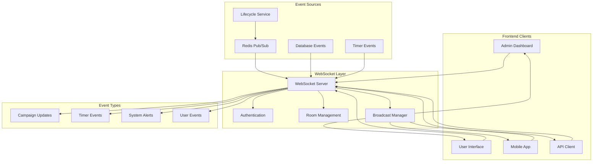

# 🔌 WebSocket Integration & Real-Time Updates

## 🎯 **Overview**

The Campaign Lifecycle Service provides real-time updates to frontend clients through WebSocket connections, ensuring users receive immediate notifications about campaign state changes, timer executions, and system events.

---

## 🏗️ **WebSocket Architecture**



---

## 🚀 **WebSocket Server Implementation**

### **1. Server Setup & Configuration**

```typescript
import { Server as SocketIOServer } from 'socket.io';
import { createAdapter } from '@socket.io/redis-adapter';
import { Server as HTTPServer } from 'http';
import Redis from 'ioredis';

interface WebSocketConfig {
  port: number;
  cors: {
    origin: string[];
    credentials: boolean;
  };
  adapter: {
    host: string;
    port: number;
    password?: string;
  };
  auth: {
    timeout: number;
    maxConnections: number;
  };
  rooms: {
    maxRoomSize: number;
    cleanupInterval: number;
  };
}

class WebSocketServer {
  private io: SocketIOServer;
  private redisAdapter: any;
  private connectionManager: ConnectionManager;
  private roomManager: RoomManager;
  private eventBridge: EventBridge;
  
  constructor(
    private httpServer: HTTPServer,
    private config: WebSocketConfig,
    private authService: AuthenticationService,
    private db: DatabaseService
  ) {
    this.initializeServer();
    this.setupComponents();
  }
  
  private initializeServer(): void {
    this.io = new SocketIOServer(this.httpServer, {
      cors: this.config.cors,
      transports: ['websocket', 'polling'],
      pingTimeout: 60000,
      pingInterval: 25000,
      maxHttpBufferSize: 1e6, // 1MB
      allowEIO3: true
    });
    
    this.setupRedisAdapter();
    this.setupMiddleware();
    this.setupEventHandlers();
  }
  
  private setupRedisAdapter(): void {
    const pubClient = new Redis({
      host: this.config.adapter.host,
      port: this.config.adapter.port,
      password: this.config.adapter.password,
      retryDelayOnFailover: 100,
      maxRetriesPerRequest: 3
    });
    
    const subClient = pubClient.duplicate();
    
    this.redisAdapter = createAdapter(pubClient, subClient);
    this.io.adapter(this.redisAdapter);
  }
  
  private setupComponents(): void {
    this.connectionManager = new ConnectionManager(this.io, this.config.auth);
    this.roomManager = new RoomManager(this.io, this.config.rooms);
    this.eventBridge = new EventBridge(this.io, this.db);
  }
  
  private setupMiddleware(): void {
    // Authentication middleware
    this.io.use(async (socket, next) => {
      try {
        const token = socket.handshake.auth.token;
        const user = await this.authService.validateToken(token);
        
        socket.data.user = user;
        socket.data.connectedAt = new Date();
        
        next();
      } catch (error) {
        console.error('WebSocket authentication failed:', error);
        next(new Error('Authentication failed'));
      }
    });
    
    // Rate limiting middleware
    this.io.use(async (socket, next) => {
      const rateLimiter = new RateLimiter({
        windowMs: 60000, // 1 minute
        maxRequests: 100 // per window
      });
      
      const allowed = await rateLimiter.checkLimit(socket.data.user.id);
      
      if (!allowed) {
        next(new Error('Rate limit exceeded'));
      } else {
        next();
      }
    });
  }
  
  private setupEventHandlers(): void {
    this.io.on('connection', (socket) => {
      this.handleConnection(socket);
    });
  }
  
  private async handleConnection(socket: any): Promise<void> {
    const user = socket.data.user;
    console.log(`WebSocket connected: ${user.id} (${socket.id})`);
    
    // Track connection
    await this.connectionManager.addConnection(socket);
    
    // Setup socket event handlers
    this.setupSocketHandlers(socket);
    
    // Send initial data
    await this.sendInitialData(socket);
    
    // Handle disconnection
    socket.on('disconnect', async (reason) => {
      console.log(`WebSocket disconnected: ${user.id} (${reason})`);
      await this.connectionManager.removeConnection(socket);
      await this.roomManager.leaveAllRooms(socket);
    });
  }
  
  private setupSocketHandlers(socket: any): void {
    // Campaign subscription
    socket.on('subscribe:campaign', async (data) => {
      await this.handleCampaignSubscription(socket, data);
    });
    
    socket.on('unsubscribe:campaign', async (data) => {
      await this.handleCampaignUnsubscription(socket, data);
    });
    
    // User-specific subscriptions
    socket.on('subscribe:user', async (data) => {
      await this.handleUserSubscription(socket, data);
    });
    
    // System subscriptions
    socket.on('subscribe:system', async (data) => {
      await this.handleSystemSubscription(socket, data);
    });
    
    // Heartbeat
    socket.on('ping', () => {
      socket.emit('pong', { timestamp: Date.now() });
    });
  }
  
  private async sendInitialData(socket: any): Promise<void> {
    const user = socket.data.user;
    
    // Send user's active campaigns
    const activeCampaigns = await this.db.getUserActiveCampaigns(user.id);
    socket.emit('initial:campaigns', activeCampaigns);
    
    // Send pending notifications
    const notifications = await this.db.getUserNotifications(user.id, { limit: 10 });
    socket.emit('initial:notifications', notifications);
    
    // Send system status
    const systemStatus = await this.getSystemStatus();
    socket.emit('initial:system_status', systemStatus);
  }
  
  private async handleCampaignSubscription(socket: any, data: any): Promise<void> {
    const { campaignId } = data;
    const user = socket.data.user;
    
    // Verify user has access to campaign
    const hasAccess = await this.db.userHasCampaignAccess(user.id, campaignId);
    
    if (!hasAccess) {
      socket.emit('error', { message: 'Access denied to campaign' });
      return;
    }
    
    // Join campaign room
    await this.roomManager.joinRoom(socket, `campaign:${campaignId}`);
    
    // Send current campaign status
    const campaign = await this.db.getCampaign(campaignId);
    socket.emit('campaign:status', {
      campaignId,
      status: campaign.status,
      metadata: campaign.metadata
    });
    
    socket.emit('subscribed', { type: 'campaign', campaignId });
  }
  
  private async handleCampaignUnsubscription(socket: any, data: any): Promise<void> {
    const { campaignId } = data;
    
    await this.roomManager.leaveRoom(socket, `campaign:${campaignId}`);
    socket.emit('unsubscribed', { type: 'campaign', campaignId });
  }
  
  private async handleUserSubscription(socket: any, data: any): Promise<void> {
    const user = socket.data.user;
    
    // Join user-specific room
    await this.roomManager.joinRoom(socket, `user:${user.id}`);
    socket.emit('subscribed', { type: 'user', userId: user.id });
  }
  
  private async handleSystemSubscription(socket: any, data: any): Promise<void> {
    const user = socket.data.user;
    
    // Only admins can subscribe to system events
    if (!user.isAdmin) {
      socket.emit('error', { message: 'Admin access required' });
      return;
    }
    
    await this.roomManager.joinRoom(socket, 'system');
    socket.emit('subscribed', { type: 'system' });
  }
  
  private async getSystemStatus(): Promise<any> {
    return {
      timestamp: new Date(),
      status: 'operational',
      version: process.env.SERVICE_VERSION || '1.0.0',
      uptime: process.uptime()
    };
  }
  
  // Public methods for external event publishing
  async broadcastCampaignUpdate(campaignId: string, update: any): Promise<void> {
    this.io.to(`campaign:${campaignId}`).emit('campaign:updated', {
      campaignId,
      timestamp: new Date(),
      ...update
    });
  }
  
  async broadcastTimerEvent(timerId: string, campaignId: string, event: any): Promise<void> {
    this.io.to(`campaign:${campaignId}`).emit('timer:event', {
      timerId,
      campaignId,
      timestamp: new Date(),
      ...event
    });
  }
  
  async broadcastSystemAlert(alert: any): Promise<void> {
    this.io.to('system').emit('system:alert', {
      timestamp: new Date(),
      ...alert
    });
  }
  
  async sendUserNotification(userId: string, notification: any): Promise<void> {
    this.io.to(`user:${userId}`).emit('notification', {
      timestamp: new Date(),
      ...notification
    });
  }
}
```

### **2. Connection Management**

```typescript
interface ConnectionInfo {
  socketId: string;
  userId: string;
  connectedAt: Date;
  lastActivity: Date;
  rooms: Set<string>;
  metadata: any;
}

class ConnectionManager {
  private connections: Map<string, ConnectionInfo> = new Map();
  private userConnections: Map<string, Set<string>> = new Map();
  private cleanupInterval: NodeJS.Timeout;
  
  constructor(
    private io: SocketIOServer,
    private config: any
  ) {
    this.startCleanupInterval();
  }
  
  async addConnection(socket: any): Promise<void> {
    const user = socket.data.user;
    const connectionInfo: ConnectionInfo = {
      socketId: socket.id,
      userId: user.id,
      connectedAt: new Date(),
      lastActivity: new Date(),
      rooms: new Set(),
      metadata: {
        userAgent: socket.handshake.headers['user-agent'],
        ip: socket.handshake.address,
        version: socket.handshake.query.version
      }
    };
    
    this.connections.set(socket.id, connectionInfo);
    
    // Track user connections
    if (!this.userConnections.has(user.id)) {
      this.userConnections.set(user.id, new Set());
    }
    this.userConnections.get(user.id)!.add(socket.id);
    
    // Check connection limits
    await this.enforceConnectionLimits(user.id);
    
    // Log connection
    console.log(`Connection added: ${user.id} (${socket.id})`);
  }
  
  async removeConnection(socket: any): Promise<void> {
    const connectionInfo = this.connections.get(socket.id);
    
    if (connectionInfo) {
      // Remove from user connections
      const userSockets = this.userConnections.get(connectionInfo.userId);
      if (userSockets) {
        userSockets.delete(socket.id);
        if (userSockets.size === 0) {
          this.userConnections.delete(connectionInfo.userId);
        }
      }
      
      // Remove connection info
      this.connections.delete(socket.id);
      
      console.log(`Connection removed: ${connectionInfo.userId} (${socket.id})`);
    }
  }
  
  updateActivity(socketId: string): void {
    const connection = this.connections.get(socketId);
    if (connection) {
      connection.lastActivity = new Date();
    }
  }
  
  getConnectionCount(): number {
    return this.connections.size;
  }
  
  getUserConnectionCount(userId: string): number {
    const userSockets = this.userConnections.get(userId);
    return userSockets ? userSockets.size : 0;
  }
  
  getActiveUsers(): string[] {
    return Array.from(this.userConnections.keys());
  }
  
  private async enforceConnectionLimits(userId: string): Promise<void> {
    const userSockets = this.userConnections.get(userId);
    
    if (userSockets && userSockets.size > this.config.maxConnections) {
      // Disconnect oldest connections
      const connections = Array.from(userSockets).map(socketId => {
        const info = this.connections.get(socketId);
        return { socketId, connectedAt: info?.connectedAt || new Date() };
      });
      
      connections.sort((a, b) => a.connectedAt.getTime() - b.connectedAt.getTime());
      
      const toDisconnect = connections.slice(0, -this.config.maxConnections);
      
      for (const { socketId } of toDisconnect) {
        const socket = this.io.sockets.sockets.get(socketId);
        if (socket) {
          socket.emit('error', { message: 'Connection limit exceeded' });
          socket.disconnect(true);
        }
      }
    }
  }
  
  private startCleanupInterval(): void {
    this.cleanupInterval = setInterval(() => {
      this.cleanupStaleConnections();
    }, 300000); // 5 minutes
  }
  
  private cleanupStaleConnections(): void {
    const now = new Date();
    const staleThreshold = 10 * 60 * 1000; // 10 minutes
    
    for (const [socketId, connection] of this.connections) {
      const timeSinceActivity = now.getTime() - connection.lastActivity.getTime();
      
      if (timeSinceActivity > staleThreshold) {
        const socket = this.io.sockets.sockets.get(socketId);
        if (socket) {
          console.log(`Disconnecting stale connection: ${socketId}`);
          socket.disconnect(true);
        } else {
          // Socket already disconnected, clean up our records
          this.connections.delete(socketId);
        }
      }
    }
  }
  
  stop(): void {
    if (this.cleanupInterval) {
      clearInterval(this.cleanupInterval);
    }
  }
}
```

### **3. Room Management**

```typescript
class RoomManager {
  private roomMembers: Map<string, Set<string>> = new Map();
  private socketRooms: Map<string, Set<string>> = new Map();
  
  constructor(
    private io: SocketIOServer,
    private config: any
  ) {}
  
  async joinRoom(socket: any, roomName: string): Promise<void> {
    const socketId = socket.id;
    
    // Check room size limits
    const currentSize = this.getRoomSize(roomName);
    if (currentSize >= this.config.maxRoomSize) {
      throw new Error(`Room ${roomName} is full`);
    }
    
    // Join the room
    await socket.join(roomName);
    
    // Track room membership
    if (!this.roomMembers.has(roomName)) {
      this.roomMembers.set(roomName, new Set());
    }
    this.roomMembers.get(roomName)!.add(socketId);
    
    // Track socket rooms
    if (!this.socketRooms.has(socketId)) {
      this.socketRooms.set(socketId, new Set());
    }
    this.socketRooms.get(socketId)!.add(roomName);
    
    console.log(`Socket ${socketId} joined room ${roomName}`);
  }
  
  async leaveRoom(socket: any, roomName: string): Promise<void> {
    const socketId = socket.id;
    
    // Leave the room
    await socket.leave(roomName);
    
    // Update tracking
    const roomMemberSet = this.roomMembers.get(roomName);
    if (roomMemberSet) {
      roomMemberSet.delete(socketId);
      if (roomMemberSet.size === 0) {
        this.roomMembers.delete(roomName);
      }
    }
    
    const socketRoomSet = this.socketRooms.get(socketId);
    if (socketRoomSet) {
      socketRoomSet.delete(roomName);
      if (socketRoomSet.size === 0) {
        this.socketRooms.delete(socketId);
      }
    }
    
    console.log(`Socket ${socketId} left room ${roomName}`);
  }
  
  async leaveAllRooms(socket: any): Promise<void> {
    const socketId = socket.id;
    const rooms = this.socketRooms.get(socketId);
    
    if (rooms) {
      for (const roomName of rooms) {
        await this.leaveRoom(socket, roomName);
      }
    }
  }
  
  getRoomSize(roomName: string): number {
    const members = this.roomMembers.get(roomName);
    return members ? members.size : 0;
  }
  
  getRoomMembers(roomName: string): string[] {
    const members = this.roomMembers.get(roomName);
    return members ? Array.from(members) : [];
  }
  
  getSocketRooms(socketId: string): string[] {
    const rooms = this.socketRooms.get(socketId);
    return rooms ? Array.from(rooms) : [];
  }
  
  getAllRooms(): string[] {
    return Array.from(this.roomMembers.keys());
  }
  
  getRoomStats(): any {
    const stats: any = {};
    
    for (const [roomName, members] of this.roomMembers) {
      stats[roomName] = {
        memberCount: members.size,
        members: Array.from(members)
      };
    }
    
    return stats;
  }
}
```

---

## 🌉 **Event Bridge Integration**

### **1. Redis to WebSocket Bridge**

```typescript
class EventBridge {
  private redisSubscriber: Redis;
  private eventHandlers: Map<string, Function> = new Map();
  
  constructor(
    private io: SocketIOServer,
    private db: DatabaseService
  ) {
    this.setupRedisSubscriber();
    this.registerEventHandlers();
  }
  
  private setupRedisSubscriber(): void {
    this.redisSubscriber = new Redis({
      host: process.env.REDIS_HOST,
      port: parseInt(process.env.REDIS_PORT || '6379'),
      password: process.env.REDIS_PASSWORD
    });
    
    // Subscribe to relevant channels
    this.redisSubscriber.psubscribe(
      'campaign:*',
      'timer:*',
      'system:*',
      'user:*'
    );
    
    this.redisSubscriber.on('pmessage', (pattern, channel, message) => {
      this.handleRedisMessage(pattern, channel, message);
    });
    
    this.redisSubscriber.on('error', (error) => {
      console.error('Redis subscriber error:', error);
    });
  }
  
  private registerEventHandlers(): void {
    this.eventHandlers.set('campaign:status', (data) => this.handleCampaignStatus(data));
    this.eventHandlers.set('campaign:timer', (data) => this.handleCampaignTimer(data));
    this.eventHandlers.set('timer:executed', (data) => this.handleTimerExecuted(data));
    this.eventHandlers.set('timer:failed', (data) => this.handleTimerFailed(data));
    this.eventHandlers.set('system:alert', (data) => this.handleSystemAlert(data));
    this.eventHandlers.set('user:notification', (data) => this.handleUserNotification(data));
  }
  
  private async handleRedisMessage(pattern: string, channel: string, message: string): Promise<void> {
    try {
      const data = JSON.parse(message);
      const eventType = this.extractEventType(channel, data);
      
      const handler = this.eventHandlers.get(eventType);
      if (handler) {
        await handler({ channel, data });
      } else {
        console.warn(`No handler for event type: ${eventType}`);
      }
      
    } catch (error) {
      console.error('Error handling Redis message:', error);
    }
  }
  
  private extractEventType(channel: string, data: any): string {
    // Extract event type from channel and data
    if (channel.startsWith('campaign:')) {
      if (data.eventType === 'status.changed') return 'campaign:status';
      if (data.eventType === 'timer.scheduled') return 'campaign:timer';
    }
    
    if (channel.startsWith('timer:')) {
      if (data.eventType === 'executed') return 'timer:executed';
      if (data.eventType === 'failed') return 'timer:failed';
    }
    
    if (channel.startsWith('system:')) {
      return 'system:alert';
    }
    
    if (channel.startsWith('user:')) {
      return 'user:notification';
    }
    
    return 'unknown';
  }
  
  private async handleCampaignStatus(event: any): Promise<void> {
    const { data } = event;
    const campaignId = data.campaignId;
    
    // Broadcast to campaign room
    this.io.to(`campaign:${campaignId}`).emit('campaign:status_changed', {
      campaignId,
      status: data.toStatus,
      previousStatus: data.fromStatus,
      trigger: data.trigger,
      timestamp: data.timestamp,
      metadata: data.metadata
    });
    
    // Also send to campaign owner
    const campaign = await this.db.getCampaign(campaignId);
    if (campaign) {
      this.io.to(`user:${campaign.ownerId}`).emit('campaign:status_changed', {
        campaignId,
        status: data.toStatus,
        previousStatus: data.fromStatus,
        trigger: data.trigger,
        timestamp: data.timestamp
      });
    }
  }
  
  private async handleCampaignTimer(event: any): Promise<void> {
    const { data } = event;
    const campaignId = data.campaignId;
    
    this.io.to(`campaign:${campaignId}`).emit('campaign:timer_scheduled', {
      campaignId,
      timerId: data.timerId,
      timerType: data.timerType,
      scheduledAt: data.scheduledAt,
      timestamp: new Date()
    });
  }
  
  private async handleTimerExecuted(event: any): Promise<void> {
    const { data } = event;
    const campaignId = data.campaignId;
    
    this.io.to(`campaign:${campaignId}`).emit('timer:executed', {
      timerId: data.timerId,
      campaignId,
      timerType: data.timerType,
      status: data.status,
      executionTime: data.executionTime,
      result: data.result,
      timestamp: new Date()
    });
  }
  
  private async handleTimerFailed(event: any): Promise<void> {
    const { data } = event;
    const campaignId = data.campaignId;
    
    // Send to campaign room
    this.io.to(`campaign:${campaignId}`).emit('timer:failed', {
      timerId: data.timerId,
      campaignId,
      timerType: data.timerType,
      error: data.error,
      retryCount: data.retryCount,
      nextRetryAt: data.nextRetryAt,
      timestamp: new Date()
    });
    
    // Also send error notification to campaign owner
    const campaign = await this.db.getCampaign(campaignId);
    if (campaign) {
      this.io.to(`user:${campaign.ownerId}`).emit('notification', {
        type: 'error',
        title: 'Timer Execution Failed',
        message: `Timer ${data.timerType} failed for campaign ${campaignId}`,
        campaignId,
        timestamp: new Date()
      });
    }
  }
  
  private async handleSystemAlert(event: any): Promise<void> {
    const { data } = event;
    
    this.io.to('system').emit('system:alert', {
      level: data.level,
      title: data.title,
      message: data.message,
      timestamp: data.timestamp,
      metadata: data.metadata
    });
  }
  
  private async handleUserNotification(event: any): Promise<void> {
    const { data } = event;
    const userId = data.userId;
    
    this.io.to(`user:${userId}`).emit('notification', {
      type: data.type,
      title: data.title,
      message: data.message,
      timestamp: data.timestamp,
      metadata: data.metadata
    });
  }
  
  stop(): void {
    if (this.redisSubscriber) {
      this.redisSubscriber.disconnect();
    }
  }
}
```

---

## 📊 **Event Types & Payloads**

### **1. Campaign Events**

```typescript
// Campaign status changed
interface CampaignStatusEvent {
  event: 'campaign:status_changed';
  data: {
    campaignId: string;
    status: CampaignStatus;
    previousStatus: CampaignStatus;
    trigger: string;
    timestamp: string;
    metadata?: any;
  };
}

// Campaign timer scheduled
interface CampaignTimerEvent {
  event: 'campaign:timer_scheduled';
  data: {
    campaignId: string;
    timerId: string;
    timerType: TimerType;
    scheduledAt: string;
    timestamp: string;
  };
}

// Campaign metrics updated
interface CampaignMetricsEvent {
  event: 'campaign:metrics_updated';
  data: {
    campaignId: string;
    metrics: {
      participants: number;
      engagements: number;
      rewards: number;
    };
    timestamp: string;
  };
}
```

### **2. Timer Events**

```typescript
// Timer executed
interface TimerExecutedEvent {
  event: 'timer:executed';
  data: {
    timerId: string;
    campaignId: string;
    timerType: TimerType;
    status: 'COMPLETED' | 'FAILED';
    executionTime: string;
    processingTimeMs: number;
    result?: any;
    timestamp: string;
  };
}

// Timer failed
interface TimerFailedEvent {
  event: 'timer:failed';
  data: {
    timerId: string;
    campaignId: string;
    timerType: TimerType;
    error: string;
    retryCount: number;
    nextRetryAt?: string;
    timestamp: string;
  };
}
```

### **3. System Events**

```typescript
// System alert
interface SystemAlertEvent {
  event: 'system:alert';
  data: {
    level: 'info' | 'warning' | 'error' | 'critical';
    title: string;
    message: string;
    timestamp: string;
    metadata?: any;
  };
}

// Service status
interface ServiceStatusEvent {
  event: 'system:service_status';
  data: {
    service: string;
    status: 'healthy' | 'degraded' | 'unhealthy';
    timestamp: string;
    metrics?: any;
  };
}
```

### **4. User Events**

```typescript
// User notification
interface UserNotificationEvent {
  event: 'notification';
  data: {
    type: 'info' | 'success' | 'warning' | 'error';
    title: string;
    message: string;
    timestamp: string;
    actionUrl?: string;
    metadata?: any;
  };
}
```

---

## 🔒 **Security & Authentication**

### **1. Token-Based Authentication**

```typescript
class WebSocketAuthService {
  constructor(private jwtService: JWTService) {}
  
  async validateToken(token: string): Promise<User> {
    if (!token) {
      throw new Error('Authentication token required');
    }
    
    try {
      const payload = await this.jwtService.verify(token);
      
      // Additional validation
      if (!payload.sub || !payload.permissions) {
        throw new Error('Invalid token payload');
      }
      
      return {
        id: payload.sub,
        permissions: payload.permissions,
        isAdmin: payload.permissions.includes('admin')
      };
      
    } catch (error) {
      throw new Error('Invalid or expired token');
    }
  }
  
  async refreshToken(oldToken: string): Promise<string> {
    const user = await this.validateToken(oldToken);
    return await this.jwtService.sign({
      sub: user.id,
      permissions: user.permissions
    });
  }
}
```

### **2. Permission-Based Access Control**

```typescript
class PermissionManager {
  static canAccessCampaign(user: User, campaignId: string): boolean {
    // Admin can access all campaigns
    if (user.isAdmin) return true;
    
    // User can access their own campaigns
    if (user.ownedCampaigns?.includes(campaignId)) return true;
    
    // User can access campaigns they participate in
    if (user.participatingCampaigns?.includes(campaignId)) return true;
    
    return false;
  }
  
  static canAccessSystemEvents(user: User): boolean {
    return user.isAdmin || user.permissions.includes('system:read');
  }
  
  static canReceiveUserNotifications(user: User, targetUserId: string): boolean {
    return user.id === targetUserId || user.isAdmin;
  }
}
```

---

## 📊 **Monitoring & Analytics**

### **1. WebSocket Metrics**

```typescript
import { Counter, Histogram, Gauge } from 'prom-client';

class WebSocketMetrics {
  private readonly connectionsTotal = new Counter({
    name: 'websocket_connections_total',
    help: 'Total number of WebSocket connections',
    labelNames: ['status']
  });
  
  private readonly activeConnections = new Gauge({
    name: 'websocket_connections_active',
    help: 'Number of active WebSocket connections'
  });
  
  private readonly messagesTotal = new Counter({
    name: 'websocket_messages_total',
    help: 'Total number of WebSocket messages',
    labelNames: ['type', 'direction']
  });
  
  private readonly messageSize = new Histogram({
    name: 'websocket_message_size_bytes',
    help: 'Size of WebSocket messages in bytes',
    labelNames: ['type'],
    buckets: [100, 500, 1000, 5000, 10000, 50000]
  });
  
  private readonly roomMembers = new Gauge({
    name: 'websocket_room_members',
    help: 'Number of members in WebSocket rooms',
    labelNames: ['room']
  });
  
  recordConnection(status: 'connected' | 'disconnected'): void {
    this.connectionsTotal.inc({ status });
    
    if (status === 'connected') {
      this.activeConnections.inc();
    } else {
      this.activeConnections.dec();
    }
  }
  
  recordMessage(type: string, direction: 'inbound' | 'outbound', size: number): void {
    this.messagesTotal.inc({ type, direction });
    this.messageSize.observe({ type }, size);
  }
  
  updateRoomMembers(room: string, count: number): void {
    this.roomMembers.set({ room }, count);
  }
}
```

### **2. Connection Analytics**

```typescript
class ConnectionAnalytics {
  constructor(
    private db: DatabaseService,
    private metrics: WebSocketMetrics
  ) {}
  
  async trackConnection(connectionInfo: ConnectionInfo): Promise<void> {
    await this.db.logConnectionEvent({
      socketId: connectionInfo.socketId,
      userId: connectionInfo.userId,
      event: 'connected',
      timestamp: connectionInfo.connectedAt,
      metadata: connectionInfo.metadata
    });
    
    this.metrics.recordConnection('connected');
  }
  
  async trackDisconnection(socketId: string, reason: string): Promise<void> {
    const connectionInfo = await this.getConnectionInfo(socketId);
    
    if (connectionInfo) {
      const duration = Date.now() - connectionInfo.connectedAt.getTime();
      
      await this.db.logConnectionEvent({
        socketId,
        userId: connectionInfo.userId,
        event: 'disconnected',
        timestamp: new Date(),
        metadata: {
          reason,
          durationMs: duration
        }
      });
    }
    
    this.metrics.recordConnection('disconnected');
  }
  
  async getConnectionStats(timeRange: string): Promise<any> {
    return await this.db.getConnectionStats({ timeRange });
  }
  
  async generateUsageReport(): Promise<any> {
    const [
      totalConnections,
      activeUsers,
      topRooms,
      messageStats
    ] = await Promise.all([
      this.db.getTotalConnections(),
      this.db.getActiveUsers(),
      this.db.getTopRooms(),
      this.db.getMessageStats()
    ]);
    
    return {
      timestamp: new Date(),
      totalConnections,
      activeUsers,
      topRooms,
      messageStats
    };
  }
  
  private async getConnectionInfo(socketId: string): Promise<ConnectionInfo | null> {
    // Implementation to retrieve connection info
    return null; // Placeholder
  }
}
```

---

*This WebSocket integration provides a robust, scalable, and secure real-time communication layer for the Campaign Lifecycle Service, ensuring users receive immediate updates about campaign states and system events.*
