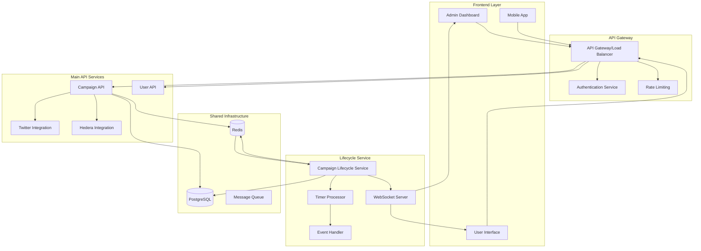

# 🔗 API Integration & Communication

## 🎯 **Overview**

The Campaign Lifecycle Service integrates seamlessly with the main Hashbuzz API through event-driven communication, REST endpoints, and shared database access, ensuring coordinated campaign management across all system components.

---

## 🏗️ **Integration Architecture**



---

## 🚀 **Event-Driven Integration**

### **1. Campaign Events Publisher/Subscriber**

```typescript
interface CampaignEventPayload {
  eventType: string;
  campaignId: string;
  userId: string;
  timestamp: Date;
  data: any;
  metadata?: any;
}

class CampaignEventIntegration {
  private eventBus: RedisEventBus;
  private db: DatabaseService;
  
  constructor(eventBus: RedisEventBus, db: DatabaseService) {
    this.eventBus = eventBus;
    this.db = db;
    this.setupEventHandlers();
  }
  
  private setupEventHandlers(): void {
    // Listen for events from main API
    this.eventBus.subscribe('campaign.created', this.handleCampaignCreated.bind(this));
    this.eventBus.subscribe('campaign.updated', this.handleCampaignUpdated.bind(this));
    this.eventBus.subscribe('campaign.cancelled', this.handleCampaignCancelled.bind(this));
    this.eventBus.subscribe('campaign.funded', this.handleCampaignFunded.bind(this));
    
    // Listen for Twitter integration events
    this.eventBus.subscribe('twitter.engagement.detected', this.handleTwitterEngagement.bind(this));
    this.eventBus.subscribe('twitter.api.error', this.handleTwitterError.bind(this));
    
    // Listen for Hedera blockchain events
    this.eventBus.subscribe('hedera.transaction.confirmed', this.handleHederaTransaction.bind(this));
    this.eventBus.subscribe('hedera.contract.executed', this.handleHederaContract.bind(this));
  }
  
  async handleCampaignCreated(payload: CampaignEventPayload): Promise<void> {
    console.log(`Processing campaign.created event: ${payload.campaignId}`);
    
    try {
      // Validate campaign data
      const campaign = await this.db.getCampaign(payload.campaignId);
      if (!campaign) {
        throw new Error(`Campaign not found: ${payload.campaignId}`);
      }
      
      // Schedule campaign timers
      const timerScheduler = new TimerScheduler(this.db, this.eventBus);
      const timers = await timerScheduler.scheduleCampaignTimers(campaign);
      
      console.log(`Scheduled ${timers.length} timers for campaign ${payload.campaignId}`);
      
      // Publish lifecycle event
      await this.eventBus.publish('lifecycle.campaign.initialized', {
        campaignId: payload.campaignId,
        timersScheduled: timers.length,
        scheduledTimers: timers.map(t => ({
          id: t.id,
          type: t.type,
          scheduledAt: t.scheduledAt
        })),
        timestamp: new Date()
      });
      
      // Initialize campaign monitoring
      await this.initializeCampaignMonitoring(campaign);
      
    } catch (error) {
      console.error(`Error handling campaign.created: ${error.message}`);
      
      // Publish error event
      await this.eventBus.publish('lifecycle.campaign.error', {
        campaignId: payload.campaignId,
        error: error.message,
        eventType: 'campaign.created',
        timestamp: new Date()
      });
    }
  }
  
  async handleCampaignUpdated(payload: CampaignEventPayload): Promise<void> {
    console.log(`Processing campaign.updated event: ${payload.campaignId}`);
    
    try {
      const { changes } = payload.data;
      
      // Handle timing changes
      if (changes.startTime || changes.endTime || changes.durationHours) {
        await this.updateCampaignTimers(payload.campaignId, changes);
      }
      
      // Handle status changes
      if (changes.status) {
        await this.handleStatusChange(payload.campaignId, changes.status);
      }
      
      // Handle configuration changes
      if (changes.autoClose !== undefined || changes.rewardsEnabled !== undefined) {
        await this.updateCampaignConfiguration(payload.campaignId, changes);
      }
      
    } catch (error) {
      console.error(`Error handling campaign.updated: ${error.message}`);
    }
  }
  
  async handleCampaignCancelled(payload: CampaignEventPayload): Promise<void> {
    console.log(`Processing campaign.cancelled event: ${payload.campaignId}`);
    
    try {
      // Cancel all pending timers
      await this.db.cancelTimers({
        campaignId: payload.campaignId,
        status: ['PENDING', 'RUNNING']
      });
      
      // Update campaign status
      await this.db.updateCampaignStatus(payload.campaignId, 'CANCELLED', {
        trigger: 'api.campaign.cancelled',
        reason: payload.data.reason || 'manual_cancellation',
        cancelledBy: payload.userId,
        timestamp: new Date()
      });
      
      // Publish cancellation event
      await this.eventBus.publish('lifecycle.campaign.cancelled', {
        campaignId: payload.campaignId,
        reason: payload.data.reason,
        cancelledBy: payload.userId,
        timestamp: new Date()
      });
      
    } catch (error) {
      console.error(`Error handling campaign.cancelled: ${error.message}`);
    }
  }
  
  async handleTwitterEngagement(payload: CampaignEventPayload): Promise<void> {
    console.log(`Processing Twitter engagement: ${payload.campaignId}`);
    
    try {
      const { tweetId, engagementType, userId, metrics } = payload.data;
      
      // Record engagement in campaign metrics
      await this.db.recordCampaignMetric({
        campaignId: payload.campaignId,
        metricType: 'ENGAGEMENT_COUNT',
        value: 1,
        attributes: {
          tweetId,
          engagementType,
          userId,
          source: 'twitter'
        }
      });
      
      // Check if campaign goals are met
      await this.checkCampaignProgress(payload.campaignId);
      
      // Publish engagement event for real-time updates
      await this.eventBus.publish('lifecycle.engagement.recorded', {
        campaignId: payload.campaignId,
        tweetId,
        engagementType,
        userId,
        timestamp: new Date()
      });
      
    } catch (error) {
      console.error(`Error handling Twitter engagement: ${error.message}`);
    }
  }
  
  private async initializeCampaignMonitoring(campaign: any): Promise<void> {
    // Set up Twitter monitoring if needed
    if (campaign.metadata?.twitterConfig) {
      await this.eventBus.publish('twitter.monitoring.start', {
        campaignId: campaign.id,
        twitterConfig: campaign.metadata.twitterConfig,
        timestamp: new Date()
      });
    }
    
    // Set up blockchain monitoring if needed
    if (campaign.metadata?.hederaConfig) {
      await this.eventBus.publish('hedera.monitoring.start', {
        campaignId: campaign.id,
        hederaConfig: campaign.metadata.hederaConfig,
        timestamp: new Date()
      });
    }
  }
  
  private async updateCampaignTimers(campaignId: string, changes: any): Promise<void> {
    // Cancel existing timers
    await this.db.cancelTimers({
      campaignId,
      status: 'PENDING'
    });
    
    // Get updated campaign
    const campaign = await this.db.getCampaign(campaignId);
    
    // Reschedule timers with new timing
    const timerScheduler = new TimerScheduler(this.db, this.eventBus);
    await timerScheduler.scheduleCampaignTimers(campaign);
    
    console.log(`Updated timers for campaign ${campaignId}`);
  }
  
  private async checkCampaignProgress(campaignId: string): Promise<void> {
    const campaign = await this.db.getCampaign(campaignId);
    const metrics = await this.db.getCampaignMetrics(campaignId);
    
    // Check if engagement targets are met
    const totalEngagements = metrics
      .filter(m => m.metricType === 'ENGAGEMENT_COUNT')
      .reduce((sum, m) => sum + m.value, 0);
    
    const targetEngagements = campaign.metadata?.targetEngagements || 100;
    
    if (totalEngagements >= targetEngagements && campaign.status === 'RUNNING') {
      // Trigger early completion if targets met
      await this.eventBus.publish('lifecycle.campaign.target_reached', {
        campaignId,
        targetEngagements,
        actualEngagements: totalEngagements,
        timestamp: new Date()
      });
    }
  }
}
```

### **2. API Response Integration**

```typescript
class APIResponseIntegration {
  constructor(
    private db: DatabaseService,
    private eventBus: RedisEventBus
  ) {}
  
  async enrichCampaignResponse(campaignData: any): Promise<any> {
    // Add lifecycle information to campaign responses
    const [timers, metrics, stateLog] = await Promise.all([
      this.getActiveCampaignTimers(campaignData.id),
      this.getCampaignMetrics(campaignData.id),
      this.getRecentStateChanges(campaignData.id)
    ]);
    
    return {
      ...campaignData,
      lifecycle: {
        activeTimers: timers,
        metrics,
        recentStateChanges: stateLog,
        nextScheduledEvent: this.getNextScheduledEvent(timers),
        estimatedCompletion: this.estimateCompletion(campaignData, timers)
      }
    };
  }
  
  private async getActiveCampaignTimers(campaignId: string): Promise<any[]> {
    const timers = await this.db.getCampaignTimers({
      campaignId,
      status: ['PENDING', 'RUNNING'],
      orderBy: 'scheduledAt'
    });
    
    return timers.map(timer => ({
      id: timer.id,
      type: timer.type,
      scheduledAt: timer.scheduledAt,
      status: timer.status,
      retryCount: timer.retryCount
    }));
  }
  
  private async getCampaignMetrics(campaignId: string): Promise<any> {
    const metrics = await this.db.getCampaignMetrics(campaignId);
    
    return {
      totalEngagements: this.sumMetrics(metrics, 'ENGAGEMENT_COUNT'),
      participants: this.sumMetrics(metrics, 'PARTICIPANT_COUNT'),
      rewardsClaimed: this.sumMetrics(metrics, 'REWARD_CLAIMED'),
      lastUpdated: this.getLatestMetricTime(metrics)
    };
  }
  
  private async getRecentStateChanges(campaignId: string): Promise<any[]> {
    const stateLog = await this.db.getCampaignStateLog({
      campaignId,
      limit: 10,
      orderBy: 'createdAt',
      order: 'DESC'
    });
    
    return stateLog.map(log => ({
      fromState: log.fromState,
      toState: log.toState,
      trigger: log.triggerEvent,
      timestamp: log.createdAt,
      metadata: log.metadata
    }));
  }
  
  private getNextScheduledEvent(timers: any[]): any | null {
    const pendingTimers = timers.filter(t => t.status === 'PENDING');
    if (pendingTimers.length === 0) return null;
    
    return pendingTimers.reduce((next, timer) => {
      if (!next || new Date(timer.scheduledAt) < new Date(next.scheduledAt)) {
        return timer;
      }
      return next;
    });
  }
  
  private estimateCompletion(campaign: any, timers: any[]): Date | null {
    // Find the latest scheduled timer
    const latestTimer = timers.reduce((latest, timer) => {
      if (!latest || new Date(timer.scheduledAt) > new Date(latest.scheduledAt)) {
        return timer;
      }
      return latest;
    }, null);
    
    if (latestTimer) {
      return new Date(latestTimer.scheduledAt);
    }
    
    // Fallback to campaign end time
    return campaign.endTime ? new Date(campaign.endTime) : null;
  }
  
  private sumMetrics(metrics: any[], type: string): number {
    return metrics
      .filter(m => m.metricType === type)
      .reduce((sum, m) => sum + m.value, 0);
  }
  
  private getLatestMetricTime(metrics: any[]): Date | null {
    if (metrics.length === 0) return null;
    
    return metrics.reduce((latest, metric) => {
      const metricTime = new Date(metric.recordedAt);
      return !latest || metricTime > latest ? metricTime : latest;
    }, null);
  }
}
```

---

## 🔄 **REST API Endpoints**

### **1. Lifecycle Management Endpoints**

```typescript
import { Router, Request, Response } from 'express';
import { body, param, query, validationResult } from 'express-validator';

class LifecycleAPIController {
  private router: Router;
  
  constructor(
    private db: DatabaseService,
    private timerProcessor: TimerProcessor,
    private eventBus: RedisEventBus
  ) {
    this.router = Router();
    this.setupRoutes();
  }
  
  private setupRoutes(): void {
    // Campaign lifecycle endpoints
    this.router.get('/campaigns/:id/lifecycle', this.getCampaignLifecycle.bind(this));
    this.router.get('/campaigns/:id/timers', this.getCampaignTimers.bind(this));
    this.router.post('/campaigns/:id/timers/:timerId/execute', this.executeTimer.bind(this));
    this.router.delete('/campaigns/:id/timers/:timerId', this.cancelTimer.bind(this));
    
    // System management endpoints
    this.router.get('/health', this.getHealthStatus.bind(this));
    this.router.get('/metrics', this.getMetrics.bind(this));
    this.router.post('/recovery/trigger', this.triggerRecovery.bind(this));
    
    // Timer management endpoints
    this.router.get('/timers/pending', this.getPendingTimers.bind(this));
    this.router.get('/timers/overdue', this.getOverdueTimers.bind(this));
    this.router.post('/timers/process', this.processTimers.bind(this));
  }
  
  async getCampaignLifecycle(req: Request, res: Response): Promise<void> {
    try {
      const { id } = req.params;
      
      const [campaign, timers, metrics, stateLog] = await Promise.all([
        this.db.getCampaign(id),
        this.db.getCampaignTimers({ campaignId: id }),
        this.db.getCampaignMetrics(id),
        this.db.getCampaignStateLog({ campaignId: id, limit: 20 })
      ]);
      
      if (!campaign) {
        res.status(404).json({ error: 'Campaign not found' });
        return;
      }
      
      const lifecycleData = {
        campaign: {
          id: campaign.id,
          status: campaign.status,
          createdAt: campaign.createdAt,
          startTime: campaign.startTime,
          endTime: campaign.endTime,
          durationHours: campaign.durationHours
        },
        timers: {
          total: timers.length,
          pending: timers.filter(t => t.status === 'PENDING').length,
          completed: timers.filter(t => t.status === 'COMPLETED').length,
          failed: timers.filter(t => t.status === 'FAILED').length,
          details: timers.map(t => ({
            id: t.id,
            type: t.type,
            status: t.status,
            scheduledAt: t.scheduledAt,
            executedAt: t.executedAt,
            retryCount: t.retryCount
          }))
        },
        metrics: this.aggregateMetrics(metrics),
        stateHistory: stateLog.map(log => ({
          fromState: log.fromState,
          toState: log.toState,
          trigger: log.triggerEvent,
          timestamp: log.createdAt,
          metadata: log.metadata
        })),
        nextEvents: this.getUpcomingEvents(timers)
      };
      
      res.json(lifecycleData);
      
    } catch (error) {
      console.error('Error getting campaign lifecycle:', error);
      res.status(500).json({ error: 'Internal server error' });
    }
  }
  
  async getCampaignTimers(req: Request, res: Response): Promise<void> {
    try {
      const { id } = req.params;
      const { status, type, limit = 50 } = req.query;
      
      const filters: any = { campaignId: id };
      if (status) filters.status = Array.isArray(status) ? status : [status];
      if (type) filters.type = type;
      
      const timers = await this.db.getCampaignTimers({
        ...filters,
        limit: parseInt(limit as string),
        orderBy: 'scheduledAt'
      });
      
      res.json({
        campaignId: id,
        timers: timers.map(timer => ({
          id: timer.id,
          type: timer.type,
          status: timer.status,
          scheduledAt: timer.scheduledAt,
          executedAt: timer.executedAt,
          retryCount: timer.retryCount,
          maxRetries: timer.maxRetries,
          payload: timer.payload
        }))
      });
      
    } catch (error) {
      console.error('Error getting campaign timers:', error);
      res.status(500).json({ error: 'Internal server error' });
    }
  }
  
  async executeTimer(req: Request, res: Response): Promise<void> {
    try {
      const { id, timerId } = req.params;
      
      const timer = await this.db.getTimer(timerId);
      
      if (!timer || timer.campaignId !== id) {
        res.status(404).json({ error: 'Timer not found' });
        return;
      }
      
      if (timer.status !== 'PENDING') {
        res.status(400).json({ error: `Timer status is ${timer.status}, cannot execute` });
        return;
      }
      
      // Trigger immediate execution
      await this.timerProcessor.executeTimerNow(timerId);
      
      res.json({
        message: 'Timer execution triggered',
        timerId,
        campaignId: id
      });
      
    } catch (error) {
      console.error('Error executing timer:', error);
      res.status(500).json({ error: 'Internal server error' });
    }
  }
  
  async cancelTimer(req: Request, res: Response): Promise<void> {
    try {
      const { id, timerId } = req.params;
      const { reason = 'manual_cancellation' } = req.body;
      
      const timer = await this.db.getTimer(timerId);
      
      if (!timer || timer.campaignId !== id) {
        res.status(404).json({ error: 'Timer not found' });
        return;
      }
      
      if (!['PENDING', 'FAILED'].includes(timer.status)) {
        res.status(400).json({ error: `Timer status is ${timer.status}, cannot cancel` });
        return;
      }
      
      await this.db.updateTimerStatus(timerId, 'CANCELLED');
      
      // Log cancellation
      await this.db.logTimerCancellation({
        timerId,
        campaignId: id,
        reason,
        cancelledBy: req.user?.id,
        timestamp: new Date()
      });
      
      res.json({
        message: 'Timer cancelled',
        timerId,
        campaignId: id,
        reason
      });
      
    } catch (error) {
      console.error('Error cancelling timer:', error);
      res.status(500).json({ error: 'Internal server error' });
    }
  }
  
  async getHealthStatus(req: Request, res: Response): Promise<void> {
    try {
      const healthChecker = new HealthChecker(this.db, null, this.timerProcessor);
      const healthResults = await healthChecker.performHealthCheck();
      
      const overallStatus = healthResults.every(r => r.status === 'healthy') ? 'healthy' : 
                           healthResults.some(r => r.status === 'unhealthy') ? 'unhealthy' : 'degraded';
      
      res.json({
        status: overallStatus,
        timestamp: new Date(),
        checks: healthResults,
        uptime: process.uptime(),
        version: process.env.SERVICE_VERSION || '1.0.0'
      });
      
    } catch (error) {
      console.error('Error getting health status:', error);
      res.status(500).json({ 
        status: 'unhealthy',
        error: 'Health check failed'
      });
    }
  }
  
  async getMetrics(req: Request, res: Response): Promise<void> {
    try {
      const { timeRange = '1h' } = req.query;
      
      const [
        timerStats,
        campaignStats,
        systemStats
      ] = await Promise.all([
        this.getTimerMetrics(timeRange as string),
        this.getCampaignMetrics(timeRange as string),
        this.getSystemMetrics()
      ]);
      
      res.json({
        timestamp: new Date(),
        timeRange,
        timers: timerStats,
        campaigns: campaignStats,
        system: systemStats
      });
      
    } catch (error) {
      console.error('Error getting metrics:', error);
      res.status(500).json({ error: 'Internal server error' });
    }
  }
  
  private aggregateMetrics(metrics: any[]): any {
    return {
      totalEngagements: this.sumMetrics(metrics, 'ENGAGEMENT_COUNT'),
      totalParticipants: this.sumMetrics(metrics, 'PARTICIPANT_COUNT'),
      rewardsClaimed: this.sumMetrics(metrics, 'REWARD_CLAIMED'),
      lastUpdated: this.getLatestMetricTime(metrics)
    };
  }
  
  private getUpcomingEvents(timers: any[]): any[] {
    return timers
      .filter(t => t.status === 'PENDING')
      .sort((a, b) => new Date(a.scheduledAt).getTime() - new Date(b.scheduledAt).getTime())
      .slice(0, 5)
      .map(t => ({
        type: t.type,
        scheduledAt: t.scheduledAt,
        timeUntil: new Date(t.scheduledAt).getTime() - Date.now()
      }));
  }
  
  private async getTimerMetrics(timeRange: string): Promise<any> {
    return await this.db.getTimerMetrics({ timeRange });
  }
  
  private async getCampaignMetrics(timeRange: string): Promise<any> {
    return await this.db.getCampaignMetrics({ timeRange });
  }
  
  private async getSystemMetrics(): Promise<any> {
    return {
      memoryUsage: process.memoryUsage(),
      cpuUsage: process.cpuUsage(),
      uptime: process.uptime(),
      activeConnections: await this.getActiveConnectionCount()
    };
  }
  
  private async getActiveConnectionCount(): Promise<number> {
    // Implementation to get active connection count
    return 0; // Placeholder
  }
  
  private sumMetrics(metrics: any[], type: string): number {
    return metrics
      .filter(m => m.metricType === type)
      .reduce((sum, m) => sum + m.value, 0);
  }
  
  private getLatestMetricTime(metrics: any[]): Date | null {
    if (metrics.length === 0) return null;
    
    return metrics.reduce((latest, metric) => {
      const metricTime = new Date(metric.recordedAt);
      return !latest || metricTime > latest ? metricTime : latest;
    }, null);
  }
  
  getRouter(): Router {
    return this.router;
  }
}
```

---

## 🔒 **Authentication & Authorization**

### **1. JWT Integration**

```typescript
import jwt from 'jsonwebtoken';
import { Request, Response, NextFunction } from 'express';

interface AuthenticatedRequest extends Request {
  user?: {
    id: string;
    permissions: string[];
    isAdmin: boolean;
  };
}

class AuthenticationMiddleware {
  constructor(private secretKey: string) {}
  
  authenticate = async (req: AuthenticatedRequest, res: Response, next: NextFunction): Promise<void> => {
    try {
      const token = this.extractToken(req);
      
      if (!token) {
        res.status(401).json({ error: 'Authentication token required' });
        return;
      }
      
      const payload = jwt.verify(token, this.secretKey) as any;
      
      req.user = {
        id: payload.sub,
        permissions: payload.permissions || [],
        isAdmin: payload.permissions?.includes('admin') || false
      };
      
      next();
      
    } catch (error) {
      res.status(401).json({ error: 'Invalid or expired token' });
    }
  };
  
  requireAdmin = (req: AuthenticatedRequest, res: Response, next: NextFunction): void => {
    if (!req.user?.isAdmin) {
      res.status(403).json({ error: 'Admin access required' });
      return;
    }
    next();
  };
  
  requirePermission = (permission: string) => {
    return (req: AuthenticatedRequest, res: Response, next: NextFunction): void => {
      if (!req.user?.permissions.includes(permission) && !req.user?.isAdmin) {
        res.status(403).json({ error: `Permission required: ${permission}` });
        return;
      }
      next();
    };
  };
  
  private extractToken(req: Request): string | null {
    const authHeader = req.headers.authorization;
    
    if (authHeader && authHeader.startsWith('Bearer ')) {
      return authHeader.substring(7);
    }
    
    return req.query.token as string || null;
  }
}
```

### **2. Rate Limiting**

```typescript
import rateLimit from 'express-rate-limit';
import Redis from 'ioredis';

class RateLimitingMiddleware {
  private redis: Redis;
  
  constructor(redisConfig: any) {
    this.redis = new Redis(redisConfig);
  }
  
  createLimiter(options: {
    windowMs: number;
    maxRequests: number;
    keyGenerator?: (req: Request) => string;
  }) {
    return rateLimit({
      windowMs: options.windowMs,
      max: options.maxRequests,
      keyGenerator: options.keyGenerator || ((req: Request) => req.ip),
      store: new RedisStore({
        client: this.redis,
        prefix: 'rl:'
      }),
      message: {
        error: 'Too many requests, please try again later',
        retryAfter: Math.ceil(options.windowMs / 1000)
      }
    });
  }
  
  // Standard rate limits
  standardLimit = this.createLimiter({
    windowMs: 15 * 60 * 1000, // 15 minutes
    maxRequests: 100
  });
  
  // Strict rate limits for admin endpoints
  adminLimit = this.createLimiter({
    windowMs: 5 * 60 * 1000, // 5 minutes
    maxRequests: 20
  });
  
  // User-specific rate limits
  userSpecificLimit = this.createLimiter({
    windowMs: 1 * 60 * 1000, // 1 minute
    maxRequests: 30,
    keyGenerator: (req: any) => req.user?.id || req.ip
  });
}
```

---

## 📊 **API Monitoring & Logging**

### **1. Request Logging**

```typescript
import { Request, Response, NextFunction } from 'express';
import { v4 as uuidv4 } from 'uuid';

interface LoggedRequest extends Request {
  requestId?: string;
  startTime?: number;
}

class RequestLoggingMiddleware {
  constructor(private db: DatabaseService) {}
  
  logRequests = (req: LoggedRequest, res: Response, next: NextFunction): void => {
    req.requestId = uuidv4();
    req.startTime = Date.now();
    
    // Log request start
    console.log(`[${req.requestId}] ${req.method} ${req.path} - Start`);
    
    // Capture response
    const originalSend = res.send;
    res.send = function(data) {
      const duration = Date.now() - req.startTime!;
      
      // Log request completion
      console.log(`[${req.requestId}] ${req.method} ${req.path} - ${res.statusCode} (${duration}ms)`);
      
      // Store API metrics
      this.recordAPIMetrics(req, res, duration);
      
      return originalSend.call(this, data);
    }.bind(this);
    
    next();
  };
  
  private async recordAPIMetrics(req: LoggedRequest, res: Response, duration: number): Promise<void> {
    try {
      await this.db.recordAPIMetrics({
        requestId: req.requestId!,
        method: req.method,
        path: req.path,
        statusCode: res.statusCode,
        duration,
        userId: (req as any).user?.id,
        ip: req.ip,
        userAgent: req.get('User-Agent'),
        timestamp: new Date()
      });
    } catch (error) {
      console.error('Error recording API metrics:', error);
    }
  }
}
```

### **2. Error Handling**

```typescript
class APIErrorHandler {
  static handleErrors = (error: Error, req: Request, res: Response, next: NextFunction): void => {
    console.error(`API Error: ${error.message}`, {
      requestId: (req as any).requestId,
      path: req.path,
      method: req.method,
      stack: error.stack
    });
    
    // Categorize error types
    if (error.name === 'ValidationError') {
      res.status(400).json({
        error: 'Validation failed',
        details: error.message
      });
    } else if (error.name === 'UnauthorizedError') {
      res.status(401).json({
        error: 'Authentication required'
      });
    } else if (error.name === 'ForbiddenError') {
      res.status(403).json({
        error: 'Access denied'
      });
    } else if (error.name === 'NotFoundError') {
      res.status(404).json({
        error: 'Resource not found'
      });
    } else {
      // Generic server error
      res.status(500).json({
        error: 'Internal server error',
        requestId: (req as any).requestId
      });
    }
  };
  
  static asyncHandler = (fn: Function) => {
    return (req: Request, res: Response, next: NextFunction) => {
      Promise.resolve(fn(req, res, next)).catch(next);
    };
  };
}
```

---

## 🔄 **Data Synchronization**

### **1. Campaign Data Sync**

```typescript
class CampaignDataSync {
  constructor(
    private db: DatabaseService,
    private eventBus: RedisEventBus
  ) {}
  
  async syncCampaignData(campaignId: string): Promise<void> {
    try {
      // Get latest campaign data from main API
      const apiCampaign = await this.fetchCampaignFromAPI(campaignId);
      const localCampaign = await this.db.getCampaign(campaignId);
      
      // Compare and sync differences
      const changes = this.detectChanges(localCampaign, apiCampaign);
      
      if (changes.length > 0) {
        await this.applySyncChanges(campaignId, changes);
        
        // Publish sync event
        await this.eventBus.publish('lifecycle.campaign.synced', {
          campaignId,
          changes,
          timestamp: new Date()
        });
      }
      
    } catch (error) {
      console.error(`Error syncing campaign ${campaignId}:`, error);
    }
  }
  
  private async fetchCampaignFromAPI(campaignId: string): Promise<any> {
    // Implementation to fetch from main API
    return {}; // Placeholder
  }
  
  private detectChanges(local: any, remote: any): any[] {
    const changes = [];
    
    const fieldsToCheck = ['status', 'startTime', 'endTime', 'durationHours', 'metadata'];
    
    for (const field of fieldsToCheck) {
      if (JSON.stringify(local[field]) !== JSON.stringify(remote[field])) {
        changes.push({
          field,
          oldValue: local[field],
          newValue: remote[field]
        });
      }
    }
    
    return changes;
  }
  
  private async applySyncChanges(campaignId: string, changes: any[]): Promise<void> {
    for (const change of changes) {
      await this.db.updateCampaignField(campaignId, change.field, change.newValue);
      
      // Handle specific field changes
      if (change.field === 'startTime' || change.field === 'endTime') {
        await this.updateTimersForTimeChange(campaignId);
      }
    }
  }
  
  private async updateTimersForTimeChange(campaignId: string): Promise<void> {
    // Cancel existing pending timers
    await this.db.cancelTimers({
      campaignId,
      status: 'PENDING'
    });
    
    // Reschedule timers with new times
    const campaign = await this.db.getCampaign(campaignId);
    const timerScheduler = new TimerScheduler(this.db, this.eventBus);
    await timerScheduler.scheduleCampaignTimers(campaign);
  }
}
```

---

*This API integration ensures seamless communication between the Campaign Lifecycle Service and the main Hashbuzz API, providing comprehensive campaign management with real-time synchronization and robust error handling.*
