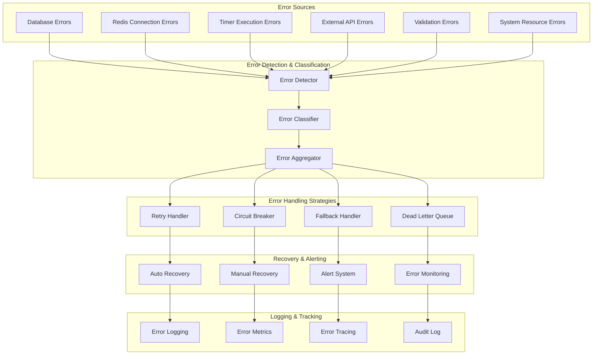

# ⚠️ Error Handling & Resilience

## 🎯 **Overview**

The Campaign Lifecycle Service implements comprehensive error handling, resilience patterns, and recovery mechanisms to ensure reliable operation under various failure conditions, maintaining service availability and data consistency.

---

## 🛡️ **Error Handling Architecture**



---

## 🔍 **Error Classification System**

### **1. Error Categories**

```typescript
enum ErrorCategory {
  TRANSIENT = 'TRANSIENT',
  PERMANENT = 'PERMANENT',
  CONFIGURATION = 'CONFIGURATION',
  BUSINESS_LOGIC = 'BUSINESS_LOGIC',
  EXTERNAL_DEPENDENCY = 'EXTERNAL_DEPENDENCY',
  RESOURCE_EXHAUSTION = 'RESOURCE_EXHAUSTION',
  SECURITY = 'SECURITY',
  DATA_CORRUPTION = 'DATA_CORRUPTION'
}

enum ErrorSeverity {
  LOW = 'LOW',
  MEDIUM = 'MEDIUM',
  HIGH = 'HIGH',
  CRITICAL = 'CRITICAL'
}

interface ServiceError {
  id: string;
  category: ErrorCategory;
  severity: ErrorSeverity;
  code: string;
  message: string;
  context: any;
  timestamp: Date;
  retryable: boolean;
  recoverable: boolean;
  stackTrace?: string;
  causedBy?: ServiceError;
}

class ErrorClassifier {
  private errorPatterns: Map<string, ErrorCategory> = new Map([
    // Database errors
    ['ECONNREFUSED', ErrorCategory.TRANSIENT],
    ['ENOTFOUND', ErrorCategory.CONFIGURATION],
    ['ECONNRESET', ErrorCategory.TRANSIENT],
    ['ETIMEDOUT', ErrorCategory.TRANSIENT],
    ['SequelizeConnectionError', ErrorCategory.TRANSIENT],
    ['SequelizeValidationError', ErrorCategory.BUSINESS_LOGIC],
    ['SequelizeUniqueConstraintError', ErrorCategory.BUSINESS_LOGIC],
    
    // Redis errors
    ['ConnectionError', ErrorCategory.TRANSIENT],
    ['TimeoutError', ErrorCategory.TRANSIENT],
    ['ReplyError', ErrorCategory.PERMANENT],
    
    // System errors
    ['ENOMEM', ErrorCategory.RESOURCE_EXHAUSTION],
    ['EMFILE', ErrorCategory.RESOURCE_EXHAUSTION],
    ['ENOSPC', ErrorCategory.RESOURCE_EXHAUSTION],
    
    // Validation errors
    ['ValidationError', ErrorCategory.BUSINESS_LOGIC],
    ['TypeError', ErrorCategory.BUSINESS_LOGIC],
    ['ReferenceError', ErrorCategory.BUSINESS_LOGIC],
    
    // HTTP errors
    ['401', ErrorCategory.SECURITY],
    ['403', ErrorCategory.SECURITY],
    ['404', ErrorCategory.BUSINESS_LOGIC],
    ['429', ErrorCategory.EXTERNAL_DEPENDENCY],
    ['500', ErrorCategory.EXTERNAL_DEPENDENCY],
    ['502', ErrorCategory.EXTERNAL_DEPENDENCY],
    ['503', ErrorCategory.EXTERNAL_DEPENDENCY],
    ['504', ErrorCategory.EXTERNAL_DEPENDENCY]
  ]);
  
  classifyError(error: Error | any): ServiceError {
    const errorCode = this.extractErrorCode(error);
    const category = this.errorPatterns.get(errorCode) || ErrorCategory.PERMANENT;
    const severity = this.determineSeverity(error, category);
    
    return {
      id: this.generateErrorId(),
      category,
      severity,
      code: errorCode,
      message: error.message || 'Unknown error',
      context: this.extractContext(error),
      timestamp: new Date(),
      retryable: this.isRetryable(category, error),
      recoverable: this.isRecoverable(category, error),
      stackTrace: error.stack,
      causedBy: error.cause ? this.classifyError(error.cause) : undefined
    };
  }
  
  private extractErrorCode(error: any): string {
    if (error.code) return error.code;
    if (error.name) return error.name;
    if (error.status) return error.status.toString();
    if (error.errno) return error.errno.toString();
    return 'UNKNOWN_ERROR';
  }
  
  private determineSeverity(error: any, category: ErrorCategory): ErrorSeverity {
    // Critical errors that affect service availability
    if (category === ErrorCategory.RESOURCE_EXHAUSTION) return ErrorSeverity.CRITICAL;
    if (category === ErrorCategory.DATA_CORRUPTION) return ErrorSeverity.CRITICAL;
    if (category === ErrorCategory.SECURITY) return ErrorSeverity.HIGH;
    
    // High severity for permanent failures
    if (category === ErrorCategory.PERMANENT) return ErrorSeverity.HIGH;
    if (category === ErrorCategory.CONFIGURATION) return ErrorSeverity.HIGH;
    
    // Medium for external dependencies and business logic
    if (category === ErrorCategory.EXTERNAL_DEPENDENCY) return ErrorSeverity.MEDIUM;
    if (category === ErrorCategory.BUSINESS_LOGIC) return ErrorSeverity.MEDIUM;
    
    // Low for transient errors
    return ErrorSeverity.LOW;
  }
  
  private isRetryable(category: ErrorCategory, error: any): boolean {
    const retryableCategories = [
      ErrorCategory.TRANSIENT,
      ErrorCategory.EXTERNAL_DEPENDENCY
    ];
    
    return retryableCategories.includes(category) && !this.isNonRetryableError(error);
  }
  
  private isRecoverable(category: ErrorCategory, error: any): boolean {
    const nonRecoverableCategories = [
      ErrorCategory.DATA_CORRUPTION,
      ErrorCategory.SECURITY
    ];
    
    return !nonRecoverableCategories.includes(category);
  }
  
  private isNonRetryableError(error: any): boolean {
    const nonRetryableCodes = ['401', '403', '404', '422'];
    return nonRetryableCodes.includes(error.status?.toString() || error.code);
  }
  
  private extractContext(error: any): any {
    return {
      component: error.component,
      operation: error.operation,
      campaignId: error.campaignId,
      timerId: error.timerId,
      userId: error.userId,
      additionalInfo: error.additionalInfo
    };
  }
  
  private generateErrorId(): string {
    return `err_${Date.now()}_${Math.random().toString(36).substring(2)}`;
  }
}
```

### **2. Error Handler Implementation**

```typescript
class ServiceErrorHandler {
  private errorClassifier: ErrorClassifier;
  private retryHandler: RetryHandler;
  private circuitBreaker: CircuitBreaker;
  private alertSystem: AlertSystem;
  private errorLogger: ErrorLogger;
  
  constructor(
    private db: DatabaseService,
    private eventBus: RedisEventBus,
    private config: ErrorHandlingConfig
  ) {
    this.errorClassifier = new ErrorClassifier();
    this.retryHandler = new RetryHandler(config.retry);
    this.circuitBreaker = new CircuitBreaker(config.circuitBreaker);
    this.alertSystem = new AlertSystem(config.alerts);
    this.errorLogger = new ErrorLogger(db);
  }
  
  async handleError(error: Error, context: ErrorContext): Promise<ErrorHandlingResult> {
    const serviceError = this.errorClassifier.classifyError(error);
    
    // Log the error
    await this.errorLogger.logError(serviceError, context);
    
    // Record error metrics
    await this.recordErrorMetrics(serviceError, context);
    
    // Determine handling strategy
    const strategy = this.determineHandlingStrategy(serviceError, context);
    
    try {
      switch (strategy) {
        case 'RETRY':
          return await this.handleWithRetry(serviceError, context);
          
        case 'CIRCUIT_BREAK':
          return await this.handleWithCircuitBreaker(serviceError, context);
          
        case 'FALLBACK':
          return await this.handleWithFallback(serviceError, context);
          
        case 'DEAD_LETTER':
          return await this.handleWithDeadLetter(serviceError, context);
          
        case 'IMMEDIATE_ALERT':
          return await this.handleWithImmediateAlert(serviceError, context);
          
        default:
          return await this.handleDefault(serviceError, context);
      }
    } catch (handlingError) {
      // Error in error handling - escalate
      await this.escalateError(serviceError, handlingError, context);
      throw handlingError;
    }
  }
  
  private determineHandlingStrategy(error: ServiceError, context: ErrorContext): string {
    // Critical errors require immediate attention
    if (error.severity === ErrorSeverity.CRITICAL) {
      return 'IMMEDIATE_ALERT';
    }
    
    // Security errors should not be retried
    if (error.category === ErrorCategory.SECURITY) {
      return 'IMMEDIATE_ALERT';
    }
    
    // Data corruption requires special handling
    if (error.category === ErrorCategory.DATA_CORRUPTION) {
      return 'DEAD_LETTER';
    }
    
    // Retryable errors with circuit breaker protection
    if (error.retryable && context.attemptCount < this.config.maxRetries) {
      return this.circuitBreaker.shouldAllowRequest(context.operation) ? 'RETRY' : 'CIRCUIT_BREAK';
    }
    
    // Non-retryable or exhausted retry attempts
    if (!error.retryable || context.attemptCount >= this.config.maxRetries) {
      return error.recoverable ? 'FALLBACK' : 'DEAD_LETTER';
    }
    
    return 'FALLBACK';
  }
  
  private async handleWithRetry(error: ServiceError, context: ErrorContext): Promise<ErrorHandlingResult> {
    const retryDelay = this.retryHandler.calculateDelay(context.attemptCount);
    
    console.log(`Retrying operation ${context.operation} after ${retryDelay}ms (attempt ${context.attemptCount + 1})`);
    
    // Schedule retry
    setTimeout(() => {
      this.retryOperation(context);
    }, retryDelay);
    
    return {
      strategy: 'RETRY',
      success: false,
      retryAfter: retryDelay,
      error
    };
  }
  
  private async handleWithCircuitBreaker(error: ServiceError, context: ErrorContext): Promise<ErrorHandlingResult> {
    console.log(`Circuit breaker open for ${context.operation}, falling back`);
    
    this.circuitBreaker.recordFailure(context.operation);
    
    // Use fallback or return cached response
    const fallbackResult = await this.executeFallback(context);
    
    return {
      strategy: 'CIRCUIT_BREAK',
      success: fallbackResult.success,
      fallbackUsed: true,
      error
    };
  }
  
  private async handleWithFallback(error: ServiceError, context: ErrorContext): Promise<ErrorHandlingResult> {
    console.log(`Using fallback for operation ${context.operation}`);
    
    const fallbackResult = await this.executeFallback(context);
    
    // Alert if fallback fails
    if (!fallbackResult.success) {
      await this.alertSystem.sendAlert({
        level: 'HIGH',
        message: `Fallback failed for ${context.operation}`,
        error,
        context
      });
    }
    
    return {
      strategy: 'FALLBACK',
      success: fallbackResult.success,
      fallbackUsed: true,
      error
    };
  }
  
  private async handleWithDeadLetter(error: ServiceError, context: ErrorContext): Promise<ErrorHandlingResult> {
    console.log(`Moving operation ${context.operation} to dead letter queue`);
    
    // Move to dead letter queue for manual processing
    await this.moveToDeadLetterQueue(error, context);
    
    // Send high priority alert
    await this.alertSystem.sendAlert({
      level: 'HIGH',
      message: `Operation moved to dead letter queue: ${context.operation}`,
      error,
      context
    });
    
    return {
      strategy: 'DEAD_LETTER',
      success: false,
      requiresManualIntervention: true,
      error
    };
  }
  
  private async handleWithImmediateAlert(error: ServiceError, context: ErrorContext): Promise<ErrorHandlingResult> {
    console.log(`Sending immediate alert for critical error in ${context.operation}`);
    
    // Send critical alert
    await this.alertSystem.sendAlert({
      level: 'CRITICAL',
      message: `Critical error in ${context.operation}`,
      error,
      context,
      immediate: true
    });
    
    // For critical errors, also try fallback if available
    const fallbackResult = await this.executeFallback(context);
    
    return {
      strategy: 'IMMEDIATE_ALERT',
      success: fallbackResult.success,
      alertSent: true,
      fallbackUsed: fallbackResult.success,
      error
    };
  }
  
  private async executeFallback(context: ErrorContext): Promise<{ success: boolean; result?: any }> {
    try {
      switch (context.operation) {
        case 'timer.execute':
          return await this.fallbackTimerExecution(context);
          
        case 'campaign.update':
          return await this.fallbackCampaignUpdate(context);
          
        case 'database.write':
          return await this.fallbackDatabaseWrite(context);
          
        case 'event.publish':
          return await this.fallbackEventPublish(context);
          
        default:
          return { success: false };
      }
    } catch (fallbackError) {
      console.error(`Fallback failed for ${context.operation}:`, fallbackError);
      return { success: false };
    }
  }
  
  private async fallbackTimerExecution(context: ErrorContext): Promise<{ success: boolean; result?: any }> {
    // Try to reschedule timer for later execution
    try {
      await this.db.updateTimer(context.timerId!, {
        status: 'FAILED',
        retryCount: (context.attemptCount || 0) + 1,
        nextRetry: new Date(Date.now() + 5 * 60 * 1000), // 5 minutes
        errorMessage: 'Execution failed, scheduled for retry'
      });
      
      return { success: true, result: 'rescheduled' };
    } catch (error) {
      return { success: false };
    }
  }
  
  private async fallbackCampaignUpdate(context: ErrorContext): Promise<{ success: boolean; result?: any }> {
    // Use cached campaign data or skip non-critical updates
    try {
      if (context.payload?.priority === 'low') {
        console.log('Skipping low-priority campaign update during fallback');
        return { success: true, result: 'skipped' };
      }
      
      // Try with simplified update
      const essentialData = this.extractEssentialCampaignData(context.payload);
      await this.db.updateCampaignBasic(context.campaignId!, essentialData);
      
      return { success: true, result: 'simplified' };
    } catch (error) {
      return { success: false };
    }
  }
  
  private async fallbackDatabaseWrite(context: ErrorContext): Promise<{ success: boolean; result?: any }> {
    // Write to backup database or queue for later processing
    try {
      await this.queueForLaterProcessing(context);
      return { success: true, result: 'queued' };
    } catch (error) {
      return { success: false };
    }
  }
  
  private async fallbackEventPublish(context: ErrorContext): Promise<{ success: boolean; result?: any }> {
    // Store event locally for later republishing
    try {
      await this.storeEventLocally(context.payload);
      return { success: true, result: 'stored_locally' };
    } catch (error) {
      return { success: false };
    }
  }
  
  private async recordErrorMetrics(error: ServiceError, context: ErrorContext): Promise<void> {
    try {
      await this.db.recordErrorMetric({
        errorId: error.id,
        category: error.category,
        severity: error.severity,
        code: error.code,
        operation: context.operation,
        component: context.component,
        campaignId: context.campaignId,
        attemptCount: context.attemptCount,
        timestamp: new Date()
      });
    } catch (metricError) {
      console.error('Failed to record error metrics:', metricError);
    }
  }
  
  private async escalateError(originalError: ServiceError, handlingError: Error, context: ErrorContext): Promise<void> {
    // Critical escalation - error in error handling
    await this.alertSystem.sendAlert({
      level: 'CRITICAL',
      message: 'Error handling system failure',
      error: {
        original: originalError,
        handling: handlingError
      },
      context,
      immediate: true,
      escalated: true
    });
  }
  
  private async moveToDeadLetterQueue(error: ServiceError, context: ErrorContext): Promise<void> {
    await this.eventBus.publish('error.dead_letter', {
      errorId: error.id,
      error,
      context,
      timestamp: new Date()
    });
  }
  
  private async retryOperation(context: ErrorContext): Promise<void> {
    // Implementation to retry the failed operation
    // This would call back to the original service method
  }
  
  private async queueForLaterProcessing(context: ErrorContext): Promise<void> {
    await this.eventBus.publish('processing.queue', {
      operation: context.operation,
      payload: context.payload,
      priority: 'high',
      timestamp: new Date()
    });
  }
  
  private async storeEventLocally(payload: any): Promise<void> {
    await this.db.storeLocalEvent({
      payload,
      status: 'pending_republish',
      createdAt: new Date()
    });
  }
  
  private extractEssentialCampaignData(payload: any): any {
    // Extract only critical fields for fallback update
    return {
      status: payload.status,
      lastUpdated: new Date()
    };
  }
}
```

---

## 🔄 **Retry Mechanisms**

### **1. Exponential Backoff Retry**

```typescript
interface RetryConfig {
  maxRetries: number;
  baseDelay: number;
  maxDelay: number;
  exponentialBase: number;
  jitter: boolean;
}

class RetryHandler {
  constructor(private config: RetryConfig) {}
  
  calculateDelay(attemptCount: number): number {
    let delay = this.config.baseDelay * Math.pow(this.config.exponentialBase, attemptCount);
    
    // Cap at maximum delay
    delay = Math.min(delay, this.config.maxDelay);
    
    // Add jitter to prevent thundering herd
    if (this.config.jitter) {
      delay += Math.random() * delay * 0.1; // Up to 10% jitter
    }
    
    return Math.floor(delay);
  }
  
  shouldRetry(error: ServiceError, attemptCount: number): boolean {
    return (
      error.retryable &&
      attemptCount < this.config.maxRetries &&
      this.isRetryableErrorCode(error.code)
    );
  }
  
  private isRetryableErrorCode(code: string): boolean {
    const retryableCodes = [
      'ECONNREFUSED',
      'ETIMEDOUT',
      'ECONNRESET',
      'ConnectionError',
      'TimeoutError',
      '500',
      '502',
      '503',
      '504'
    ];
    
    return retryableCodes.includes(code);
  }
}
```

### **2. Circuit Breaker Pattern**

```typescript
interface CircuitBreakerConfig {
  failureThreshold: number;
  recoveryTimeout: number;
  monitoringWindow: number;
}

enum CircuitState {
  CLOSED = 'CLOSED',
  OPEN = 'OPEN',
  HALF_OPEN = 'HALF_OPEN'
}

class CircuitBreaker {
  private state: CircuitState = CircuitState.CLOSED;
  private failures: Map<string, number> = new Map();
  private lastFailureTime: Map<string, number> = new Map();
  
  constructor(private config: CircuitBreakerConfig) {}
  
  shouldAllowRequest(operation: string): boolean {
    const currentState = this.getState(operation);
    
    switch (currentState) {
      case CircuitState.CLOSED:
        return true;
        
      case CircuitState.OPEN:
        return this.shouldAttemptReset(operation);
        
      case CircuitState.HALF_OPEN:
        return true; // Allow one request to test if service is recovered
        
      default:
        return false;
    }
  }
  
  recordSuccess(operation: string): void {
    this.failures.set(operation, 0);
    this.setState(operation, CircuitState.CLOSED);
    console.log(`Circuit breaker CLOSED for ${operation}`);
  }
  
  recordFailure(operation: string): void {
    const currentFailures = this.failures.get(operation) || 0;
    const newFailures = currentFailures + 1;
    
    this.failures.set(operation, newFailures);
    this.lastFailureTime.set(operation, Date.now());
    
    if (newFailures >= this.config.failureThreshold) {
      this.setState(operation, CircuitState.OPEN);
      console.log(`Circuit breaker OPEN for ${operation} (failures: ${newFailures})`);
    }
  }
  
  private getState(operation: string): CircuitState {
    const failures = this.failures.get(operation) || 0;
    const lastFailure = this.lastFailureTime.get(operation) || 0;
    
    if (failures >= this.config.failureThreshold) {
      const timeSinceFailure = Date.now() - lastFailure;
      
      if (timeSinceFailure > this.config.recoveryTimeout) {
        return CircuitState.HALF_OPEN;
      }
      
      return CircuitState.OPEN;
    }
    
    return CircuitState.CLOSED;
  }
  
  private setState(operation: string, state: CircuitState): void {
    // In a real implementation, this might be stored in Redis for sharing across instances
    this.state = state;
  }
  
  private shouldAttemptReset(operation: string): boolean {
    const lastFailure = this.lastFailureTime.get(operation) || 0;
    const timeSinceFailure = Date.now() - lastFailure;
    
    if (timeSinceFailure > this.config.recoveryTimeout) {
      this.setState(operation, CircuitState.HALF_OPEN);
      return true;
    }
    
    return false;
  }
  
  getStatus(): { [operation: string]: { state: CircuitState; failures: number } } {
    const status: any = {};
    
    for (const [operation, failures] of this.failures) {
      status[operation] = {
        state: this.getState(operation),
        failures
      };
    }
    
    return status;
  }
}
```

---

## 🚨 **Alert System**

### **1. Multi-Channel Alerting**

```typescript
interface AlertConfig {
  email: {
    enabled: boolean;
    recipients: string[];
    smtpConfig: any;
  };
  slack: {
    enabled: boolean;
    webhookUrl: string;
    channels: string[];
  };
  webhook: {
    enabled: boolean;
    endpoints: string[];
  };
}

interface Alert {
  level: 'LOW' | 'MEDIUM' | 'HIGH' | 'CRITICAL';
  message: string;
  error?: ServiceError;
  context?: ErrorContext;
  immediate?: boolean;
  escalated?: boolean;
}

class AlertSystem {
  constructor(private config: AlertConfig) {}
  
  async sendAlert(alert: Alert): Promise<void> {
    console.log(`Sending ${alert.level} alert: ${alert.message}`);
    
    // Determine which channels to use based on alert level
    const channels = this.determineChannels(alert);
    
    // Send to all configured channels
    const promises = [];
    
    if (channels.includes('email') && this.config.email.enabled) {
      promises.push(this.sendEmailAlert(alert));
    }
    
    if (channels.includes('slack') && this.config.slack.enabled) {
      promises.push(this.sendSlackAlert(alert));
    }
    
    if (channels.includes('webhook') && this.config.webhook.enabled) {
      promises.push(this.sendWebhookAlert(alert));
    }
    
    try {
      await Promise.all(promises);
      console.log(`Alert sent successfully: ${alert.message}`);
    } catch (error) {
      console.error('Failed to send alert:', error);
    }
  }
  
  private determineChannels(alert: Alert): string[] {
    const channels = [];
    
    switch (alert.level) {
      case 'CRITICAL':
        channels.push('email', 'slack', 'webhook');
        break;
        
      case 'HIGH':
        channels.push('slack', 'webhook');
        break;
        
      case 'MEDIUM':
        channels.push('slack');
        break;
        
      case 'LOW':
        // Low level alerts might only go to logs
        break;
    }
    
    return channels;
  }
  
  private async sendEmailAlert(alert: Alert): Promise<void> {
    // Email implementation
    const subject = `[${alert.level}] Campaign Lifecycle Service Alert`;
    const body = this.formatEmailBody(alert);
    
    // Send email using configured SMTP
    console.log(`Would send email alert: ${subject}`);
  }
  
  private async sendSlackAlert(alert: Alert): Promise<void> {
    const payload = {
      text: `*${alert.level} Alert*: ${alert.message}`,
      attachments: [{
        color: this.getSlackColor(alert.level),
        fields: this.formatSlackFields(alert),
        ts: Math.floor(Date.now() / 1000)
      }]
    };
    
    // Send to Slack webhook
    console.log(`Would send Slack alert:`, payload);
  }
  
  private async sendWebhookAlert(alert: Alert): Promise<void> {
    const payload = {
      level: alert.level,
      message: alert.message,
      timestamp: new Date().toISOString(),
      error: alert.error,
      context: alert.context,
      service: 'campaign-lifecycle-service'
    };
    
    // Send to webhook endpoints
    console.log(`Would send webhook alert:`, payload);
  }
  
  private formatEmailBody(alert: Alert): string {
    let body = `Alert Level: ${alert.level}\n`;
    body += `Message: ${alert.message}\n`;
    body += `Timestamp: ${new Date().toISOString()}\n\n`;
    
    if (alert.error) {
      body += `Error Details:\n`;
      body += `  Category: ${alert.error.category}\n`;
      body += `  Code: ${alert.error.code}\n`;
      body += `  Message: ${alert.error.message}\n\n`;
    }
    
    if (alert.context) {
      body += `Context:\n`;
      body += `  Operation: ${alert.context.operation}\n`;
      body += `  Campaign ID: ${alert.context.campaignId || 'N/A'}\n`;
      body += `  Component: ${alert.context.component || 'N/A'}\n`;
    }
    
    return body;
  }
  
  private formatSlackFields(alert: Alert): any[] {
    const fields = [
      {
        title: 'Level',
        value: alert.level,
        short: true
      },
      {
        title: 'Timestamp',
        value: new Date().toISOString(),
        short: true
      }
    ];
    
    if (alert.error) {
      fields.push({
        title: 'Error Category',
        value: alert.error.category,
        short: true
      });
      
      fields.push({
        title: 'Error Code',
        value: alert.error.code,
        short: true
      });
    }
    
    if (alert.context) {
      fields.push({
        title: 'Operation',
        value: alert.context.operation,
        short: true
      });
      
      if (alert.context.campaignId) {
        fields.push({
          title: 'Campaign ID',
          value: alert.context.campaignId,
          short: true
        });
      }
    }
    
    return fields;
  }
  
  private getSlackColor(level: string): string {
    switch (level) {
      case 'CRITICAL':
        return 'danger';
      case 'HIGH':
        return 'warning';
      case 'MEDIUM':
        return '#ffcc00';
      case 'LOW':
        return 'good';
      default:
        return '#cccccc';
    }
  }
}
```

---

## 📊 **Error Monitoring & Analytics**

### **1. Error Metrics Collection**

```typescript
class ErrorMetricsCollector {
  constructor(private db: DatabaseService) {}
  
  async collectErrorMetrics(timeRange: string = '1h'): Promise<ErrorMetrics> {
    const endTime = new Date();
    const startTime = new Date(endTime.getTime() - this.parseTimeRange(timeRange));
    
    const [
      totalErrors,
      errorsByCategory,
      errorsBySeverity,
      errorTrends,
      topErrors,
      recoveryRate
    ] = await Promise.all([
      this.getTotalErrorCount(startTime, endTime),
      this.getErrorsByCategory(startTime, endTime),
      this.getErrorsBySeverity(startTime, endTime),
      this.getErrorTrends(startTime, endTime),
      this.getTopErrors(startTime, endTime),
      this.getRecoveryRate(startTime, endTime)
    ]);
    
    return {
      timeRange,
      startTime,
      endTime,
      totalErrors,
      errorsByCategory,
      errorsBySeverity,
      errorTrends,
      topErrors,
      recoveryRate,
      healthScore: this.calculateHealthScore(totalErrors, recoveryRate)
    };
  }
  
  private async getTotalErrorCount(startTime: Date, endTime: Date): Promise<number> {
    const result = await this.db.query(`
      SELECT COUNT(*) as count
      FROM error_metrics
      WHERE timestamp BETWEEN ? AND ?
    `, [startTime, endTime]);
    
    return result[0]?.count || 0;
  }
  
  private async getErrorsByCategory(startTime: Date, endTime: Date): Promise<any> {
    const result = await this.db.query(`
      SELECT category, COUNT(*) as count
      FROM error_metrics
      WHERE timestamp BETWEEN ? AND ?
      GROUP BY category
      ORDER BY count DESC
    `, [startTime, endTime]);
    
    return result.reduce((acc, row) => {
      acc[row.category] = row.count;
      return acc;
    }, {});
  }
  
  private async getErrorsBySeverity(startTime: Date, endTime: Date): Promise<any> {
    const result = await this.db.query(`
      SELECT severity, COUNT(*) as count
      FROM error_metrics
      WHERE timestamp BETWEEN ? AND ?
      GROUP BY severity
      ORDER BY 
        CASE severity
          WHEN 'CRITICAL' THEN 1
          WHEN 'HIGH' THEN 2
          WHEN 'MEDIUM' THEN 3
          WHEN 'LOW' THEN 4
        END
    `, [startTime, endTime]);
    
    return result.reduce((acc, row) => {
      acc[row.severity] = row.count;
      return acc;
    }, {});
  }
  
  private async getErrorTrends(startTime: Date, endTime: Date): Promise<any[]> {
    const result = await this.db.query(`
      SELECT 
        DATE_TRUNC('hour', timestamp) as hour,
        COUNT(*) as error_count
      FROM error_metrics
      WHERE timestamp BETWEEN ? AND ?
      GROUP BY hour
      ORDER BY hour
    `, [startTime, endTime]);
    
    return result;
  }
  
  private async getTopErrors(startTime: Date, endTime: Date, limit: number = 10): Promise<any[]> {
    const result = await this.db.query(`
      SELECT 
        code,
        COUNT(*) as count,
        MAX(timestamp) as last_occurrence
      FROM error_metrics
      WHERE timestamp BETWEEN ? AND ?
      GROUP BY code
      ORDER BY count DESC
      LIMIT ?
    `, [startTime, endTime, limit]);
    
    return result;
  }
  
  private async getRecoveryRate(startTime: Date, endTime: Date): Promise<number> {
    const result = await this.db.query(`
      SELECT 
        COUNT(CASE WHEN strategy IN ('RETRY', 'FALLBACK') AND success = true THEN 1 END) as recovered,
        COUNT(*) as total
      FROM error_handling_results
      WHERE timestamp BETWEEN ? AND ?
    `, [startTime, endTime]);
    
    const { recovered, total } = result[0] || { recovered: 0, total: 0 };
    return total > 0 ? (recovered / total) * 100 : 0;
  }
  
  private calculateHealthScore(totalErrors: number, recoveryRate: number): number {
    // Simple health score calculation
    const errorPenalty = Math.min(totalErrors * 0.1, 50); // Max 50 point penalty
    const recoveryBonus = recoveryRate * 0.5; // Max 50 point bonus
    
    return Math.max(0, Math.min(100, 100 - errorPenalty + recoveryBonus));
  }
  
  private parseTimeRange(timeRange: string): number {
    const unit = timeRange.slice(-1);
    const value = parseInt(timeRange.slice(0, -1));
    
    switch (unit) {
      case 'h':
        return value * 60 * 60 * 1000;
      case 'd':
        return value * 24 * 60 * 60 * 1000;
      case 'm':
        return value * 60 * 1000;
      default:
        return 60 * 60 * 1000; // Default to 1 hour
    }
  }
}
```

---

## 🔧 **Error Recovery Procedures**

### **1. Automated Recovery**

```typescript
class AutoRecoveryManager {
  constructor(
    private db: DatabaseService,
    private eventBus: RedisEventBus,
    private timerProcessor: TimerProcessor
  ) {}
  
  async performAutoRecovery(): Promise<RecoveryResult> {
    console.log('Starting automated recovery procedures...');
    
    const recoveryResults = await Promise.allSettled([
      this.recoverFailedTimers(),
      this.recoverStuckCampaigns(),
      this.recoverOrphanedData(),
      this.recoverEventQueue(),
      this.recoverDatabaseConnections()
    ]);
    
    const summary = this.summarizeRecoveryResults(recoveryResults);
    
    console.log('Automated recovery completed:', summary);
    return summary;
  }
  
  private async recoverFailedTimers(): Promise<void> {
    console.log('Recovering failed timers...');
    
    // Find timers that have been stuck in RUNNING state for too long
    const stuckTimers = await this.db.getTimers({
      status: 'RUNNING',
      updatedBefore: new Date(Date.now() - 5 * 60 * 1000) // 5 minutes ago
    });
    
    for (const timer of stuckTimers) {
      try {
        // Reset timer status and schedule for retry
        await this.db.updateTimer(timer.id, {
          status: 'FAILED',
          errorMessage: 'Timer stuck in RUNNING state - recovered',
          retryCount: timer.retryCount + 1,
          nextRetry: new Date(Date.now() + 2 * 60 * 1000) // 2 minutes
        });
        
        console.log(`Recovered stuck timer: ${timer.id}`);
      } catch (error) {
        console.error(`Failed to recover timer ${timer.id}:`, error);
      }
    }
    
    // Reschedule overdue timers
    const overdueTimers = await this.db.getTimers({
      status: 'PENDING',
      scheduledBefore: new Date(Date.now() - 60 * 1000) // 1 minute overdue
    });
    
    for (const timer of overdueTimers) {
      try {
        await this.timerProcessor.executeTimer(timer.id);
        console.log(`Executed overdue timer: ${timer.id}`);
      } catch (error) {
        console.error(`Failed to execute overdue timer ${timer.id}:`, error);
      }
    }
  }
  
  private async recoverStuckCampaigns(): Promise<void> {
    console.log('Recovering stuck campaigns...');
    
    // Find campaigns that should have transitioned but haven't
    const stuckCampaigns = await this.db.query(`
      SELECT c.*
      FROM campaigns c
      WHERE c.status = 'RUNNING'
        AND c.end_time < NOW() - INTERVAL '5 minutes'
        AND NOT EXISTS (
          SELECT 1 FROM campaign_timers ct
          WHERE ct.campaign_id = c.id
            AND ct.type = 'campaign.end'
            AND ct.status IN ('PENDING', 'RUNNING')
        )
    `);
    
    for (const campaign of stuckCampaigns) {
      try {
        // Force campaign completion
        await this.db.updateCampaignStatus(campaign.id, 'COMPLETED', {
          trigger: 'auto_recovery',
          reason: 'campaign_stuck_past_end_time',
          timestamp: new Date()
        });
        
        // Publish completion event
        await this.eventBus.publish('lifecycle.campaign.completed', {
          campaignId: campaign.id,
          trigger: 'auto_recovery',
          timestamp: new Date()
        });
        
        console.log(`Recovered stuck campaign: ${campaign.id}`);
      } catch (error) {
        console.error(`Failed to recover campaign ${campaign.id}:`, error);
      }
    }
  }
  
  private async recoverOrphanedData(): Promise<void> {
    console.log('Recovering orphaned data...');
    
    // Clean up orphaned timers (campaign doesn't exist)
    await this.db.query(`
      DELETE FROM campaign_timers
      WHERE campaign_id NOT IN (SELECT id FROM campaigns)
    `);
    
    // Clean up old error logs (older than 30 days)
    await this.db.query(`
      DELETE FROM error_metrics
      WHERE timestamp < NOW() - INTERVAL '30 days'
    `);
    
    // Clean up completed timers older than 7 days
    await this.db.query(`
      DELETE FROM campaign_timers
      WHERE status = 'COMPLETED'
        AND executed_at < NOW() - INTERVAL '7 days'
    `);
  }
  
  private async recoverEventQueue(): Promise<void> {
    console.log('Recovering event queue...');
    
    // Republish events that were stored locally during Redis outages
    const pendingEvents = await this.db.getLocalEvents({
      status: 'pending_republish',
      limit: 100
    });
    
    for (const event of pendingEvents) {
      try {
        await this.eventBus.publish(event.topic, event.payload);
        await this.db.updateLocalEventStatus(event.id, 'republished');
        console.log(`Republished event: ${event.id}`);
      } catch (error) {
        console.error(`Failed to republish event ${event.id}:`, error);
        await this.db.updateLocalEventStatus(event.id, 'failed');
      }
    }
  }
  
  private async recoverDatabaseConnections(): Promise<void> {
    console.log('Checking database connections...');
    
    try {
      // Test database connection
      await this.db.query('SELECT 1');
      console.log('Database connection healthy');
    } catch (error) {
      console.error('Database connection unhealthy, attempting reconnection...');
      
      try {
        await this.db.reconnect();
        console.log('Database reconnection successful');
      } catch (reconnectError) {
        console.error('Database reconnection failed:', reconnectError);
        throw reconnectError;
      }
    }
  }
  
  private summarizeRecoveryResults(results: PromiseSettledResult<void>[]): RecoveryResult {
    const successful = results.filter(r => r.status === 'fulfilled').length;
    const failed = results.filter(r => r.status === 'rejected').length;
    
    return {
      successful,
      failed,
      total: results.length,
      success: failed === 0,
      timestamp: new Date()
    };
  }
}
```

---

## 📝 **Error Logging & Audit Trail**

### **1. Comprehensive Error Logging**

```typescript
interface ErrorLogEntry {
  id: string;
  errorId: string;
  level: string;
  category: string;
  code: string;
  message: string;
  stackTrace?: string;
  context: any;
  timestamp: Date;
  resolved: boolean;
  resolvedAt?: Date;
  resolvedBy?: string;
}

class ErrorLogger {
  constructor(private db: DatabaseService) {}
  
  async logError(error: ServiceError, context: ErrorContext): Promise<void> {
    const logEntry: ErrorLogEntry = {
      id: this.generateLogId(),
      errorId: error.id,
      level: error.severity,
      category: error.category,
      code: error.code,
      message: error.message,
      stackTrace: error.stackTrace,
      context: {
        operation: context.operation,
        component: context.component,
        campaignId: context.campaignId,
        timerId: context.timerId,
        userId: context.userId,
        attemptCount: context.attemptCount,
        payload: context.payload
      },
      timestamp: new Date(),
      resolved: false
    };
    
    try {
      await this.db.insertErrorLog(logEntry);
      
      // Also log to console with proper formatting
      this.logToConsole(logEntry);
      
      // For critical errors, also write to file
      if (error.severity === ErrorSeverity.CRITICAL) {
        await this.logToFile(logEntry);
      }
      
    } catch (loggingError) {
      console.error('Failed to log error:', loggingError);
      // Fallback to console logging
      console.error('Original error:', error);
    }
  }
  
  async markErrorResolved(errorId: string, resolvedBy: string): Promise<void> {
    await this.db.updateErrorLog(errorId, {
      resolved: true,
      resolvedAt: new Date(),
      resolvedBy
    });
  }
  
  async getErrorHistory(filters: {
    campaignId?: string;
    category?: string;
    severity?: string;
    timeRange?: string;
    limit?: number;
  }): Promise<ErrorLogEntry[]> {
    return await this.db.getErrorLogs(filters);
  }
  
  private logToConsole(logEntry: ErrorLogEntry): void {
    const level = logEntry.level.toLowerCase();
    const message = `[${logEntry.timestamp.toISOString()}] ${logEntry.category}:${logEntry.code} - ${logEntry.message}`;
    
    if (logEntry.context.campaignId) {
      console[level](`${message} (Campaign: ${logEntry.context.campaignId})`);
    } else {
      console[level](message);
    }
    
    if (logEntry.stackTrace && level === 'critical') {
      console.error(logEntry.stackTrace);
    }
  }
  
  private async logToFile(logEntry: ErrorLogEntry): Promise<void> {
    // Implementation for file logging
    // This would write to a log file for critical errors
  }
  
  private generateLogId(): string {
    return `log_${Date.now()}_${Math.random().toString(36).substring(2)}`;
  }
}
```

---

*This comprehensive error handling system ensures the Campaign Lifecycle Service maintains high availability and reliability through proactive error detection, intelligent retry mechanisms, circuit breaker protection, and automated recovery procedures.*
